<table width=100% border=>
<tr><td colspan=2><h1>EXERCISE 01 - IoT : End to End scenario using MQTT and Gateway Cloud</h1></td></tr>
<tr><td><h3>SAP Partner Workshop</h3></td><td><h1> &nbsp;90 mins</h1></td></tr>
</table>


## Description
This document provides you with the exercises for the hands-on session on SAP Cloud Platform Internet of Things. This scenario will help you to go through the following activities:

* Creating Data Model
* Device on boarding with Gateway Cloud using MQTT protocol.
* Sending Data with Paho MQTT Client
* Consume Data via IoT Services Cockpit and APIs

>NOTE: Use Google Chrome browser.


## Target group

* Developers
* People interested in SAP Leonardo and Machine Learning


## Goal

The goal of this exercise is to create a new data model in the IoT Service cockpit, to onboard a new device and a new sensor with SAP Gateway Cloud using MQTT protocol, to send data with Paho MQTT Client and finally to consume them via IoT Services Cockpit and APIs


## Prerequisites

Here below are prerequisites for this exercise.

* An SAP IoT Service system. It will be provided by your instructor
* A remote desktop connection app to access the remote system


## Steps

1. [Introduction](#introduction)
1. [Creating device data model](#creating-device-data-model)
1. [Device and sensor onboarding](#device-and-sensor-onboarding)
1. [Sending messages via MQTT using Paho client](#mqtt-Paho)
1. [Consuming and viewing sensor data](#consuming-sensor-data)
1. [Working with commands](#working-with-commands)


### <a name="introduction"></a> Introduction
The SAP Cloud Platform Internet of Things Service enables customers and partners to develop, customize, and operate IoT business applications in the cloud. IoT Services provides Lifecycle management at scale for IoT devices from onboarding to decommissioning. It also provides a way to securely connect to remote devices over a broad variety of IoT protocols. It provides gateway Edge which provides one-premise IoT edge processing and also gateway cloud which does centralized cloud based processing. The **IoT cockpit** is the user interface of the solution and provides access to various functions. It is the main interface for users to interact with the Internet of Things core service. It can be used for creating users and tenants, for creating device data models, for device onboarding and for adding new networks. It can also be used to deploy interceptors, retrieve network logs, visualize the data which are being ingested via IoT devices/sensors.
	


### <a name="creating-device-data-model"></a> Creating device data model
Centralized Device data model provides the schema of device related configurations including the data fields that will be exchanged. Default template is provided and can be downloaded from the SAP Cloud Platform Internet of Things services cockpit. If you have any deviations or additions, a new sensor type can be added to the default central data model. In the below steps, we will extend this default central device data model with the new fields "Temperature and Light" that we will be getting from the device simulator. In this section, you will create few capabilities (measures and commands). A capability can be reused since it can be assigned to multiple sensor types: each capability can have one or many properties.

1.	Open the browser and navigate to the IoT Service Cockpit URL provided by the instructor  

1.	Open the **Internet of Things API Documentation**  
	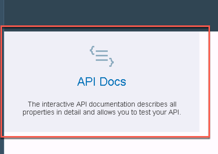
1. Choose **Authorize**
	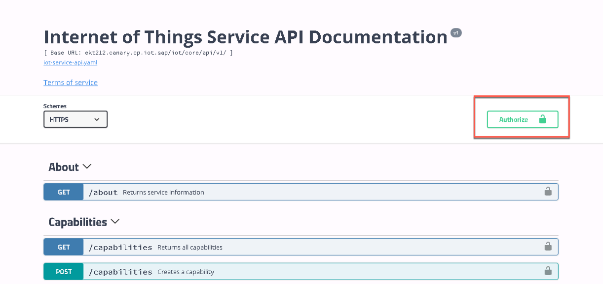
1.	Enter your user **name** and **password** and choose **Authorize** to logon  
	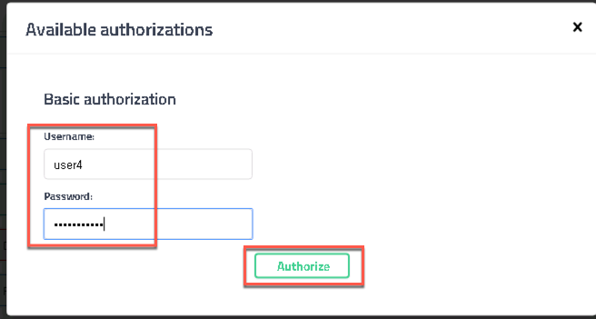
1. You should get an **Authorized** response. Close the the message from the top right corner  
	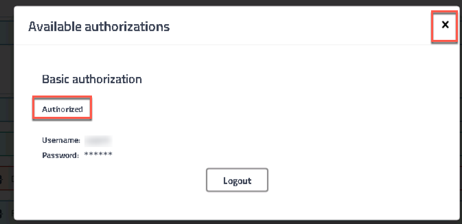
1.	 Choose the **Capabilities** section and open the **POST** request to create a new capability. Then click on **Try it out**  
	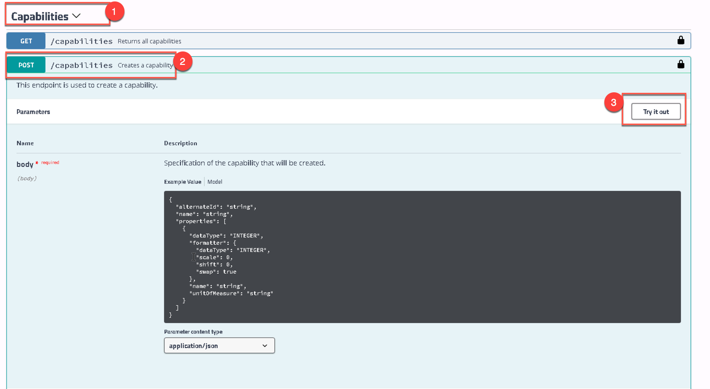
1.	Copy the following JSON script which defines a new capability named **Temperature** together a new property and paste it in the **Example Value** text area. Then click **Execute**  

	```json
	{
	  "name": "Temperature",
	  "properties": [
	    {
	      "formatter": {
	        "swap": false,
	        "dataType": "float",
	        "shift": 0,
	        "scale": 0
	      },
		  "unitOfMeasure": "°C",
	      "dataType": "float",
	      "name": "Temperature"
	    }
	  ]
	}
	```
	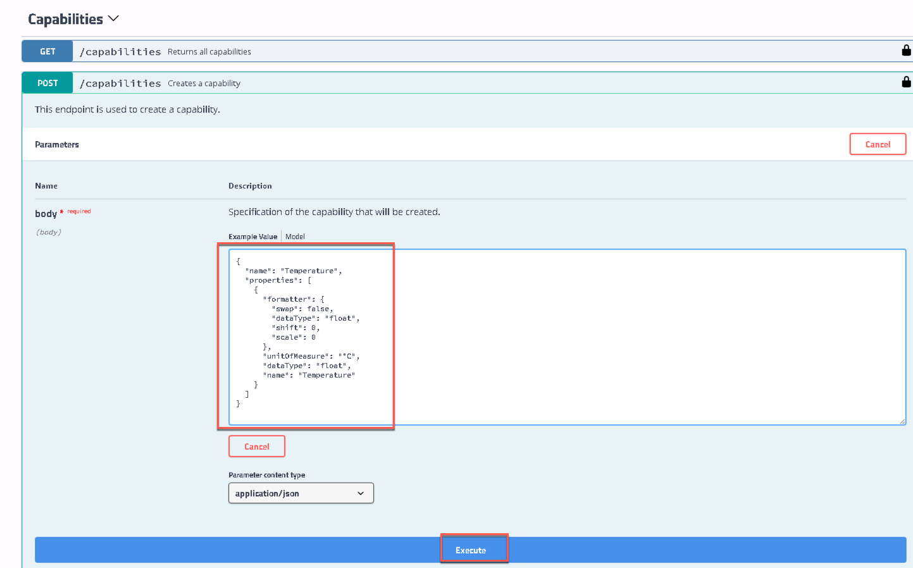

1.	You should get a response code of **200** and a response body like this. Copy and paste this response body in a text editor because you will need this information later in this section  
	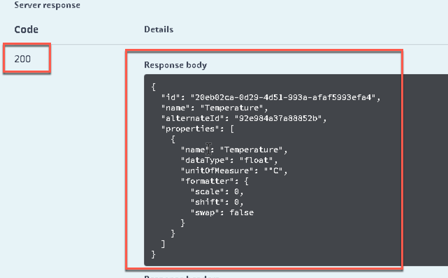

1.	Copy the following JSON script which defines a new capability named **Light** and paste it in the **Example Value** text area. Then click **Execute**  

	```json
	{
	  "name": "Light",
	  "properties": [
	    {
	      "formatter": {
	        "swap": false,
	        "dataType": "float",
	        "shift": 0,
	        "scale": 0
	      },
		  "unitOfMeasure": "Lux",
	      "dataType": "float",
	      "name": "Light"
	    }
	  ]
	}
	```
	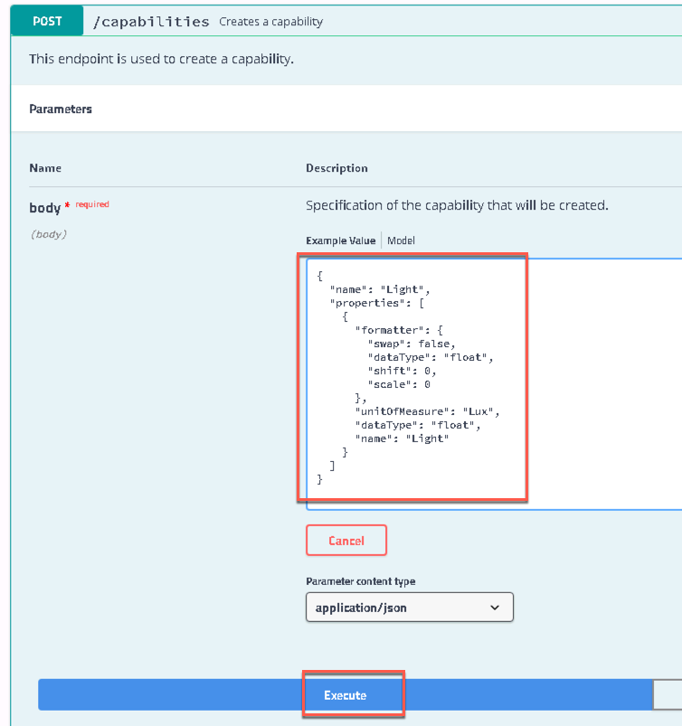

1.	You should get a response code of **200** and a response body like this. Copy and paste this response body in a text editor because you will need this information later in this section  
	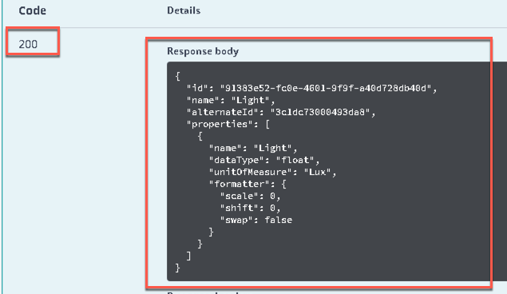

1.	Copy the following JSON script which defines a new capability named **BuzzerController** and paste it in the **Example Value** text area. Then click **Execute**  

	```json
	{
	  "name": "BuzzerController",
	  "properties": [
	    {
	      "formatter": {
	        "swap": false,
	        "dataType": "STRING",
	        "shift": 0,
	        "scale": 0
	      },

	      "dataType": "STRING",
	      "name": "BuzzerController"
	    }
	  ]
	}
	```
	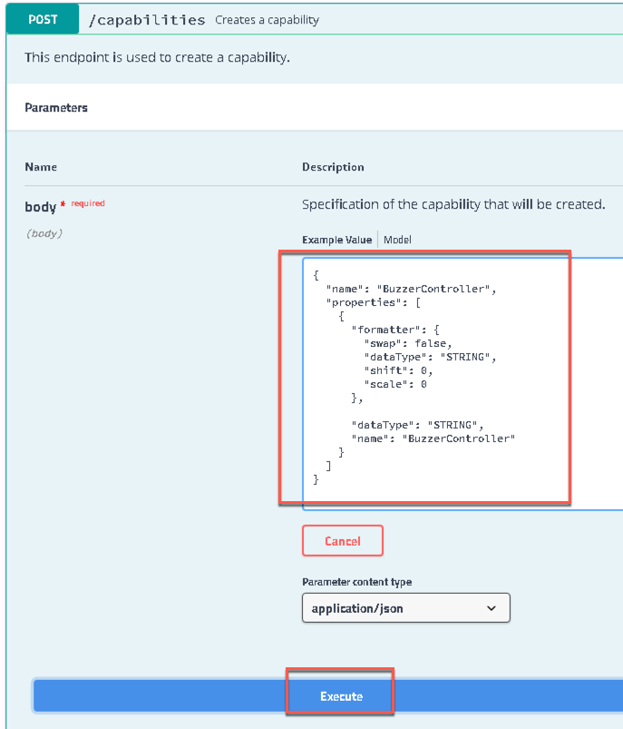

1.	You should get a response code of **200** and a response body like this. Copy and paste this response body in a text editor because you will need this information later in this section  
	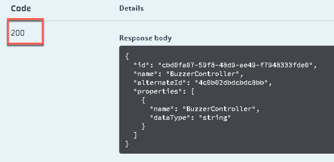

1.	Now you need to create a sensor type where the previously created capabilities are assigned to it. Go to the Home page of API services documentation and select **SensorTypes**  
	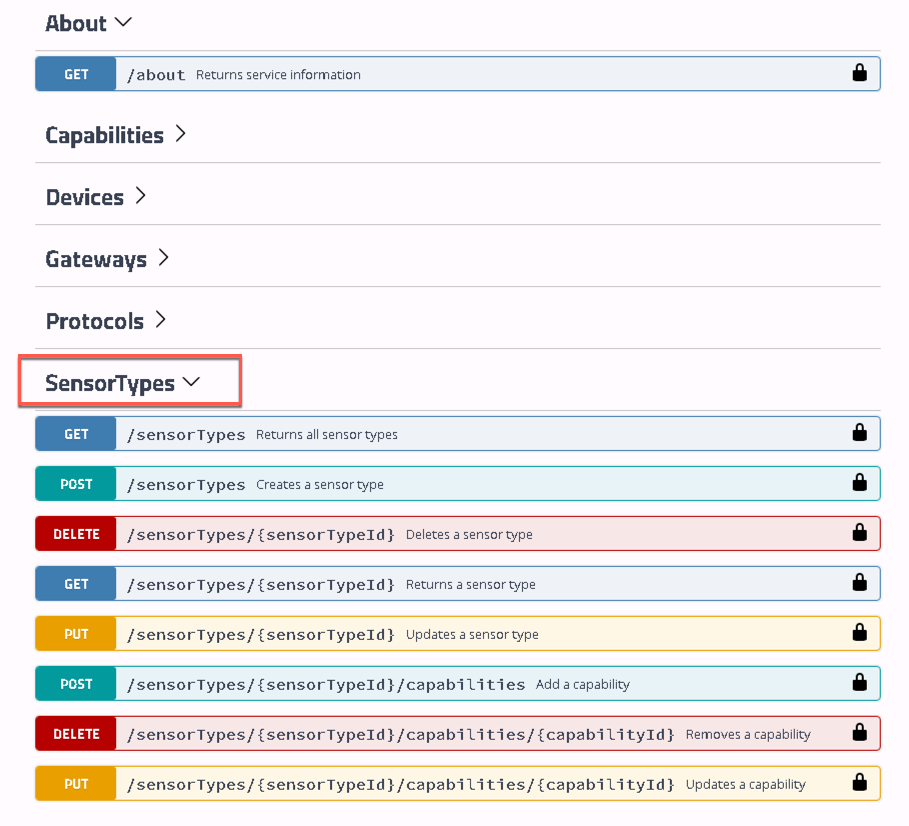

1.	Choose the **POST** request and click on **Try it out**  
	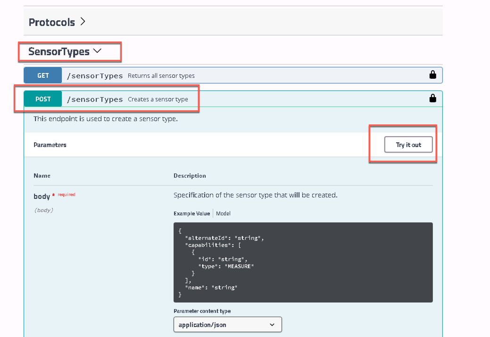

1.	Copy the following JSON script, which defines a new Sensor type with the name EKTProfile_XX (where XX must be replaced with your group number provided by the instructor). Replace

	- **<<< Temperature Capability ID >>>** with the Temperature capability ID
	- **<<< Light Capability ID >>>** with the Light capability ID
	- **<<< BuzzerController Capability ID >>>** with the BuzzerController capability ID

	you have noted down in the previous steps. Once done paste the script in the **Example Value** text area and click **Execute**

	>NOTE: You must use **capabilities IDs** here because **AlternateIDs** are **NOT** used for creating sensor types

	```json
	{
	  "protocol": "*",
	  "capabilities": [
	    {
	      "id": "<<< Temperature Capability ID >>>",
	      "type": "measure"
	    },
		{
	      "id": "<<< Light Capability ID >>>",
	      "type": "measure"
	    },
		{
	      "id": "<<< BuzzerController Capability ID >>>",
	      "type": "command"
	    }
	  ],
	  "name": "EKTProfile_XX"
	}
	```

	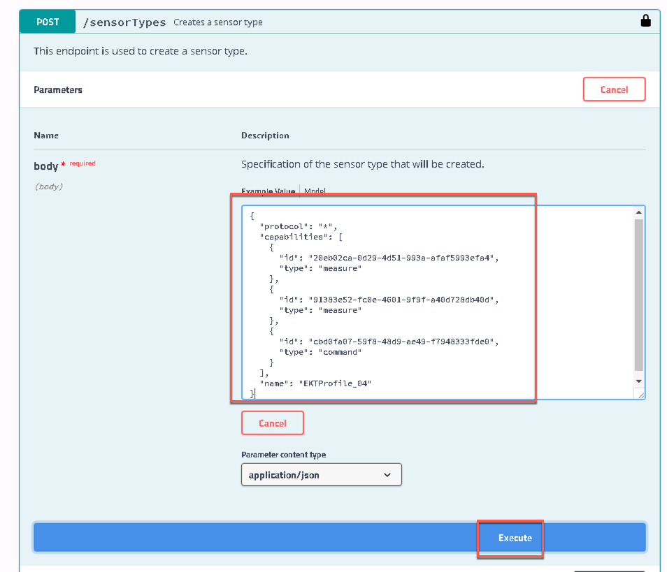

1.	You should get a response code of **200** and a response body like this. Copy and paste this response body in a text editor because you will need this information in the next section to onboard the IoT device sensor  
	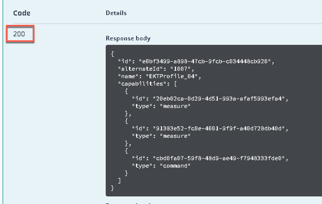

1. Congratulations! You have successfully created a new data model.


### <a name="device-and-sensor-onboarding"></a> Device and sensor onboarding
Each device exchange data with a specific protocol (for example: MQTT in this exercise).  Each device corresponds to 1 unique physical node. We need to create physical node that corresponds to a physical device. In the following section, it is described how to create a Device for the MQTT network. Also we onboard all the sensors and Actuators for the Device.

1.	Log on to the IoT Cockpit of SAP Cloud Platform Internet of Thing with the tenant user credentials  
	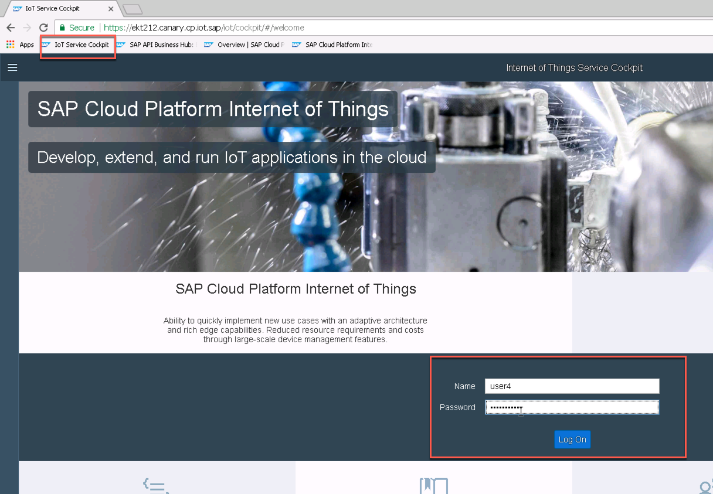

1.	Use the main menu to navigate to the **Device Management -> Devices** section and click on the "**+**" sign to start the device creation process

	>NOTE: As an alternative, devices and sensors can also be created via APIs. In this exercises, we will create it via UI cockpit  

	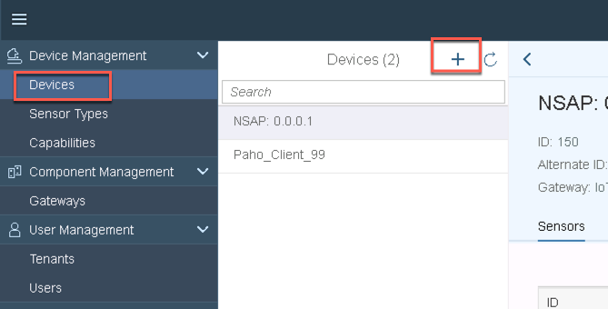

1.	In the **General Information** section, enter the following information and click on **Create**


	|Parameter|Value|
	|---------|-----|
	|Name|Paho\_Client\_XX |
	|Gateway|MQTT Network|
	|Alternate ID|11:22:33:XX|

	(where **XX** must be replaced with your group number)

	>NOTE: for the **Alternate ID**, as we are not using actual device and just a Paho MQTT Simulator Client, you can provide any string. This string resembles a MAC address where 4 groups of 2 digits must be sepaarted by colons (:)

	>NOTE: Same MAC address would be required at later steps to be provided in Paho Client as well.  

	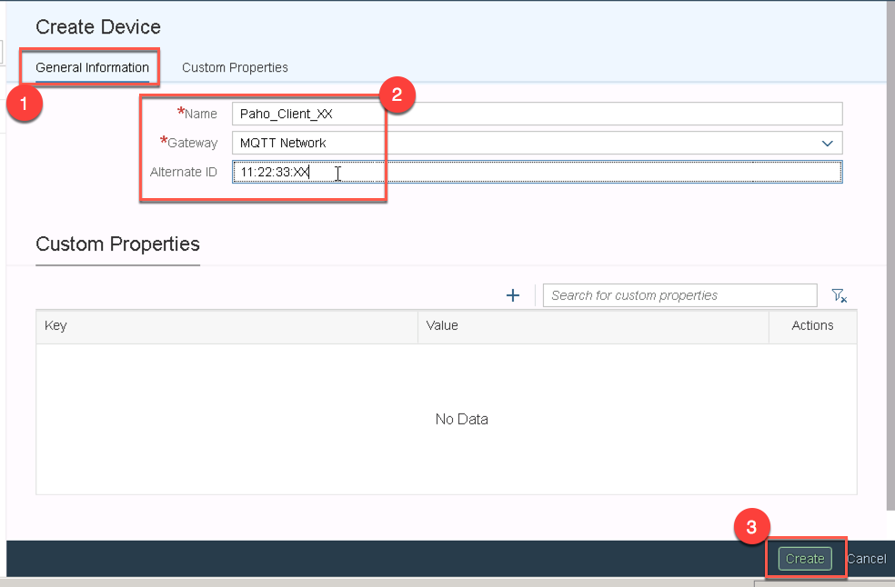

1.	Device is listed under available devices. Select the new device and click on the "**+**" sign to create a new sensor  
	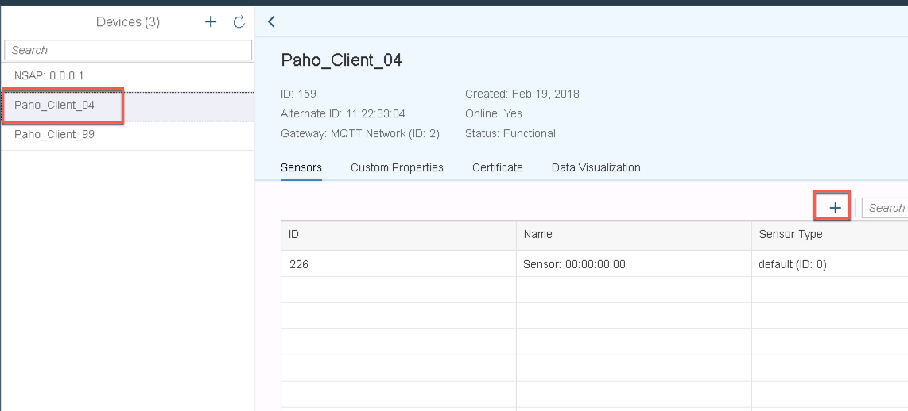

1.	In the General Information section, enter a name such as "**EKT-Sensor**", select Sensor Type you have created earlier (i.e. EKTProfile\_XX, where XX must be replaced with your group number) and ignore the Alternate ID as it's optional. This EKT-Sensor automatically provides temperature, light measurements and it also supports a buzzer actuator: these are the capabilities we have previously defined. Once done click on **Add**  
	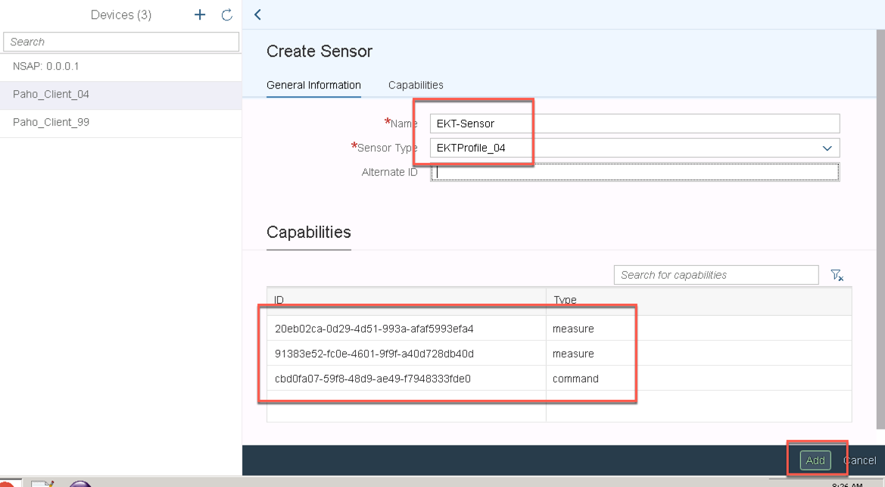

1.	The new sensor is created and you should be able to see the **EKT-Sensor** under the **Sensors** tab of the Paho\_Client\_XX device onboarded earlier  
	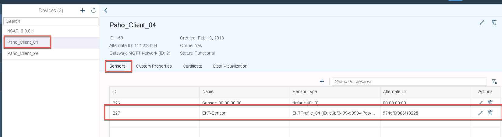

1. Be sure that your Paho Client device is selected, choose the **Certificate** tab and click on **Generate Certificate**  
	
1. Choose the Certificate Type **P12** and click **Generate**  
	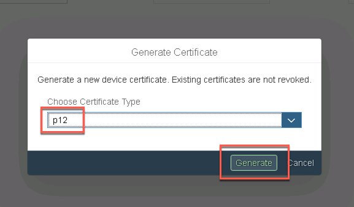
1. This will trigger a popup windows providing you with a secret key which you must copy and save in notepad. Then click **OK**  
	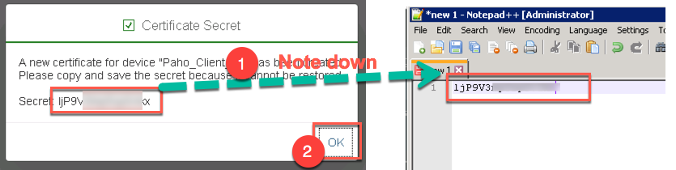
1. You can also see the downloaded certificate *Paho\_Client\_XX-device\_certificate.p12* in the Chrome browser status bar. Click on the small down arrow and choose **Show in folder**  
	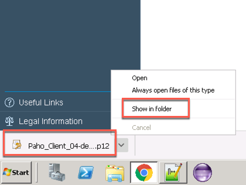

1. This will make you to understand where the certificate is located. Please keep in mind this location since it will be used in the next section  
	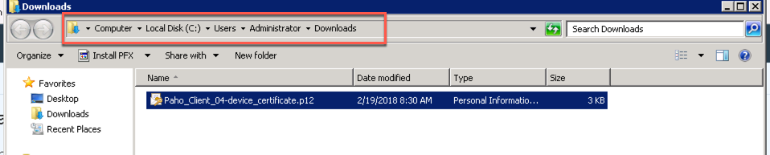
1. Congratulations! You have successfully onboarded a new device and a new sensor.


### <a name="mqtt-Paho"></a> Sending messages via MQTT using Paho client
In this step, we will send the data from Device Simulator that supports MQTT protocol. We have already on-boarded this simulator device during previous steps. Once we send the data, it would be received by Internet of Things Gateway Cloud and would be visible in the IoT services cockpit and via APIs.

1.	Launch the **MQTT Paho Client**, it should be located under the *C:\Student\PahoClient* folder  
	
1. Click on **Run** in case you get the security warning  
	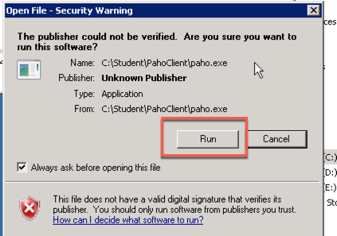

1.	Click on the "**+**" sign to create a new connection  
	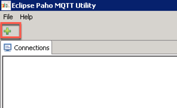

1.	Configure the **MQTT** tab of **connection1** with this information

	| Parameter |Value |
	| --------- |----- |
	| Server URI | `ssl://<host_name>:8883` where **\<host\_name\>** is the host part in the cockpit  URL |
	| Client ID | The MAC address you have defined previously (e.g. 11:22:33:XX) |
	| Alternate ID | 11:22:33:XX |

	

1.	Click on the **OPTIONS**, select **Enable SSL** and click on the first **Browse...** button to specify the Key Store Location  
	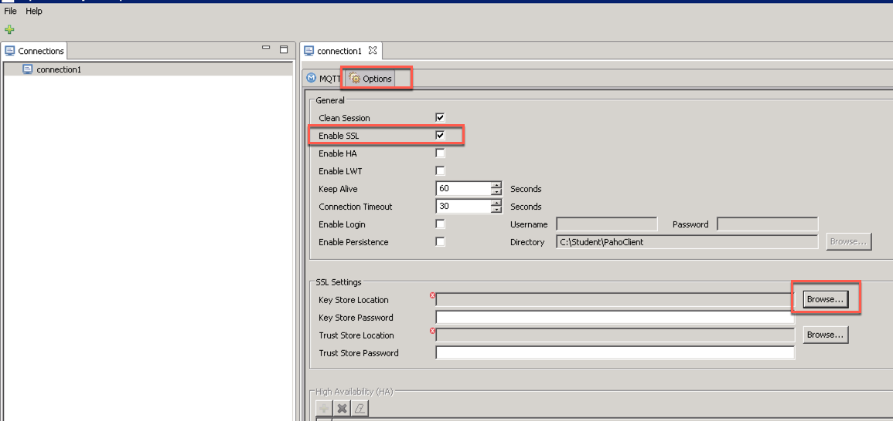

1.	Change the file extension search criteria to \*.p12 and browse for the *Paho\_Client\_XX-device\_certificate.p12* you have downloaded from IoT Services Cockpit  
	

1. As Key Store Password, specify the client secret you have copied in your notepad. Then click on the second **Browse...** button to locate the Trust Store repository  
	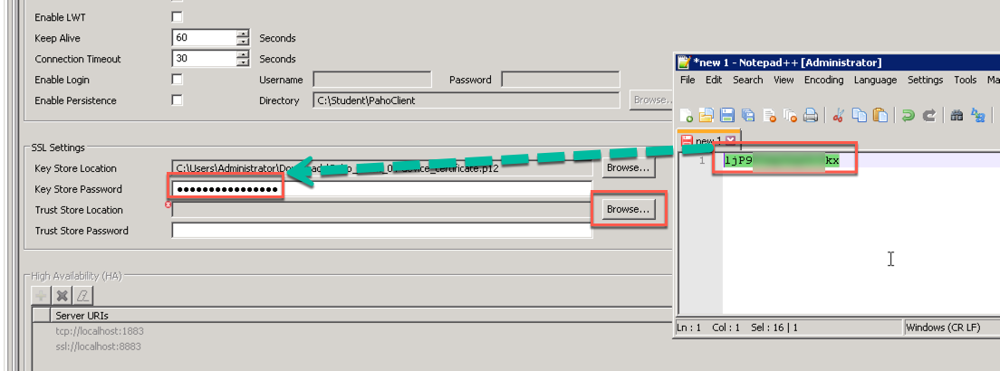

1. Change the file extension search criteria from \*.jks to \*.\* and go to the folder *\<JRE\_Installation\_Folder\>\jre\lib\security*, in your case it should be *C:\Program Files\Java\jre1.8.0_161\lib\security*. Once there, select the file *cacerts* and click **Open**  
	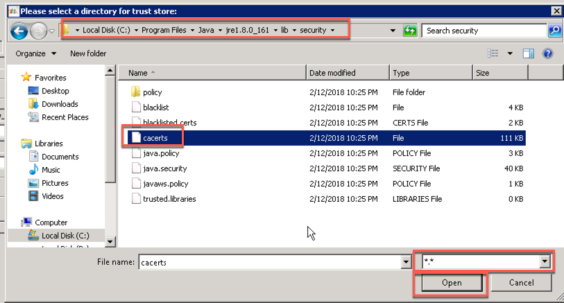

1. As Trust Store password, simply use the text "**changeit**"  
	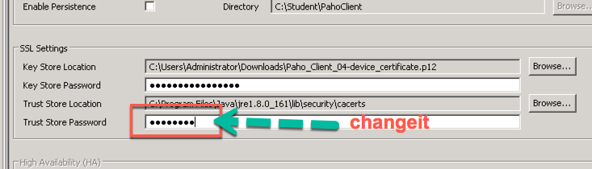

1.	Go to the **MQTT** tab and click on **Connect**  
	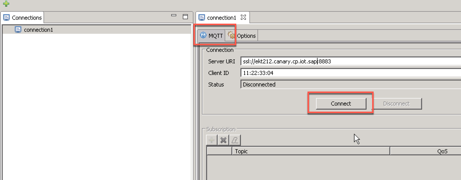

1.	Status should turn to **Connected** as shown in the picture  
	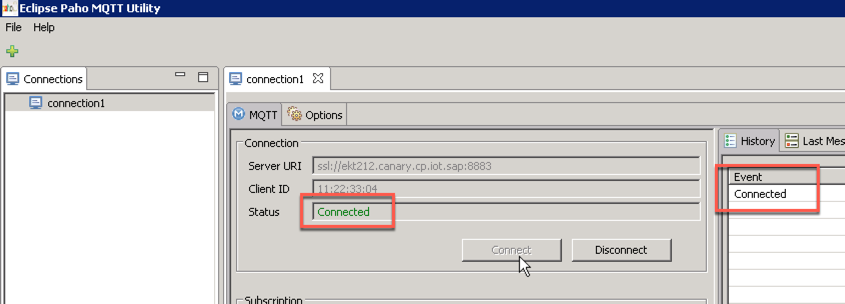

1.	In the **Publish** section, enter the topic `measures/11:22:33:XX` where `11:22:33:XX` is the MAC address you used before and where **XX** must be replaced with your group number  
	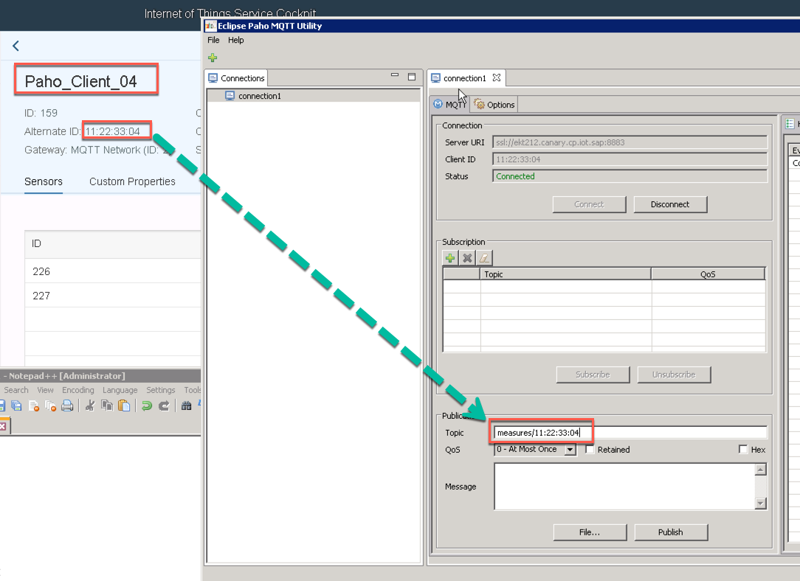

1. Use the default settings for QOS

1. Copy the following JSON script and paste it in a text editor

	```json
	{
	"capabilityAlternateId":[
		"<<< Temperature Capability Alternate ID >>>",
		"<<< Light Capability Alternate ID >>>",
		"<<< BuzzerController Capability Alternate ID >>>"
		],
	"measures":[20,20,"demo"],
	"sensorAlternateId":"<<< Sensor Alternate ID >>>"
	}
	```

1. Replace the **sensorAlternateId** with the **Alternate ID** you can read by going on your **EKT-Sensor** in your **Paho Client**  
	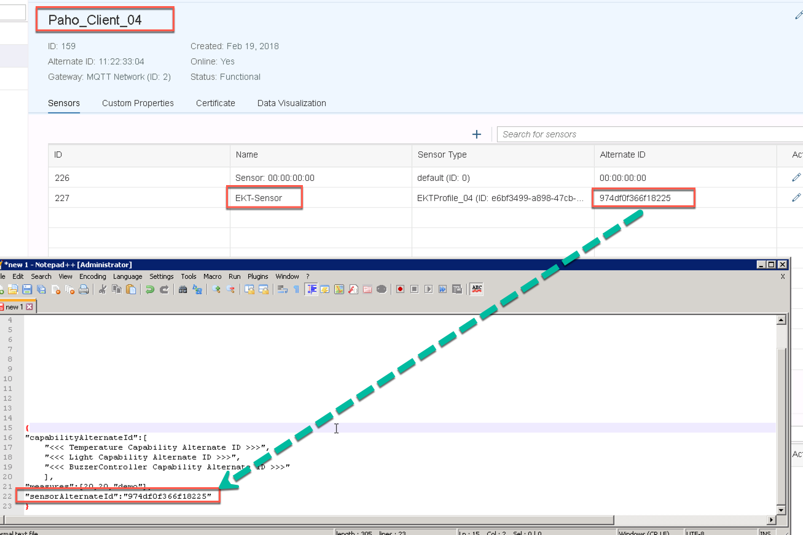

1. Then go to **Sensor Types -> EKTProfile_XX** and click on the first **Action** button for the **Temperature** capability  
	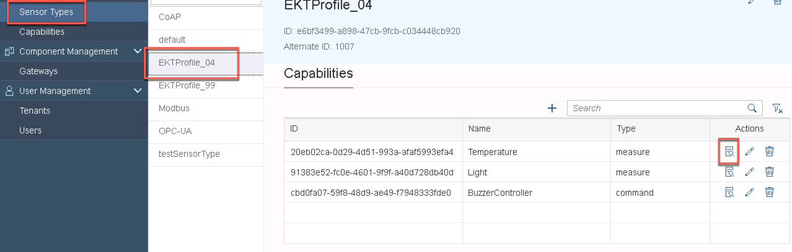

1. Replace the **<<< Temperature Capability Alternate ID >>>** with the Alternate ID of the Temperature capability  
	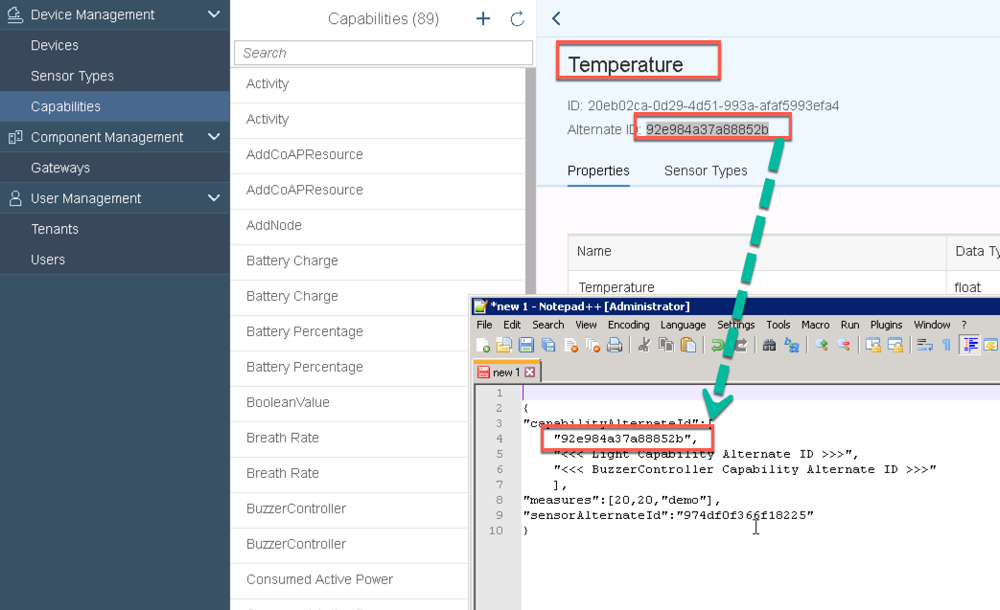

1. Repeat the previous 2 steps for the other capabilities (Light and BuzzerController). At the end copy the JSON script you have created and paste it in the Message text area of your Paho Client. Then click **Publish**  
	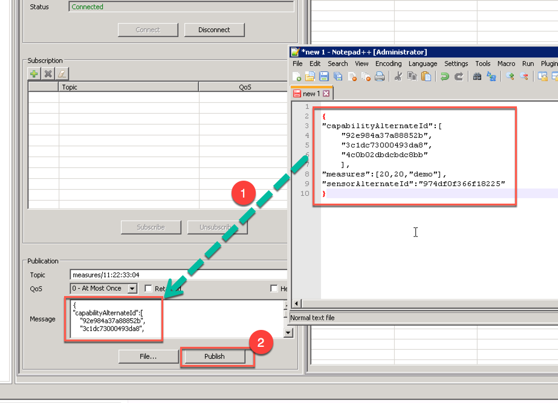

1. A new line is added to the history on the right  
	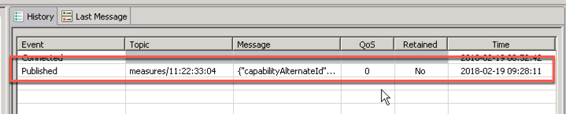

1. Repeat this step several time each time by changing the values for temperature and light in the  measures section of the JSON file  
	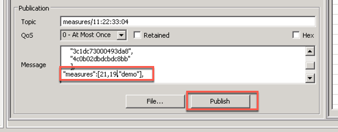

1. At the end you should have a history with several different pubblications  
	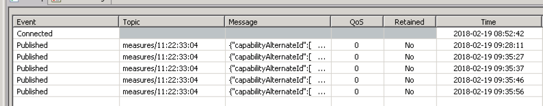

1. Congratulations! You have successfully sent messages via MQTT using the Paho Client.


### <a name="consuming-sensor-data"></a> Consuming and viewing sensor data
This section explains various ways we can consume and visualize the measurements which are sent to IoT Cloud Gateway.

1. Select your **Paho Client** in the cockpit, go to the **Data Visualization** tab, specify your **Sensor**, a **capability** and the **property** you want to analyze and click on the **Refresh** button. You should get a chart with all the data  
	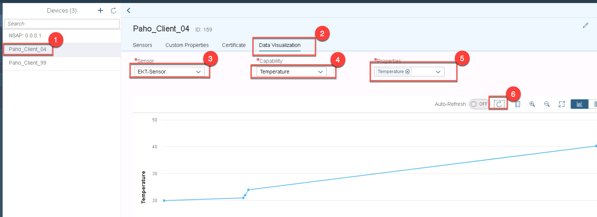

1.	Feel free to do the same for the **Light** capability  

1.	In the Chrome browser click on the Apps link  
	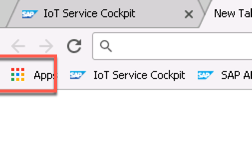

1.	Open Chrome Postman Client  
	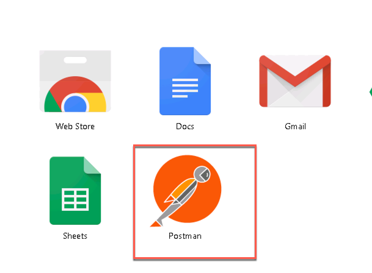

1. Select the GET request type and enter the URL `https://<HOST_NAME>:443/IoT/core/api/v1/devices/<Device_ID>/measures` where **\<HOST\_NAME\>** must be replaced with the host name you can get from the cockpit URL and **\<Device\_ID\>** with the ID you can get by selecting your **Paho\_Client\_XX** device in the IoT Cockpit  
	

1. Click on the **Authorization** tab. Select **Basic Auth** as Type, enter your SAP IoT Cockpit credentials and click on **Update Request**  
	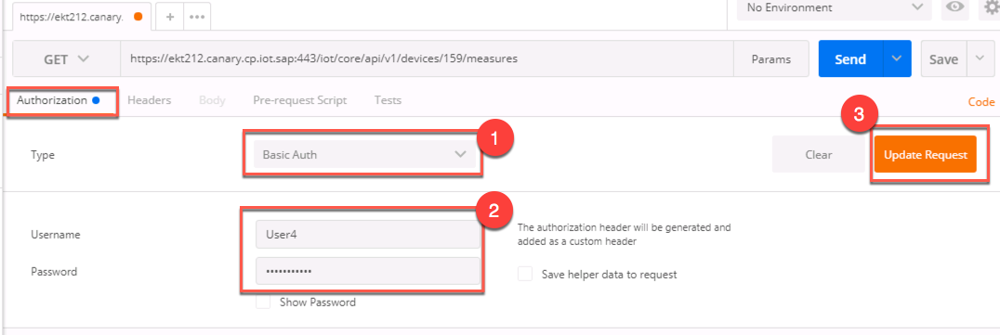

1. Click on the **Headers** tab and add a new HTTP header with the key-value pair  
	`Accept = application/json`. At the end click on **Send**  
	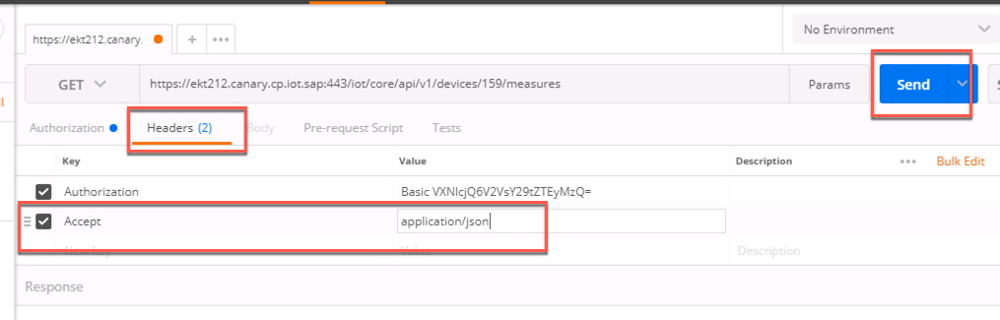

1. You should get the list of all the measures for this device  
	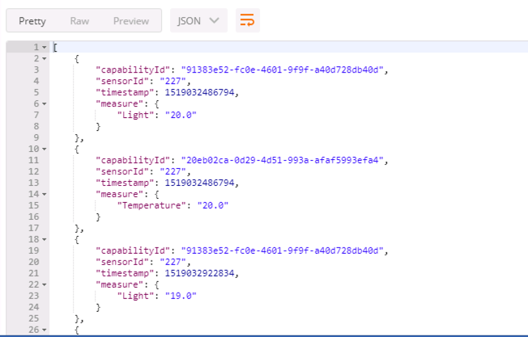

1. Congratulations! You have successfully consumed and analyzed sensor data.


### <a name="working-with-commands"></a> Working with commands
This section gives brief overview of how to work with device commands in MQTT network. Device commands are used to manage actuators such as Industrial Relays, Valve's, Alarm Buzzer and so on.

1.	In the Paho Client, navigate to **MQTT** tab of **connection1** and click on the "**+**" to create a new subscription  
	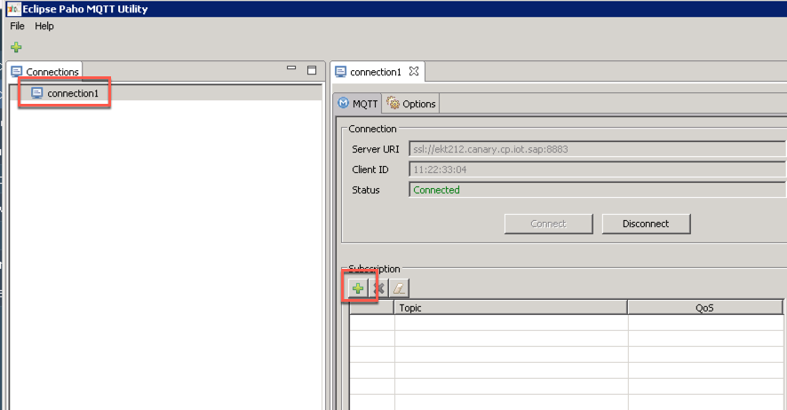

1.	Add a new subscription for Device Commands by entering the following value in the **Topic** column  

	`Topic = commands/<<<Device Mac Address>>>` where **\<\<\<Device Mac Address\>\>\>** must be replaced with the 	Mac address you created earlier. Then click on **Subscribe**  
	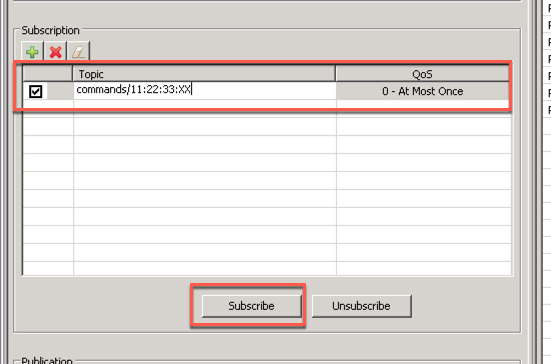

1. In the history you should get the information that a new subscription has been created  
	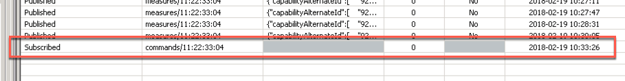

1.	Open the Internet of Things API Documentation at the link <https://\<host_name\>/IoT/core/api/v1/doc/index.html> (where **\<host\_name\>** is your IoT cockpit hostname) and choose **Authorize**  
	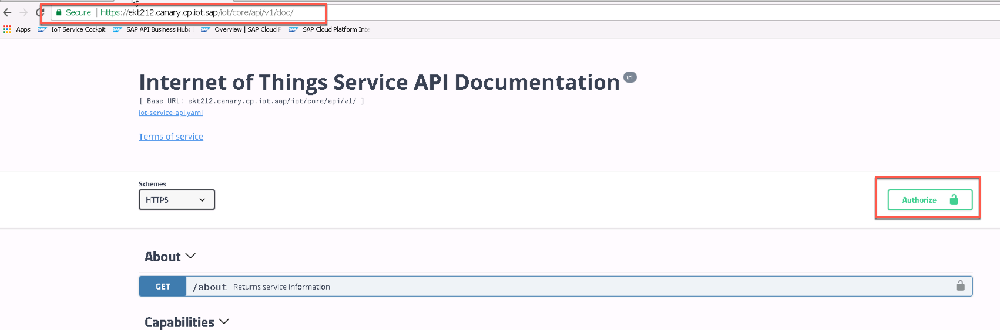

1.	Enter your credentials and click on **Authorize**  
	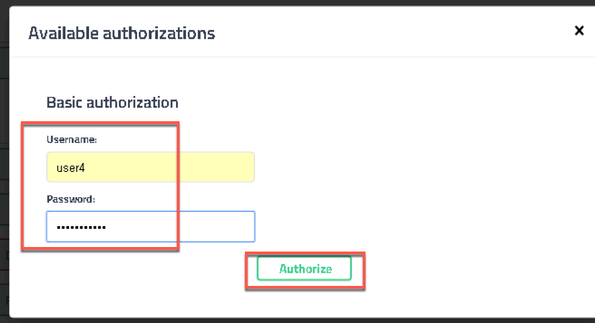

1. Close the message window  
	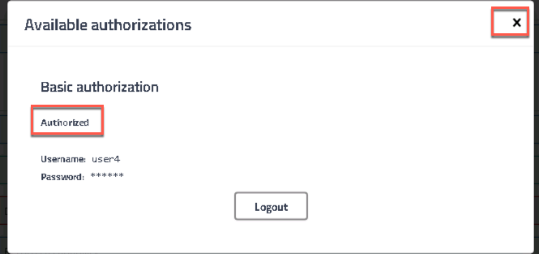

1.	Go to the Devices section, select the `POST /devices/{deviceId}/commands` request entry and click on **Try it out**  
 	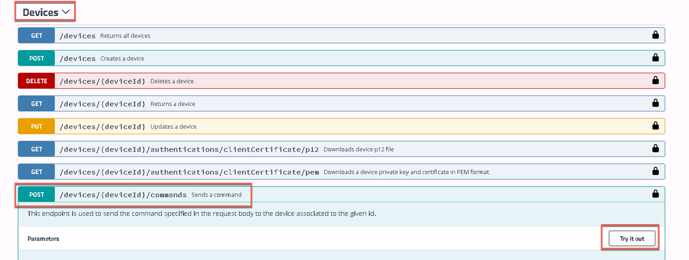

1.	Copy the below sample JSON script and paste it in a text editor. Replace the "**<<< BuzzerController Capability ID >>>**" with the ID you can find in the **BuzzerController** capability page. Then replace the "**<<< Sensor ID >>>**" with the **ID** of the **EKT-Sensor** you can find in the **Devices -> Paho\_Client\_XX** page. Take also note of the Device ID in this same page because it will be required in the next step

	```json
	{
	  "capabilityId": "<<< BuzzerController Capability ID >>>",
	  "command": {
	    "BuzzerController" : "ON"
	  },
	  "sensorId": "<<< Sensor ID >>>"
	}
	```

 	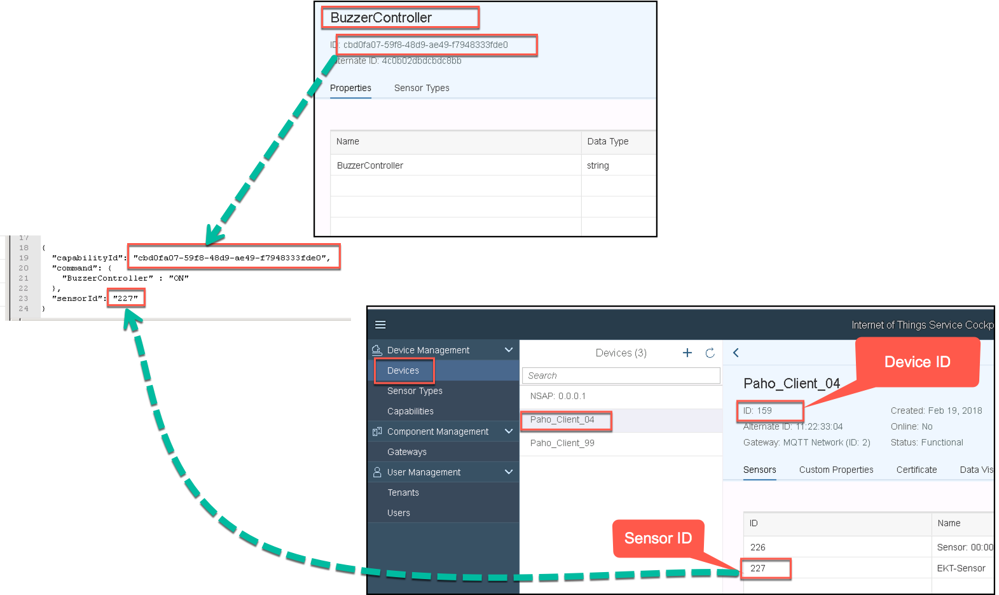

1.	Go back to the browser and copy the **Device ID**, obtained in the previous step, in the **deviceid** field. Copy and paste the **JSON script** you prepared in the text editor in the **body** text area. Then click **Execute**  
 	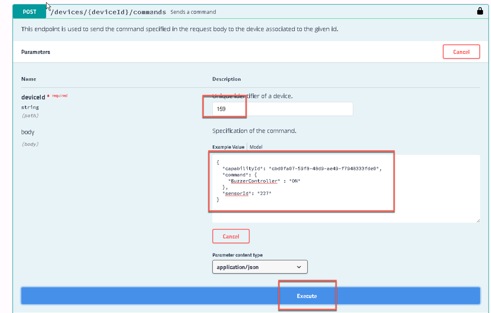

1. You should get a response code of **200** and a "Command issued sucessfully." message  
 	

1. You can see the received BuzzerController command in the Paho Client Message history Tab  
 	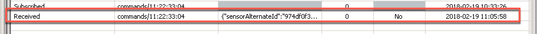

1. Congratulations! You have successfully sent a command to a Buzzer Controller.


## Summary
You have completed the exercise!

You are now able to:

* creating a new Data Model
* onboard Devices with Gateway Cloud using MQTT protocol
* send Data with Paho MQTT Client
* consume Data via IoT Services Cockpit and APIs


Please proceed with next exercise.
