<table width=100% border=>
<tr><td colspan=2><h1>EXERCISE 02 - IoT : Installing and configuring Gateway Edge for MQTT protocol</h1></td></tr>
<tr><td><h3>SAP Partner Workshop</h3></td><td><h1> &nbsp;60 mins</h1></td></tr>
</table>


## Description
This document provides you with the exercises for the hands-on session on SAP Cloud Platform, Internet of Things. This scenario will help you to go through the following activities:
* IoT Gateway Edge provisioning with MQTT protocol
* Automatic device and sensor on boarding with Gateway Edge using MQTT protocol
* Sending Data with PAHO MQTT Client
* Consume Data via IoT Services Cockpit and APIs

>NOTE: Use Google Chrome browser. 


## Target group

* Developers
* People interested in SAP Leonardo and Machine Learning 


## Goal

The goal of this exercise is to unserstand how IoT Gateway Edge works, how to onboard a new device with Gateway Edge using MQTT protocol, how to send data with PAHO MQTT Client and finally how to consume them via IoT Services Cockpit and APIs


## Prerequisites
  
Here below are prerequisites for this exercise.

* An SAP IoT Service system. It will be provided by your instructor
* A remote desktop connection app to access the remote system


## Steps


1. [Introduction](#introduction)
1. [Setup of IoT Gateway Edge for MQTT Protocol](#edge-setup)
1. [Automatic Device onboarding](#device-onboarding)
1. [Sending messages via MQTT using PAHO client](#mqtt-paho)
1. [Consuming and viewing sensor data](#consuming-sensor-data)


### <a name="introduction"></a> Introduction
The SAP Cloud Platform Internet of Things (IoT) services offer a feature rich cloud enablement & generic data treatment services, which can be used to develop end-to-end IoT applications. The SAP Cloud Platform Internet of Things enables customers and partners to develop, customize, and operate IoT business applications in the cloud. This platform provides lifecycle management at scale for IoT devices from onboarding to decommissioning. It also provides a way to securely connect to remote devices over a broad variety of IoT protocols. It provides gateway Edge which provides one-premise IoT edge processing and also gateway cloud which does centralized cloud based processing.  

Key strength of SAP Cloud Platform Internet of Things (IoT) includes

* Scalable ingestion of IoT data and broad device connectivity
* Large scale device management

The Internet of Things service cockpit is the user interface of the Internet of Things service and provides access to various functions. It is the main interface for users to interact with the Internet of Things core service. It can be used creating user & tenants. Creating device data model, Device Onboarding and adding new networks etc. it can also be used to deploy interceptors, retrieve network logs, visualize the data which is being ingested via IoT devices/sensors.
	
	

### <a name="edge-setup"></a> Setup of IoT Gateway Edge for MQTT Protocol
1.	Open a terminal window and go to the folder where your IoT Gateway Edge application is located. In your case it should be under *C:\student\IoTGateway*  
	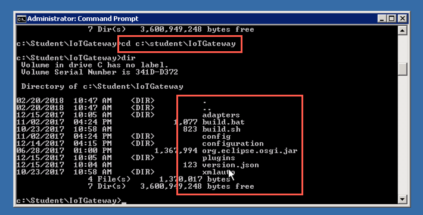
	
1. Run the command

	```sh
	build.bat MQTT
	```
	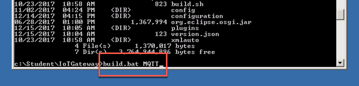

1.	The script should run successfully and you should see the results as shown in the picture  
	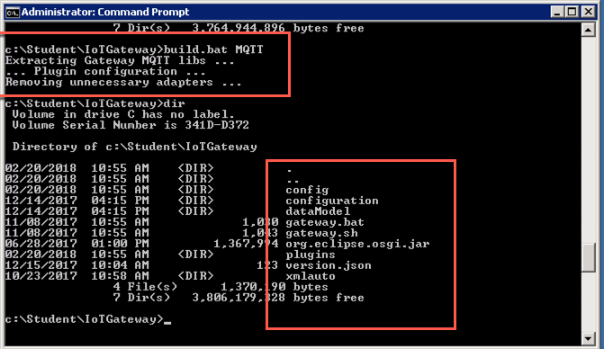

1.	Please Log on to the IoT Cockpit of SAP Cloud Platform Internet of Thing with the tenant user credentials provided by your instructor  
	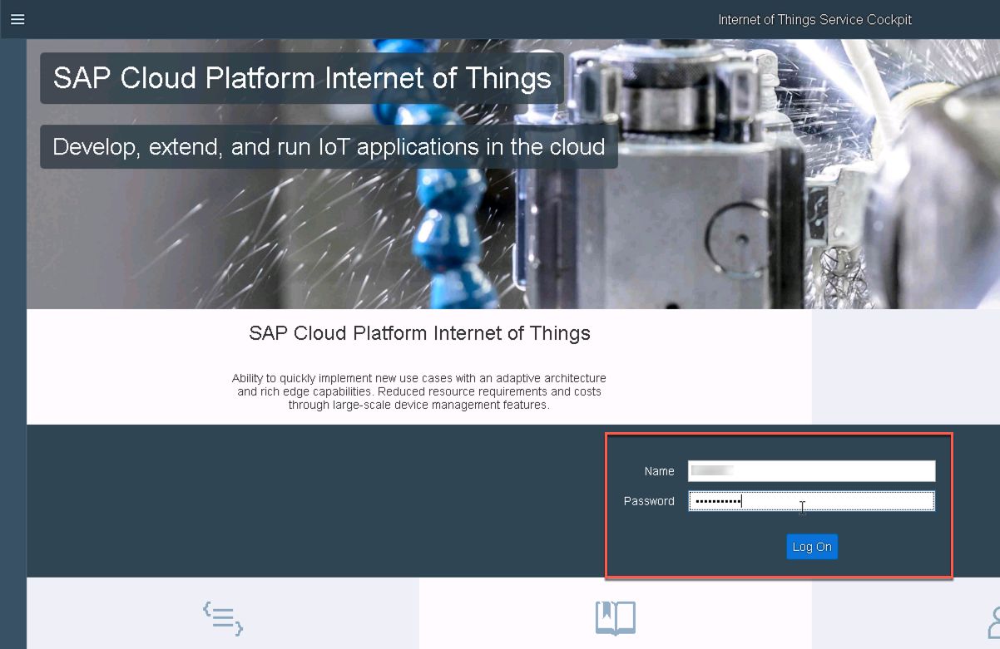

1.	Click on your username at the top right corner of the page  
	

1.	Click on the **Download** link to download the certificate for connecting the Gateway Edge to the IoT Service. Pay attention to the place where this file is downloaded  
	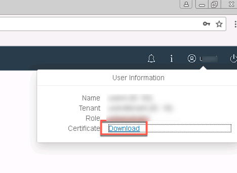

1.	Go to the *config* folder inside your IoTGateway installation and create a new subfolder  
	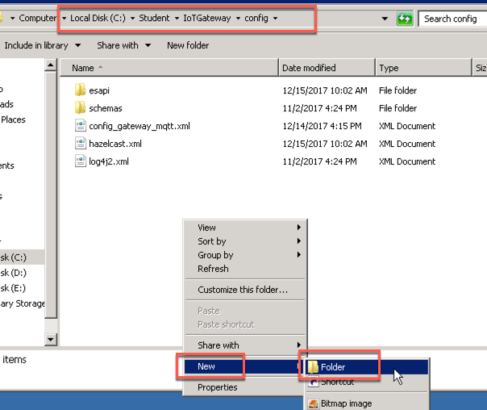

1.	Name this new folder "*certificates*"  
	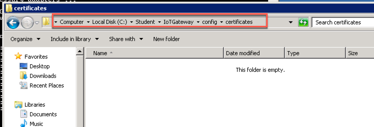

1.	Extract the content of the certificate file *certificates-userXX.zip* you have downloaded earlier in this new folder  
	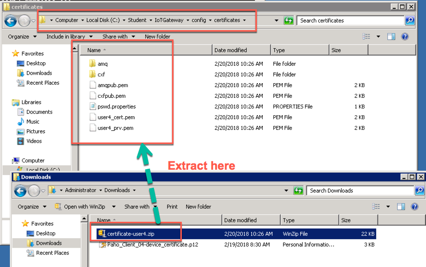

1.	Right click on the *pswd.properties* file and choose **Edit with Notepad++**  
	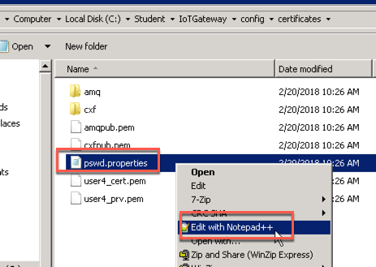

1.	Enter the **password** for your IoT user and save the file  
	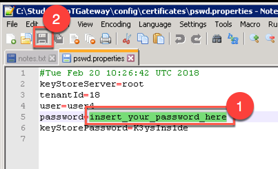

1.	Right click on the *config\_gateway\_mqtt.xml* file in the *config* folder of your Gateway Edge installation and choose **Edit with Notepad++**  
	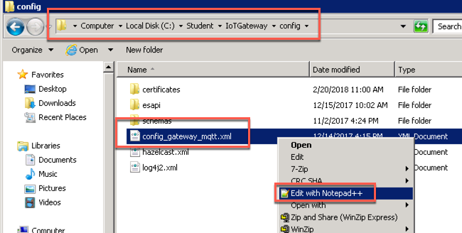

1.	For the two tags amq and coreBundles replace all the occurrences of the IP string 127.0.0.1 with the <HOST_NAME> of your IoT Service (you should have just 3 occurrences)  
	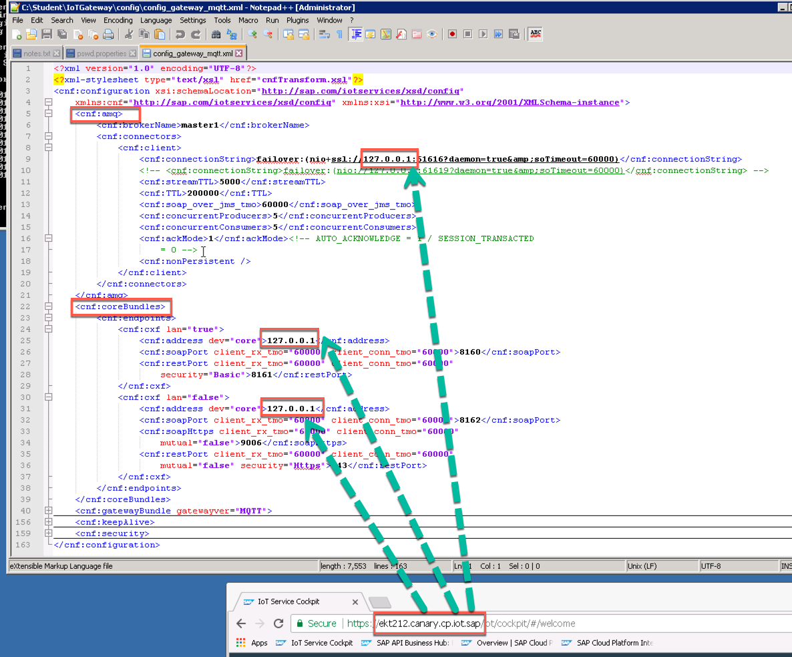

1.	You should get something like this. Save the file  
	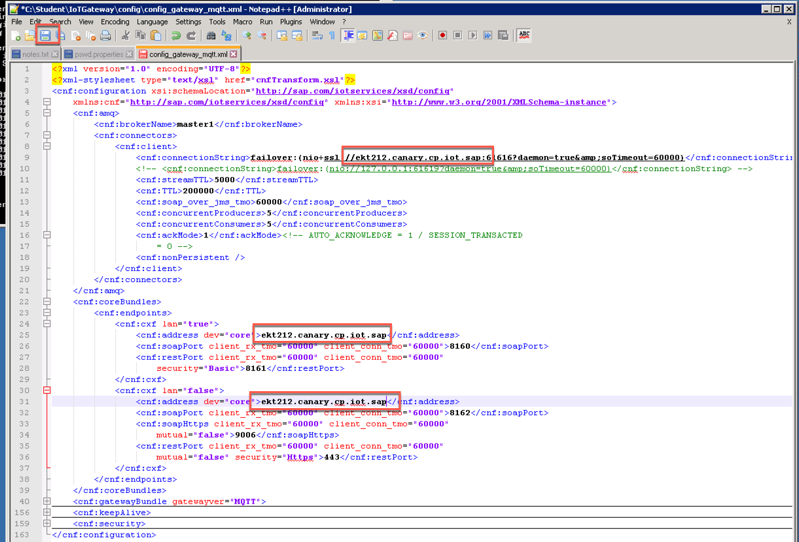

1. Go to the URL <https://www.random.org/bytes> and generate a hexadecimal random code with length 8. Copy the generated code in the clipboard  
	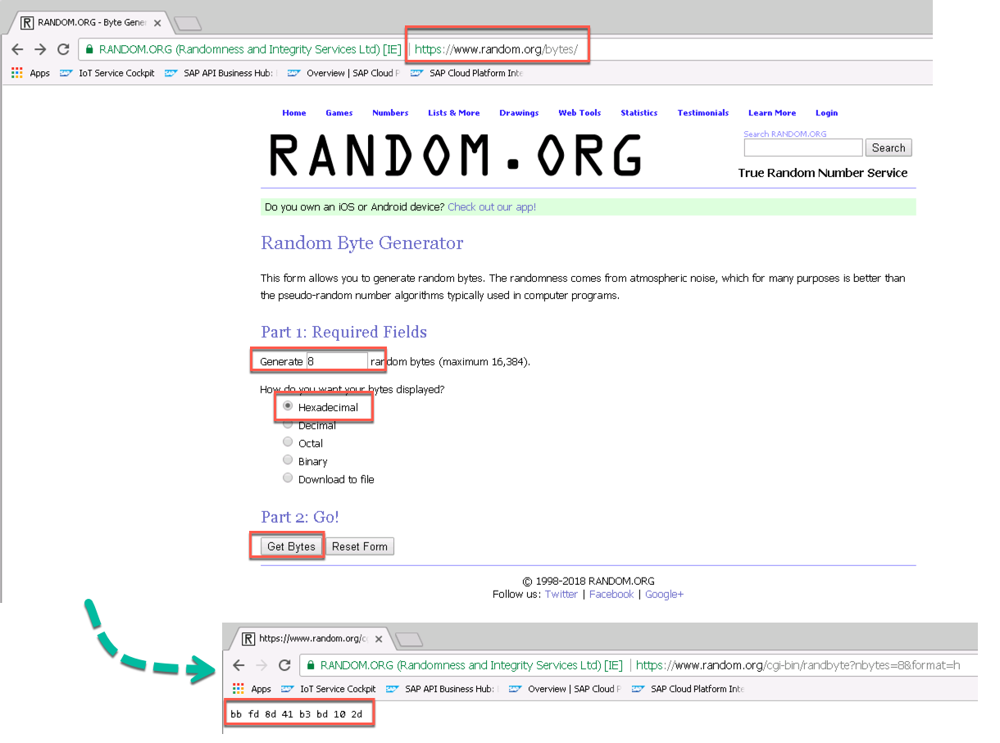

1. Search for the tag `<cnf:gateway>` in the *config\_gateway\_mqtt.xml* file and change it to
`<cnf:gateway gatewayAlternateId="<<< generated code>>> ">` where **<<< generated code >>>** must be replaced with the code you copied in the clipboard removing all the included space characters. Then save the file  
	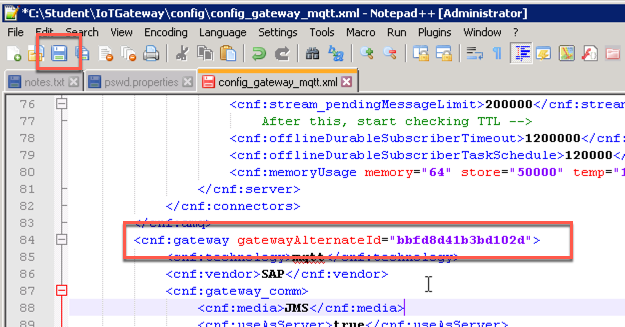

1.	Go back to the terminal window and execute the command `gateway.bat` to start the Gateway Edge onboarding process  
	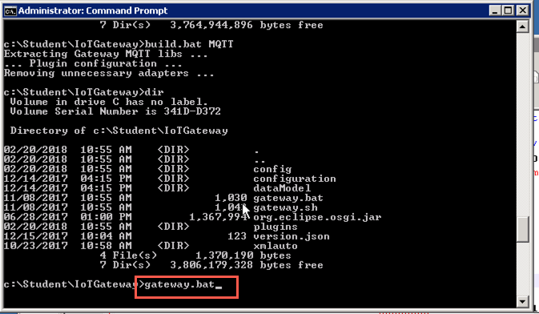

1. The Gateway Edge starts  
	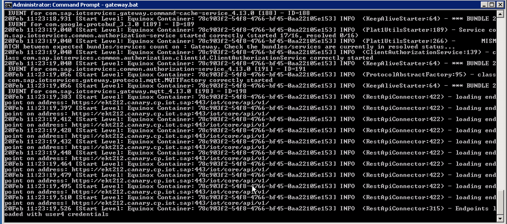

1.	In the IoT Service cockpit, go to the Gateways menu. You should be able to see the started gateway successfully running  
	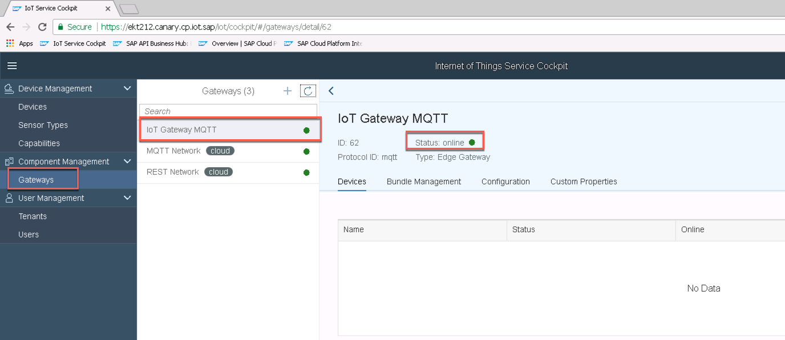

1.	Go to the folder where your Paho Client is installed and launch it  	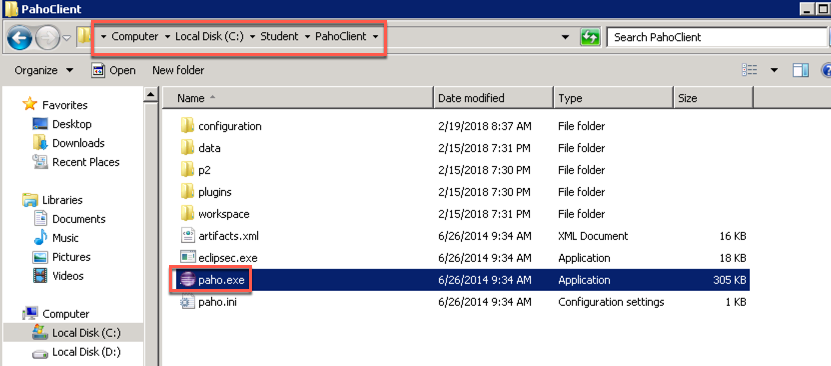
	   
1.	Click **Run** if you get this Security Warning  
	

1.	Click on the "**+**" sign to crate a new connection  
	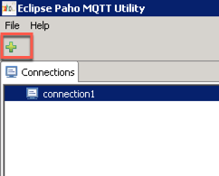

1. Rename this new connection as "connection2", enter the server URI `tcp://localhost:61618` and click on **Connect**  
	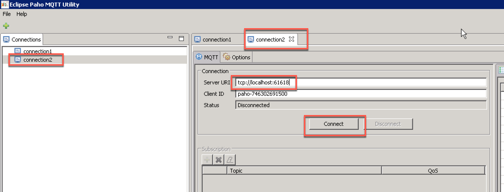

1.	You should be able to see that the status now is **Connected**  
	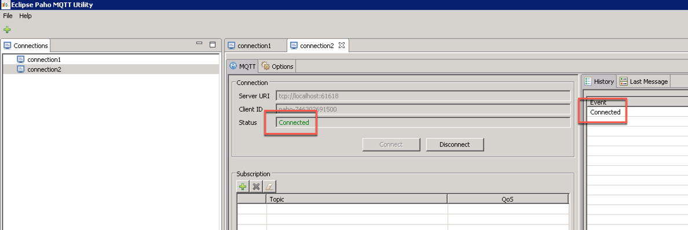

1. Congratulations! You have successfully setup your Gateway Edge.


### <a name="device-onboarding"></a> Automatic device onboarding
Each device exchanges data with a specific protocol (for example: MQTT in this exercise).  Each device corresponds to 1 unique physical node. We need to create physical node that corresponds to a physical device. In this section, it is described how to automatically provision a device for the MQTT network and how to automatically onboard sensors for the device.

1. Go to the URL <https://www.random.org/bytes> and generate a hexadecimal random code with length 4. Copy this code in the clipboard  
	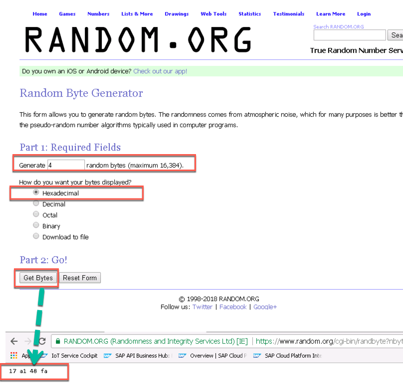

1.	Go to connection2 in your Paho Client and enter the string `measures/<MAC_ADDRESS>` in the **Publication -> Topic** textbox. Replace the **<MAC_ADDRESS**> with the code you copied in the clipboard, replacing all the spaces with colon (":"). Use default setting for QoS and enter the following JSON script in the **Message** text area. When finished click on **Publish** 

	```json
	{"capabilityAlternateId":["1"],"measures":[30],"sensorAlternateId":"Temperature-Sensor"}
	```

	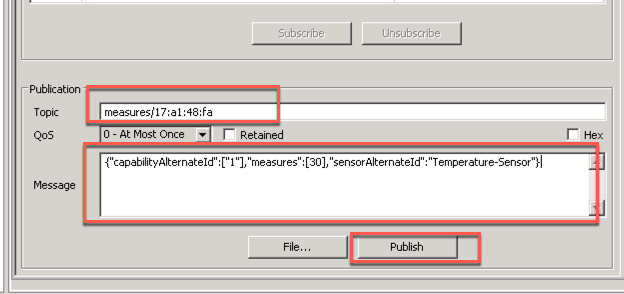

1. In the Paho Client's history tab you should be able to see the event "**Published**"  
	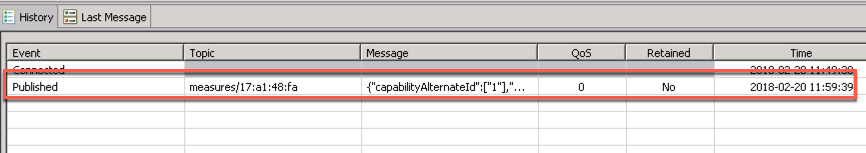
	
1.	Go to IoT Cockpit and select the **Devices** menu: you can see the new device automatically onboarded with the Temperature-Sensor  
	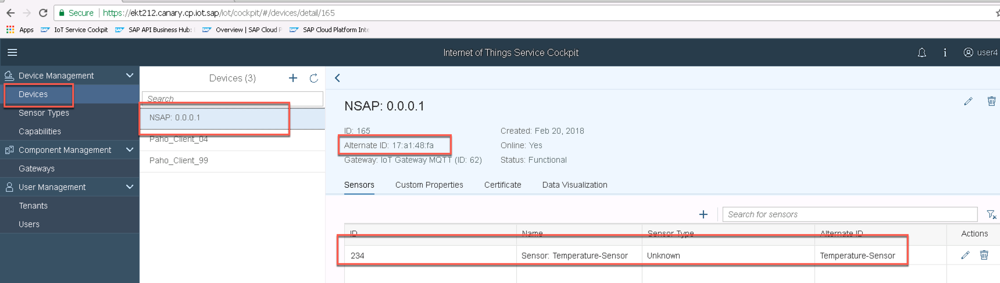

1.	Go to the **Gateways** menu: you can see new device automatically onboarded with IoT gateway we provisioned earlier with MQTT protocol  
	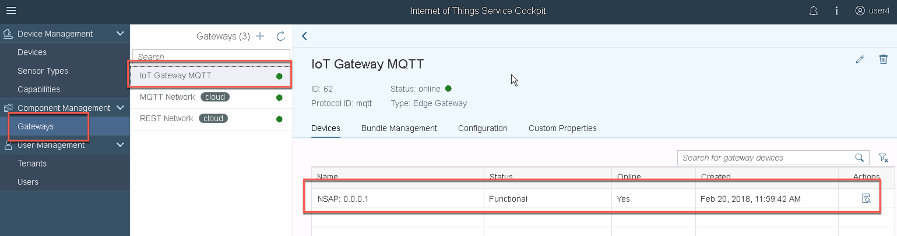

1. Congratulations! You have successfully onboarded a new device and a new sensor.


### <a name="mqtt-paho"></a> Sending messages via MQTT using PAHO client
In this step, we will send the data from Device Simulator that supports MQTT protocol. We have already on-boarded this simulator device during previous steps. Once we send the data, it would be received by Internet of Things Gateway Edge, which will send the data to IoT Core Services and data would be visible  in the IoT services cockpit and vis APIs.

1.	Go to your MQTT PAHO Client and modify the Message options under Publication section by changing the temperature value. For example, since you set it to 30 with the first message, you can think to increase it to 31. Once done click on the Publish button  

1. Do this several times so that you have several messages with different temperature values  
	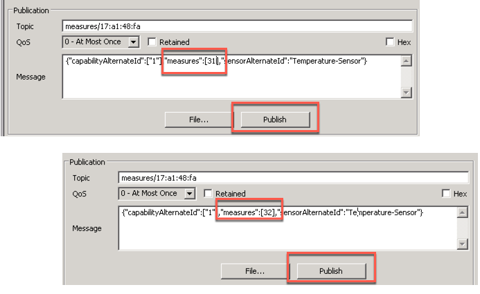

1.	Once done you should see different messages in the History tab of Paho Client  
	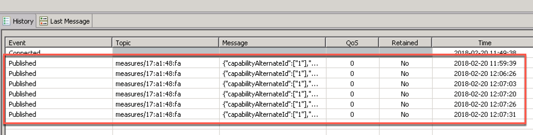

1. Congratulations! You have successfully sent some data via MQTT using the Paho Client.


### <a name="consuming-sensor-data"></a> Consuming and viewing sensor data
This section explains various ways we can consume and visualize the measurements in the IoT Cockpit 

1.	Go to the IoT Service cockpit and select the Devices -> NSAP X.X.X.X device you created earlier. Then click on the Data Visualization tab  
	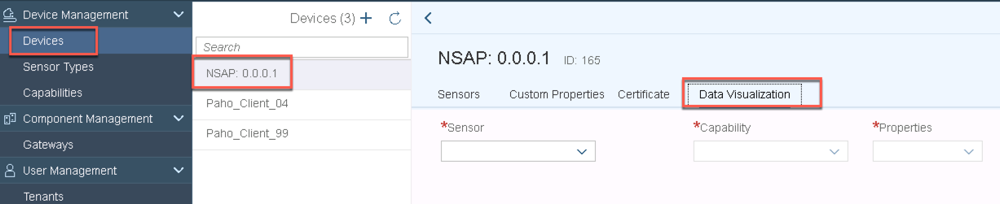

1.	Select 
	
	|Parameter|Value|
	|---------|-----|
	|Sensor|Temperature-Sensor|
	|Capability|Temperature|
	|Properties|Temperature|
	
	You should be able to see a chart with all the different tempearture values you have published  
	
	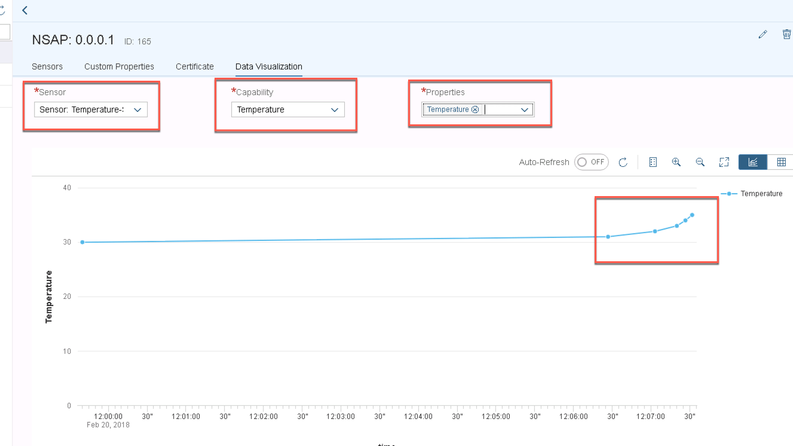

1. Congratulations! You have successfully consumed and analyzed sensor data.


## Summary
You have completed the exercise!
 
You are now able to: 

* use IoT Gateway Edge provisioning with MQTT protocol
* automatic onboard device and sensor with Gateway Edge using MQTT protocol
* send Data with PAHO MQTT Client
* consume data via IoT Services Cockpit and APIs


Please proceed with next exercise.
