<table width=100% border=>
<tr><td colspan=2><h1>EXERCISE 04 - IoT Application Enablement</h1></td></tr>
<tr><td><h3>SAP Partner Workshop</h3></td><td><h1> &nbsp;90 min</h1></td></tr>
</table>


## Description
This document provides you with an introduction to IoT Application Enablement. You will learn how to

- create Packages, Thing Types and Things to model your IoT world
- connect these Things to IoT devices
- create a SAPUI5 Application for IoT using one of the SAP Web IDE templates
- simulate data transmission using Postman
- analyze collected data within the SAPUI5 application

## Target group

* Developers
* People interested in SAP Leonardo and Machine Learning 


## Goal

The goal of this exercise is to have a quick introduction on IoT Application Enablement


## Prerequisites
  
Here below are prerequisites for this exercise.

* Chrome browser
* SAP IoT Application Enablement system (provided by your instructor)
* SAP IoT Service system (provided by your instructor)
* SAP Web IDE system (provided by your instructor)
* a REST client like Postman plugin for Chrome browser
* A remote desktop connection app to access the remote system


## Steps


1. [Create your own Package for Greenhouses](#create-package)
1. [Create the Thing Model](#thing-model)
1. [Create a Thing](#create-thing)
1. [Create the device model](#create-device-model)
1. [Connect the thing with the device](#connect-thing-with-device)
1. [Set up Postman to call APIs](#postman)
1. [Build a SAPUI5 app with SAP Web IDE](#build-app)
1. [Generate the device certificate](#generate-certificate)
1. [Install the certificate](install-certificate) 
1. [Send some data using Postman and analyze sent data](#send-data-with-postman)
1. [OPTIONAL - Build a freestyle SAPUI5 Application](#freestyle-app)


### <a name="create-package"></a> Create your own Package for Greenhouses
	
1. Open your browser and navigate to the IoT Application Enablement URL provided by your instructor. Logon using the provided credentials paying attention to not select the **Remember me** checkbox  
	

1. Do not save the password in your browser  
	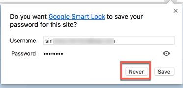

1. A Launchpad opens up: click on the **Package Manager** tile  
	

1. Click on the "**+**" sign to create a new package  
	

1. Enter

	| Parameter | Value|
	| --- | --- |
	| Name| pw.greenhouse.pkg.xx |
	| Description | Power Week Greenhouse Package XX |
	| Scope | Private |
	
	where **XX** must be replaced by your group number. Then click first on **Save** and then on the **Home** button  
	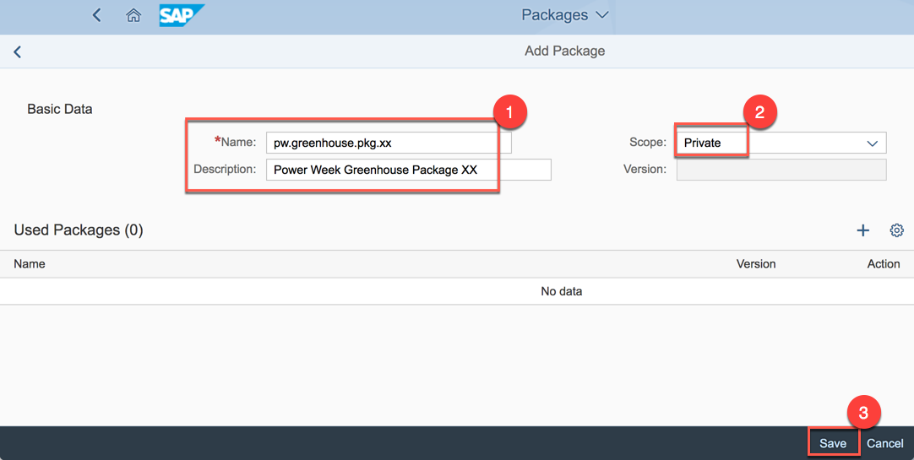

1. Check that your package has been created successfully and go back to the Launchpad's home page.
	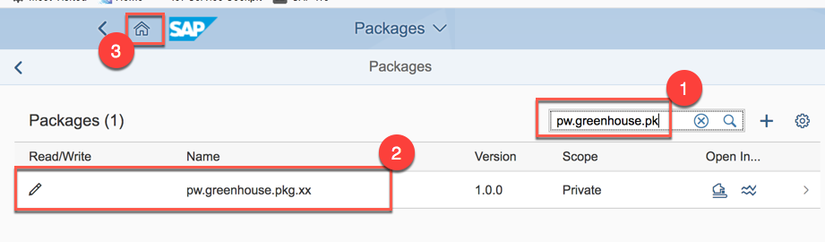


### <a name="thing-model"></a> Create the Thing Model

1. From the Weather Station Tenant Launchpad click on the **Thing Properties Catalog** tile  
	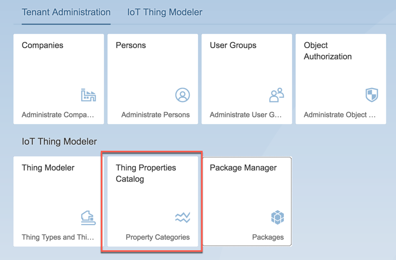

1. Click on the "**cube**" button to change package  
	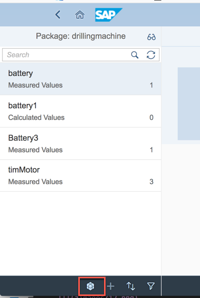

1. Search for "pw.greenhouse.pk" and you should be able to find your package named **pw.greenhouse.pkg.xx**, where **xx** must be replace with your group number. Click on your package name  
	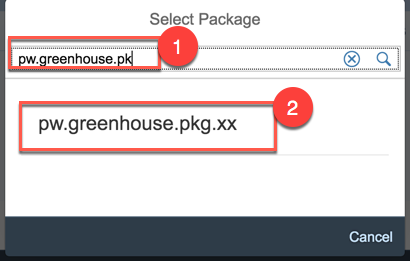

1. Once you have selected your package and you have verified that it's the correct one, click on the "**+**" symbol in the master view. This will allow you to create a new property set  
	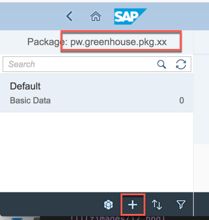

1. Enter 

	| Parameter | Value|
	| --- | --- |
	| Name | sg\_climate\_ps\_xx |
	| Description | Small Greenhouse Climate Property Set XX |
	| Property Set Category | Measured Values |

	(remember to replace **xx** with your group number) and click **Save**  
	

1. A new property set has been added. Keeping it selected, click on the "**+**" symbol in the **Measured Values** section  
	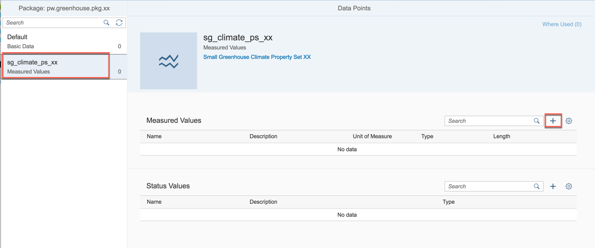

1. Enter the following values and click **OK**

	| Parameter | Value|
	| --- | --- |
	| Name| temperature |
	| Unit of Measure | °C |
	| Type | Float |
	| Thresholds | - select all thresholds options - |
	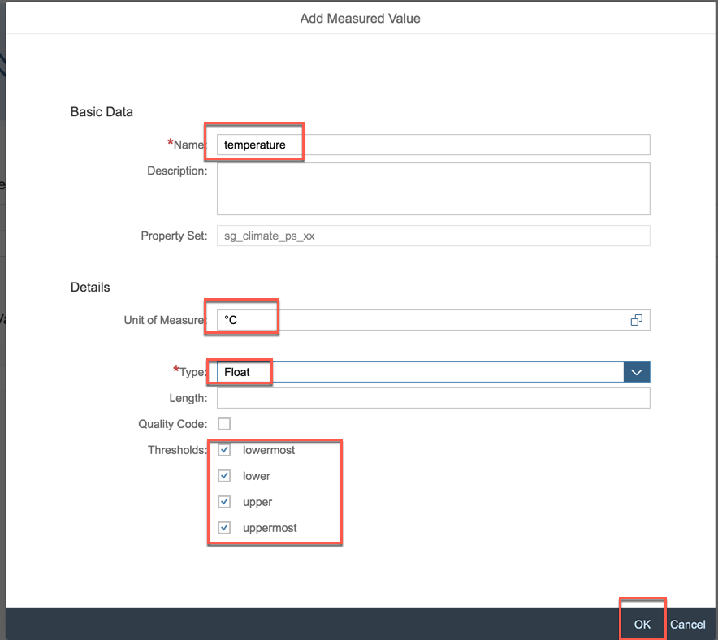

1. Click again on the "**+**" sign to add a couple of other measures. Add the humidity with these parameters and click **OK**

	| Parameter | Value|
	| --- | --- |
	| Name| humidity |
	| Unit of Measure | % |
	| Type | float |
	| Thresholds | - select all thresholds options - |
	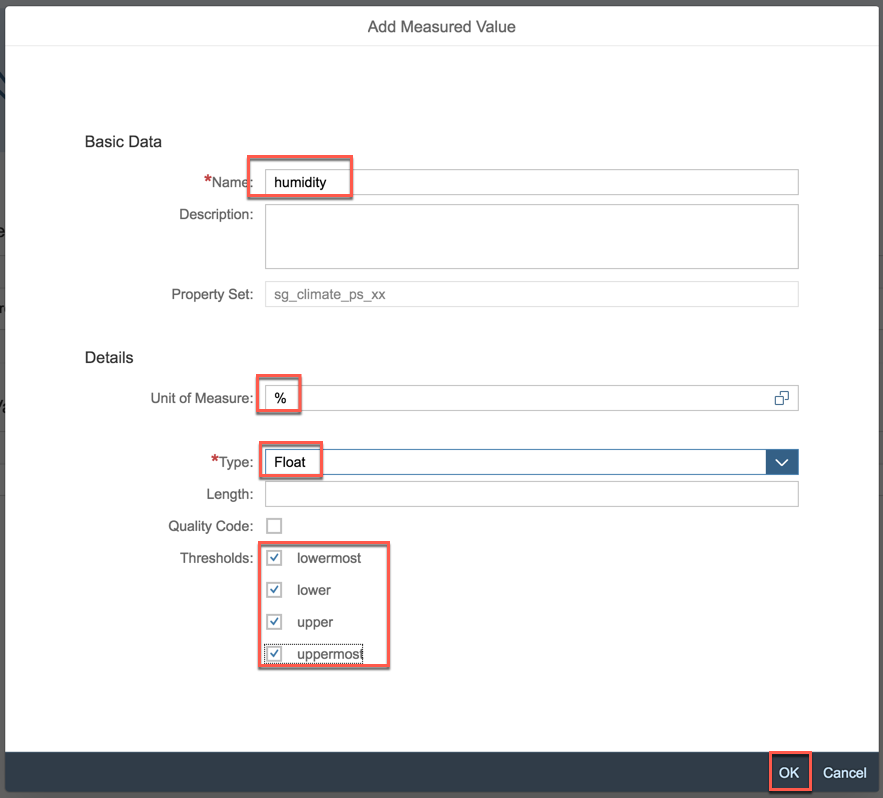
	
1. Add the light with these parameters and click **OK**

	| Parameter | Value|
	| --- | --- |
	| Name| light |
	| Unit of Measure | CD |
	| Type | Integer |
	| Thresholds | - select all thresholds options - |
	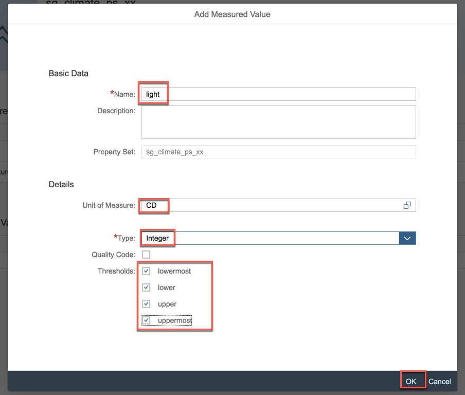

1. In the Status Values section click on the **+** symbol  
	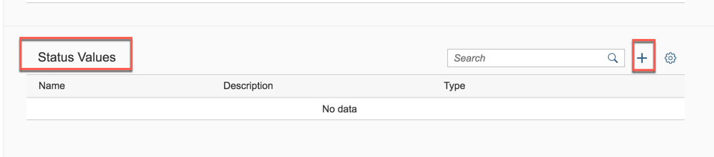

1. Add the property **door\_closed** (it will have automatically "boolean" as type) and click **OK**  
	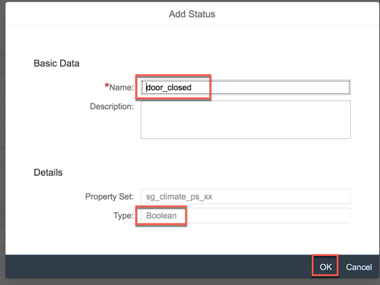

1. At the end you should have the following situation: click on the **Save** button and you should receive a message "Property set was saved"  
	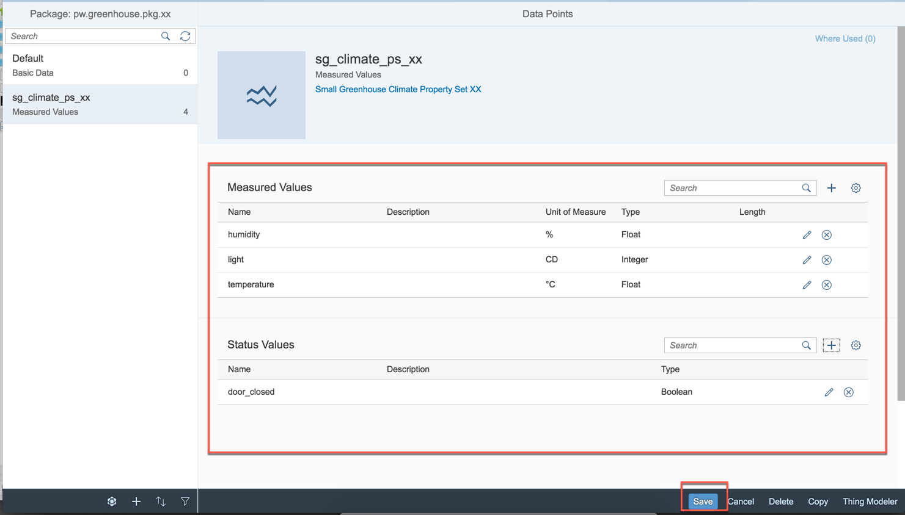

1. Let's set a couple of properties even for the Default Property set containing some Basic Data. Select it and click on the **+** sign to add a new property  
	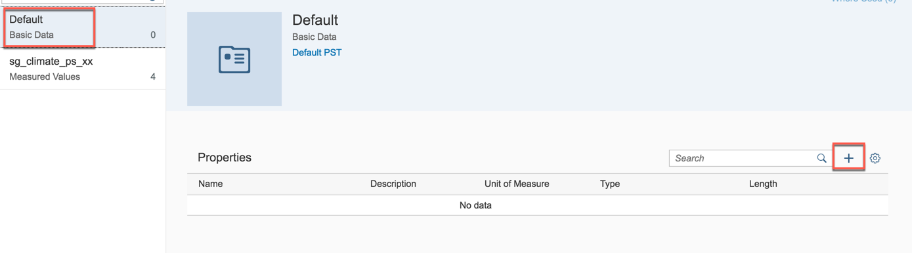

1. Enter 

	| Parameter | Value|
	| --- | --- |
	| Name| model |
	| Type | String |
	| Length | 16 |
	
	and click **OK**  
	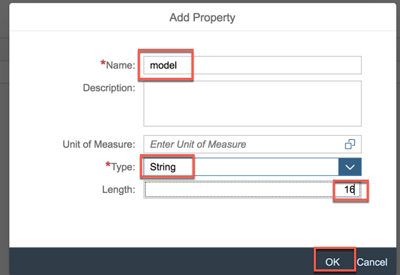

1. Add another property named **serial**  

	| Parameter | Value|
	| --- | --- |
	| Name| serial |
	| Type | String |
	| Length | 16 |
	
	and click **OK**. These two property could be used for example to host the model and the serial numbers of the greenhouse thing  
	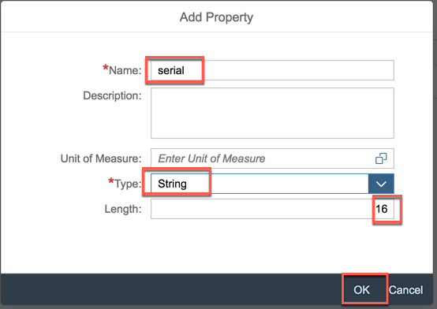

1. Once the properties have been added click on **Save**  
	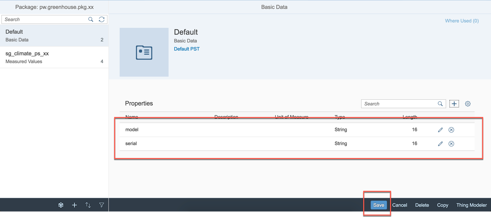

1. At the end you should get the following situation  
	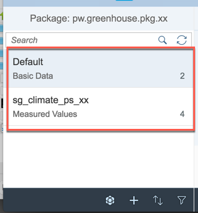

1. Click on the **Thing Modeler** button  
	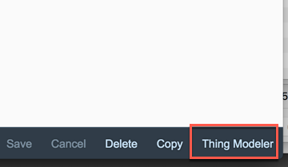
	
1. Make sure you are in the right package, **pw.greenhouse.pkg.xx** where **xx** is your group number, select the **Thing Types** tab in the master view and click on the "**+**" sign  
	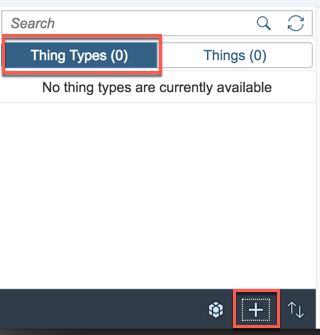

1. Enter

	| Parameter | Value|
	| --- | --- |
	| Name| small\_greenhouse\_tt\_xx |
	| Description | Small Greenhouse Thing Type xx |

	where **xx** must be replaced with your group number, and click **Save**  
	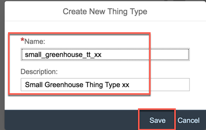

1. Select the **Basic Data** tab and click on the "**+**" to add a new Property Set to this Thing Type  
	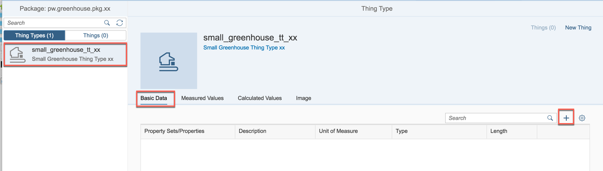

1. Select the default property set and click on **OK**  
	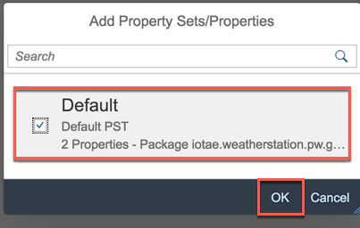

1. The Default property set has been added to the Basic Data of this Thing Type  
	

1. Select the **Measured Values** tab and click on the "**+**" to add a new Property Set to this Thing Type  
	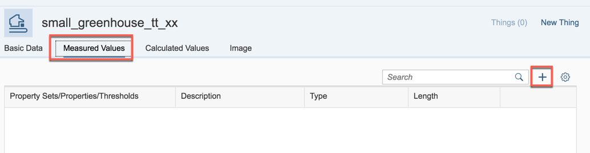

1. Locate the property set you have defined earlier, select it by the checkbox and click on **OK**  
	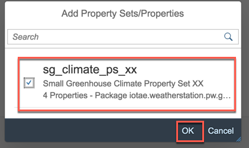

1. All the propeties you defined earlier are automatically added  
	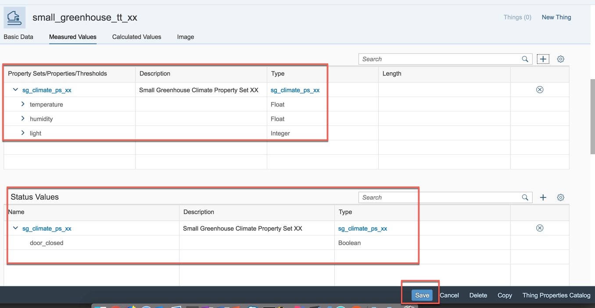

1. Take an image for your greenhouse by searching it on the web or by right clicking on this [small\_greenhouse.jpg](files/small_greenhouse.jpg) link and saving the image on your machine

1. Click on the **Image** tab and press "**+**" to add a new image  
	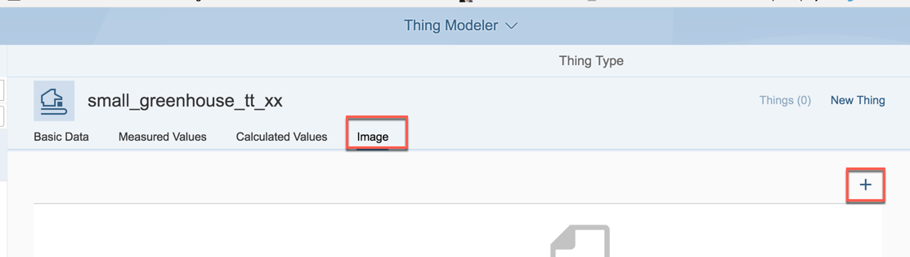

1. Browse for the desired image and add it to the Thing Type  
	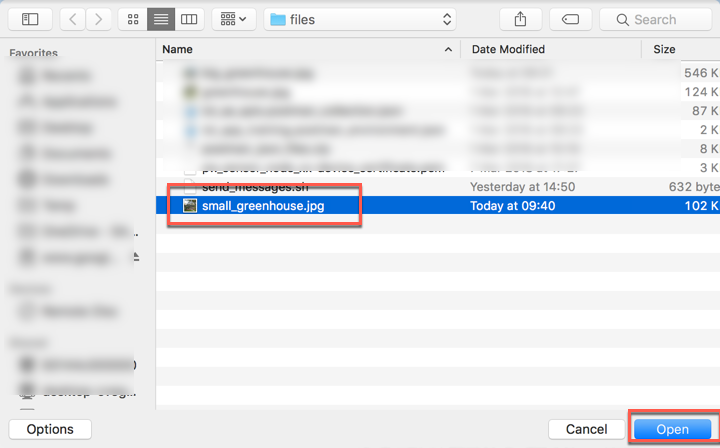

1. The image has been successfully added.  
	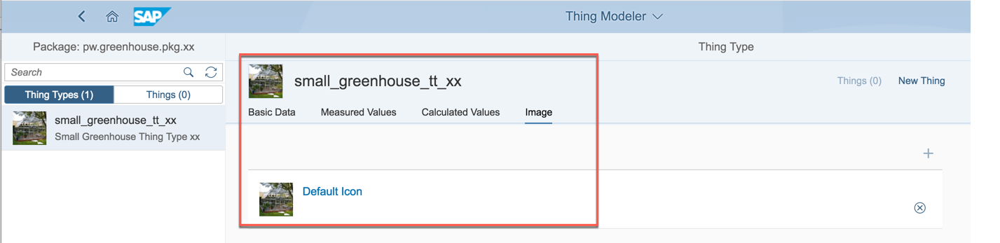


### <a name="create-thing"></a> Create a Thing
In this section you are going to learn how to create a Thing using the SAP IoT AE UI. The Thing is based on the Thing Type you created earlier. Then you will learn how to use the Thing Modeler to create thresholds for temperature and finally how to update the location of the Thing with Postman. This step is required to give this thing a location so it can show up on a map in the UI correctly.

1. Keeping the **small\_greenhouse\_tt\_xx** Thing Type selected, click on the **New Thing** button on the top right corner. This will create a new thing based on the Thing Type you have chosen  
	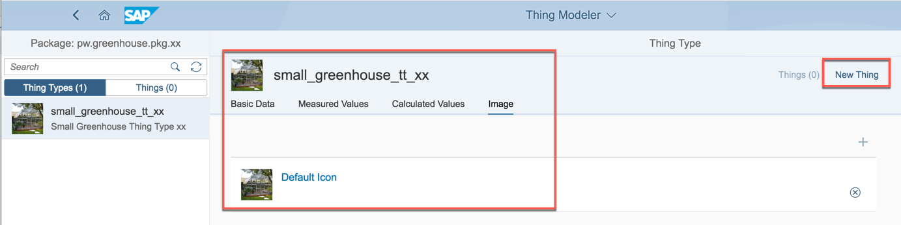

1. Enter

	| Parameter | Value |
	| --------- | ----- |
	| Name | small\_greenhouse\_xx |
	| Description | Small Greenhouse xx |
	| Authorization Group | the one starting with "6b569" |
	| Provider | None |
	
	then click on **Save**
	>NOTE: Set first the **Provider** field to **None** so that all other unnecessary fields will go away.  
	
	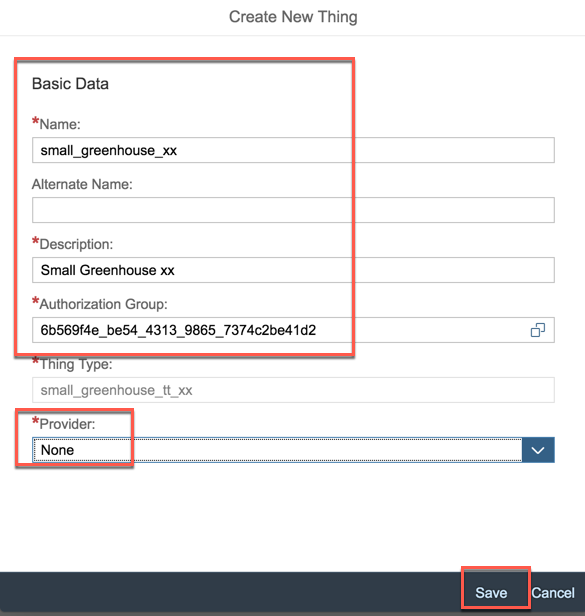

1. You will get a popup window informing you that a new thing has been created. Please note down in a text editor the **Thing ID**, because it will be required later. Click on **OK**  
	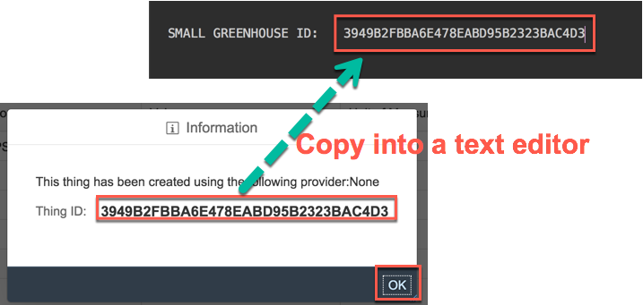

1. This is your new Thing based on the specified Thing Type  
	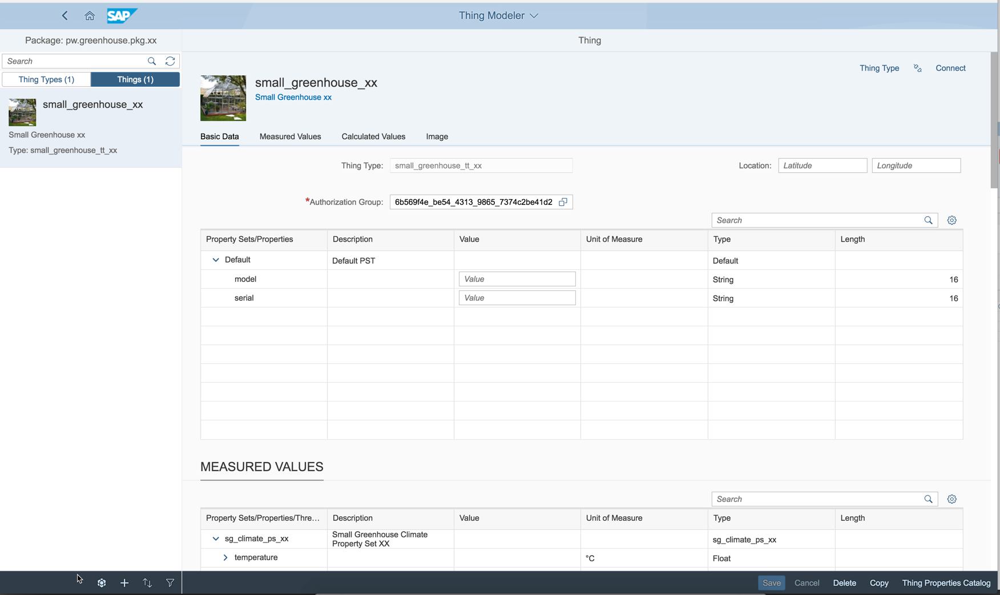

1. Switch to the **Measured Values** tab, expand the temperature property and enter **[1,10,30,45]** for the 4 thresholds values; then click **Save**  
	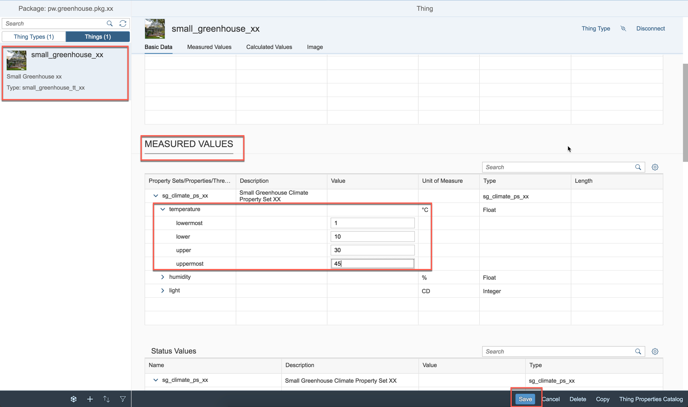


### <a name="create-device-model"></a> Create the device model
The created Thing, in order to work properly, needs to be attached to a device. We don't have yet this device so in this chapter we are going to create it in the IoT Service cockpit, together with a sensor and some properties.

1. With Chrome, navigate to the **IoT Service cockpit** address provided by your instructor and login with the related credentials  
	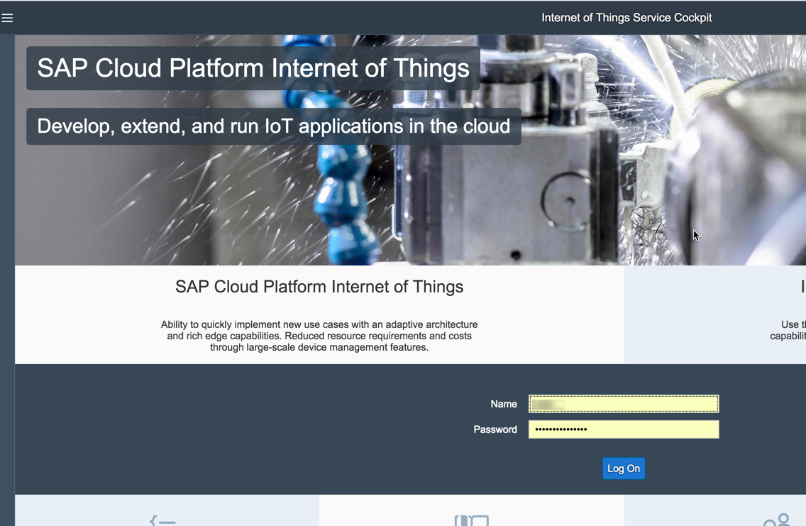

1. Select **Capabilities** and click on the **+** sign to create a new Capability  
	

1. Enter the same name you used for the property set when you created your Thing. If you don't do this, then you won't be able to attach your thing with the device, because the metching will not be possible. If you have followed the naming convention used in this exercise, this name should be **sg\_climate\_ps\_xx** where xx must be replaced with your group number. Then click on the **+** sign to create a new property  
	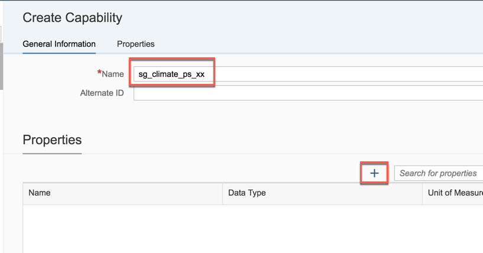

1. Enter

	| Property Name| Property Data Type |
	| --------- | ----- |
	| temperature | float |

	and click again on the **+** sign to add again a new property  
	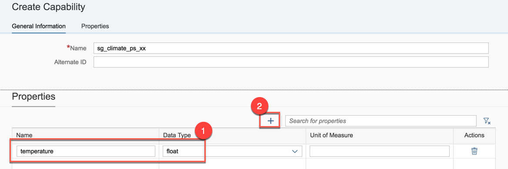

1. Enter the following set of new properties and click on **Create**

	| Property Name| Property Data Type |
	| --------- | ----- |
	| temperature | float |
	| humidity | float |
	| light | integer |
	| door\_closed | boolean |
	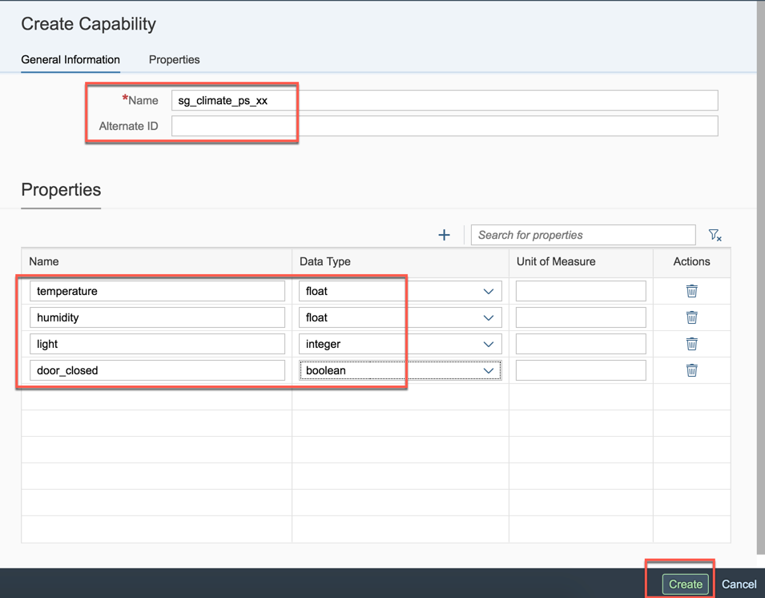

1. Select the **Sensor Types** item in the left-hand menu and click on the **+** sign to create a new sensor type  
	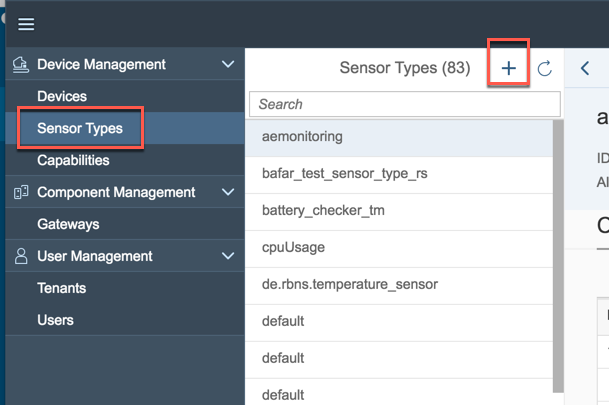

1. Enter "**sg\_climate\_st\_xx**" for the **Name** and click (remember to replace **xx** with your group number) and click on the **+** sign to add a new capability  
	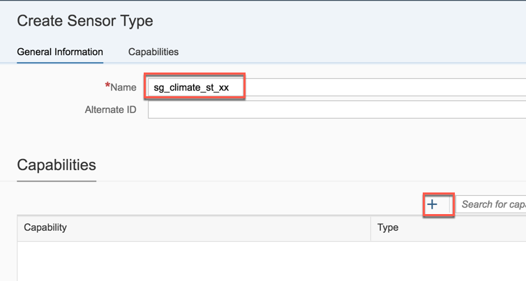

1. Select the "**sg\_climate\_ps\_xx**" capability you have created earlier and set "measure" as its Type. Then click on **Create**  
	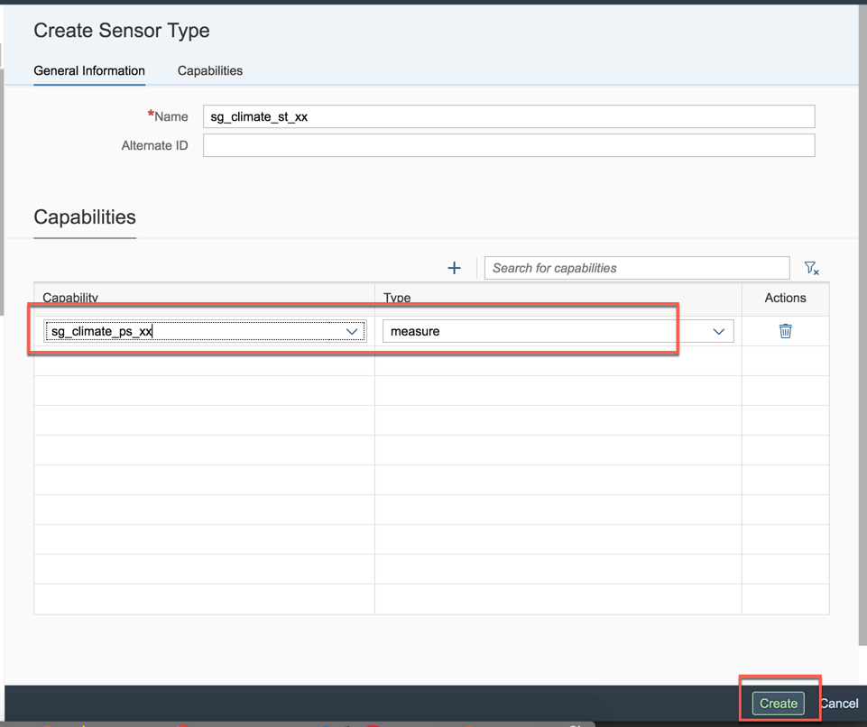

1. On the left-hand menu, select **Devices** and click again on the **+** sign to create a new Device  
	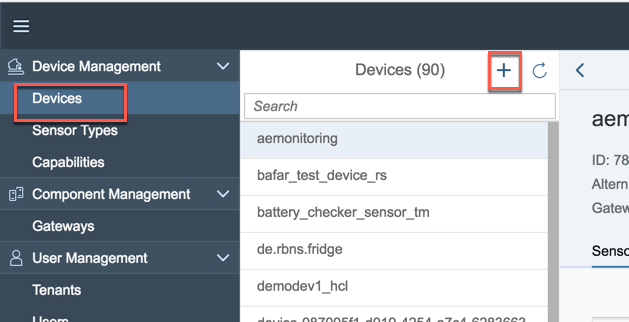

1. Enter the following properties and click on **Create**

	| Parameter| Value |
	| --------- | ----- |
	| Name | sg\_climate\_dev\_xx (remember to replace **xx** with your group number)|
	| Gateway | REST Network |
	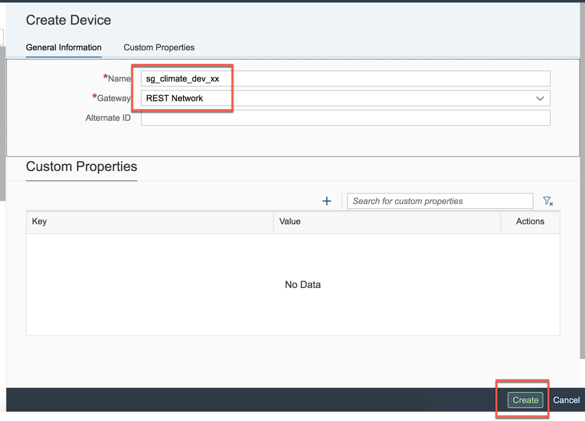

1. Select the **Sensors** tab and click on the **+** sign to add a new sensor  
	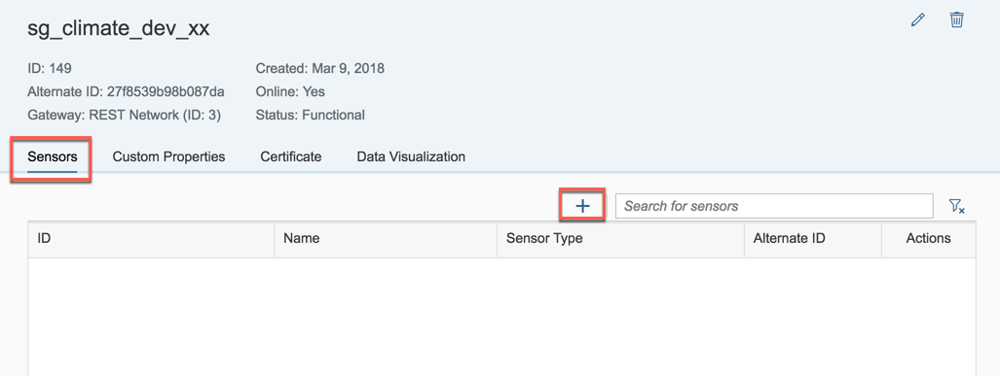

1. Enter the following properties and click on **Add**

	| Parameter| Value |
	| --------- | ----- |
	| Name | sg\_climate\_sens\_xx |
	| Sensor Type | sg\_climate\_st\_xx |
	(remember to replace **xx** with your group number)
	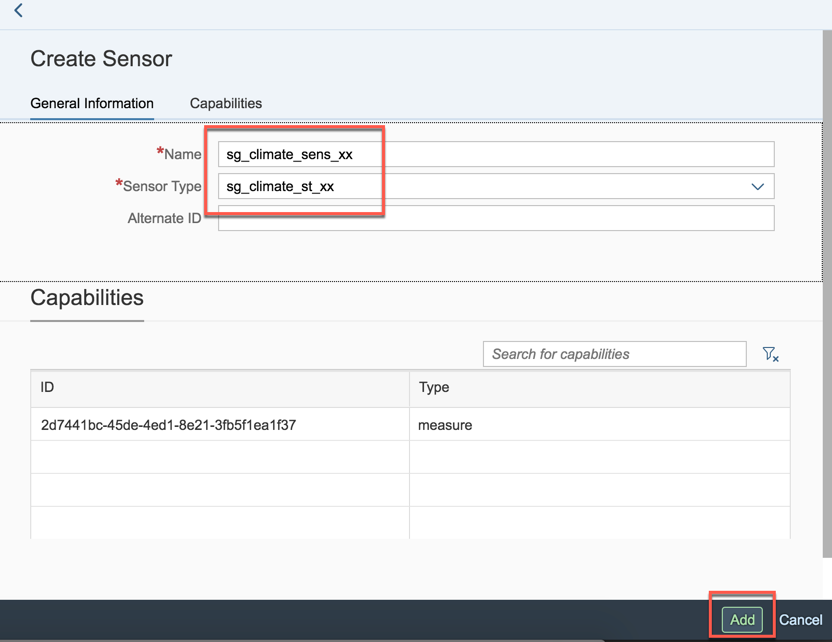

1. Your device has been successfully created.  
	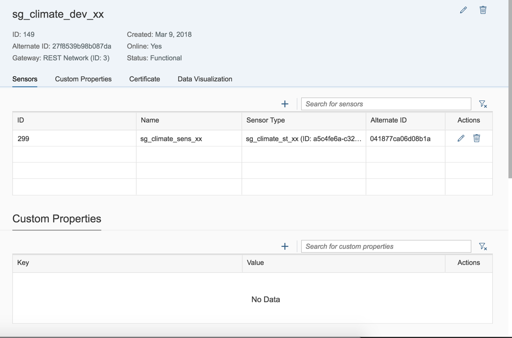


### <a name="connect-thing-with-device"></a> Connect the thing with the device
We can now connect the Thing with the created device.

1. Go back to the **IoT Application Enablement cockpit**, select the "**small\_greenhouse\_xx**" thing, where **xx** must be replaced by your group number, from the Thigs tab and click on the **Connect** button on the top right corner  
	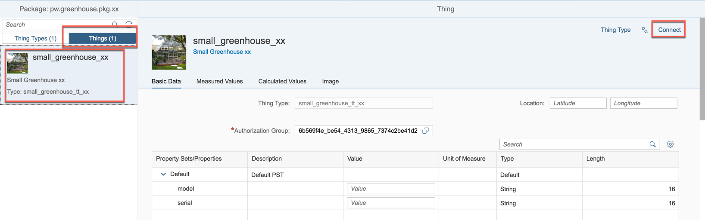

1. First set the **Device ID** by clicking on the drop down menu  
	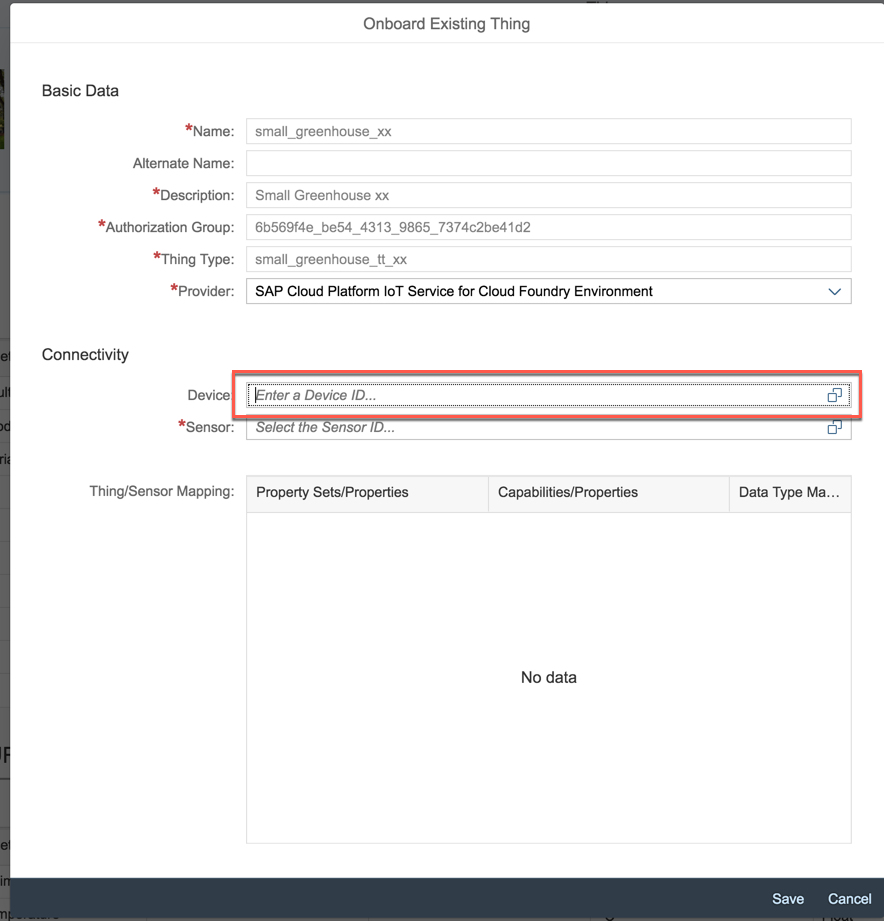

1. Enter **sg\_** to filter the device list and select the device **sg\_climate\_dev\_xx** you created previously (**xx** is your group number)  
	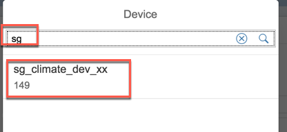

1. Then select the **Sensor**  
	

1. It should appear automatically because related to the selected device. Click on the proposed sensor  
	

1. As soon as both Device and Sensor are specified, the matching between Thing Property Set and Sensor Capability is performed. If you have properly followed the exercise, the matching should be successful: all the squares in the Data Type Matching column on the right should be green. Click on **Save**  
	

1. A summary of the preformed matching is displayed. Click **OK**  
	

1. Congratulations! You have successfully connected your thing with a device.


### <a name="postman"></a> Set up Postman to call APIs
In order to perform this step you need to have Postman Interceptor installed in your Chrome browser. You should have already installed it if you have followed the prerequisites to this execises series. However, for your comfort, we are adding here the required steps to do it: so if you have not done it yet, do it right now. 

1. Open Chrome and navigate to <https://chrome.google.com/webstore/search/postman%20interceptor> and select the **Postman Interceptor** tool  
	

1. Click on **ADD TO CHROME**  
	

1. Download the zip file [postman\_json\_files.zip](files/postman_json_files.zip) and extract it in a proper location on your machine

1.	Open Postman from <chrome://apps/>  
	

1.	Click on **Import**  
	

1.	Import the two json files you have extracted from the *postman\_json\_files.zip* file  
	
	 
1. You should receive a couple of confirmation messages that the import was successful  
	

1.	Select the **wdiot1** environment on the upper right corner, press the **Eye** icon, and click on **Edit**  
	

1.	Change the

	| Parameter | Value|
	| --- | --- |
	| number| xx |
	| packageId | pw.greenhouse.pkg.xx (this is the name you used earlier)|
	 
	where **xx** is your group number. Then click on **Update**  
	

1. Close the popup window from the top right corner  
	
	
1. Make sure that the **Postman Interceptor** is enabled  
	

1.	On the left-hand side, select **01 Thing Configuration -> Read configuration**. A new tab opens up on the right-hand side containing a GET request to read the package configuration. Some of the variables in the URL request will be replaced by the corresponding ones in the environment you have configured before. Click on **Send**  
	

1. You shoudl get a JSON file with all the details about your package configuration  
	

1. If the response you get is only an HTML file, it means that there is something wrong. Please check that your Postman Interceptor is enabled and try by signing in again to the Weather Station on Chrome with your credentials  
	

1. In the "**wdiot1 iotae apis**" collection, click on **Thing Onboarding -> Fetch csrf token**. Click **Send** and you should receive a "**200 OK**" status code with some JSON in the response body  
	

1. On the top right corner, be sure to have the **wdiot1** environment selected, click on the **eye** button and then on **Edit**  
	

1. Replace the field **yourthingId** with the **Thing ID** you received when you created the thing. Make sure that a **x-csrf-token** has been created and click on **Update**  
	

1. Close the popup window  
	

1. Now that we have set the Thing ID in our environment and that we have get a valid **x-csrf-token**, we are ready to create a location for that thing. In the same collection, click on **Thing Onboarding -> Create Location**. Switch to the **body** tab and take a look to the location you are going to create  
	

1. If you want you can go to the website <https://www.latlong.net> and find your own location, copy and paste the latitude and longitude in this JSON body and fill the other location details  
	

1. When finished changing your location click on **Send**  
	

1. The location is created. You should receive a "**201 Created**" message. Note down the **location ID** you received in the headers  
	

1. Go to the **Thing Onboarding -> Read the created thing**, click on **Send** and copy in the clipboard the entire response body. In this way we are copying the Thing's metadata, we will use this in the next step  
	

1. Go to the **Thing Onboarding -> Update Thing (incl. location)**, delete the current **body** content and paste the one you have in memory, copied in the previous step  
	

1. Just above the "\_objectGroup" property, add the line `"_location":"<location_ID>",` where **\<location\_ID\>** must be replaced by the location ID you got in the headers when you created the location (you should have noted down this ID already). Then click **Send** and check that you have received a "**201 Created**" message  
	

1. Go to the **Thing Onboarding -> Read the created thing**, click on **Send** and check that the thing has been updates with the new **\_location** property  
	

1. The same information can be now read in the IoT Application Enablement cockpit  
	
	
1. Congratulations! You have successfully updated your Thing by using Postman REST Client.


### <a name="build-app"></a> Build a SAPUI5 app with SAP Web IDE
In this section you will build a simple SAPUI5 app which allows you to monitor your greenhouses (in this case you have only one) and examine data its connected sensors generate.

1. Open **SAP Web IDE** using the URL provided by your instructor and logon using the related credentials  
	

1. You get the Home page of your Development Environment  
	

1. Click on the small gear on the left toolbar, select **Features**, type "iot" in the search box, locate the **IoT Application Enablement** plugin and **enable** it; then click on **Save**  
	

1. You will be requested to restart SAP Web IDE; click on **Refresh**  
	

1. From the main menu select **File -> New -> Project from Template**  
	

1. Browse for the Category "Internet of Things", select the **IoT Application** tile and click **Next**  
	

1. Enter the following information and click **Next**

	| Parameter | Value|
	| --- | --- |
	| Package Name| greenhouse\_xx |
	| Namespace | com.greenhousexx |
	| Title | Small Greenhouse Application |

	(remember to replace **xx** with your group number)  
	

1. Select the Service "**IOTAS-ADVANCEDLIST-THING-ODATA**" and browse for the **Property Sets**  
	

1. Open the drop down list  
	

1. Enter "pw.greenhouse.pk" in the searchbox and select the Thing Type you have created earlier. You need to choose the one with your group number. Then click **OK**  
	

1. Select all the common property sets and click **OK**  
	

1. Once you have specified Service and Property Sets click **Next**  
	

1. Click **Next**  
	

1. Click **Next**  
	

1. Click **Next**  
	

1. Click **Next**  
	

1. Click **Finish**  
	

1. The application is created. Expand the *webapp* folder and select the *index.html* file; then click on the **Run** button on the toolbar to execute your application  
	

1. The application is executed. You should be able to see your Thing on the left side and a map showing its location on the right  
	

1. Click on the pin point on the map and then on **Analysis Page**  
	

1. The Analysis Page is shown, but at moment there are no data. We will see in the next step how to load data in the app  
	

1. Congratulations! You have successfully created a SAPUI5 application to analyze IoT data!


### <a name="generate-certificate"></a> Generate the device certificate
Before we can send some data to the device we need to establish a connection with it in Postman. For this we need to use a special certificate provided by the device itself in the IoT Service cockpit

1. Go to your IoT Service cockpit and login with your credentials  
	

1. Select Devices, type "sg" in the search box, select your device **sg\_climate\_dev\_xx** (where **xx** is your group number), select the "Certificate" tab and click on **Generate Certificate**  
	
	
1. Select "**p12**" as Certificate Type and click **Generate**. The certificate will be generated and you will receive a prompt to save the file on your disk. Please keep in mind where you put it, since it will be required in the next section  
	

1. Write down the Secret Key you received and click **OK**  
	

1. If you forgot where you saved the certificate, you can click on the small down arrow beside the downloaded file in the Chrome status bar and select Show in Finder(MAC) or View in Explorer (WIN).  
	


### <a name="install-certificate"></a> Install the certificate
At this point we need in some way to install the certificate we have downloaded in your system so that it can be used by a REST client like POSTMAN. We are going to illustrate here two distinct procedures for installing this certificate, one for Windows and another for MAC.

#### --- Windows Users ---

1. Open Chrome browser and go to <chrome://settings>  
	

1.	Search for SSL in search text field: you get **Manage HTTPS/SSL certificates and settings**. Click on this link  
	

1.	Once in the certificate manager, go to the **Personal** tab and click on **Import...**  
	

1.	**Certificate Import Wizard** will be opened: click on **Next**  
	

1.	Browse to folder where you have saved the p12 certificate and choose "All Files (*.*)" in the file extension drop down list  
	

1.	Select the certificate and click **Open**  
	

1.	Enter the **secret key** you obtained while downloading device certificate and noted down in a text editor; then click **Next**  
	

1. Click **Next**  
	

1.	Finally, click on the **Finish** button  
	

1.	You should receive the information that the import was successful.  
	


#### --- MAC Users ---

1. Open the **Keychain** utility and select **File -> Import Items...**  
	

1. Locate the p12 certificate you downloaded earlier  
	

1. Enter your MAC credentials if required  
	

1. Enter the **secret key** you obtained while downloading the certificate and noted down in a text editor; then click **OK**  
	

1. The certificate is imported, but it's not yet trusted. You can see a message saying that this certificate was signed by an unknown authority. Double click on the certificate  
	

1. In the **Trust** section choose **Always Trust** for the parameter "When using this certificate"  
	

1. Enter your MAC credentials if required and click **Update Settings**  
	

1. The certificate is now successfully imported and trusted  
	


### <a name="send-data-with-postman"></a> Send some data using Postman and analyze sent data
As final step for this exercise we can send some data to the device using Postman, to see if data is really visible in the SAPUI5 application. Of course this is just a simulation because real data should come to the device from the sensors, but since we don't have physical sensors, we can simply emulate them using REST requests.
However before we can proceed, we need to gather some information from the IoT Services cockpit. What we need is the Device Alternate ID, the Capability Alternate ID and the Sensor Alternate ID of our IoT configuration.

1. Go to the IoT Services cockpit and select **Devices** on the left-hand menu. Filter for your device and select it. On the right page you can read the **Device Alternate ID** in the header and the **Sensor Alternate ID** in the detail row. Note down these two IDs  
	

1. Now switch to Capabilities, filter for your capability and get on the right side the **Capability Alternate ID**. Note down this ID  
	

1. Now, open Postman and **disable** the Postman Interceptor  
	

1.  Create a new request specifying the following configuration:

	- Method: **POST**
	- URL: `https://<host_name>/iot/gateway/rest/measures/<device_alternate_ID>`
	- Click on the Body tab and select the **raw** with **JSON** format
	- In the body section enter the following JSON code
	
	```json
	{
	    "capabilityAlternateId":["<capability_alternate_ID>"],
	    "sensorAlternateId":"<sensor_alternate_ID>",
	    "measures":[{"temperature":25,"humidity":71}]
	}
	```
	
	Of course, you need to replace **\<device\_alternate\_ID\>**, **\<capability\_alternate\_ID\>** and **\<sensor\_alternate\_ID\>** with the values gathered earlier. When finished press the **Send** button  
	

1. Select the right certificate (the right one should be the one with the same your Device Alternate ID) and click **OK**  
	

1. You should receive a successful response from the server with a status code of "**200 OK**"  
	

1. Keep changing measures data in the request body and sending them again. Do it for 5 or 6 times with an interval of 1 or 2 minutes from each other  
	

1. Go back to your SAP Web IDE application. Run the application again or refresh the page if already open. Click on **Measured Values**  
	

1. Select just **temperature** and **humidity** and click **OK**  
	

1. Switch to the **1 Hour** tab and you should be able to see data in the application  
	

1. You can also resize the time range using the slide control at the bottom of the page  
	

1. If you want you can now enable also the other measures. Notice the flag **door\_closed** shown as a filled blue bar  
	

1. Congratulations! You have successfully sent some sensor data with Postman and analyzed them with the SAPUI5 application in SAP Web IDE.


### <a name="freestyle-app"></a> OPTIONAL - Build a freestyle SAPUI5 Application
This is an OPTIONAL part of the exercise. There is another way to create an IoT application with SAP Web IDE, which is to use the Freestyle IoT Application template. With this template you are free to adjust the application layout and behaviour as you wish using some built-in components. 

1. Open SAP Web IDE and from the main menu select **File -> New -> Project from Template**  
	

1. Browse for the **Internet Of Things** Category and select the **Freestyle IoT Application** template; then click **Next**  
	

1. Enter the following information and click **Next**

	| Parameter | Value|
	| --- | --- |
	| Package Name| greenhouse\_fs\_xx |
	| Namespace | com.greenhouse.fsxx |
	| Title | Small Greenhouse Freestyle Application |

	(remember to replace **xx** with your group number)  
	

1. Select the Service "**IOTAS-ADVANCEDLIST-THING-ODATA**" and browse for the **Property Sets**  
	

1. Open the drop down list  
	

1. Enter "pw.greenhouse.pk" in the search box and select the Thing Type you have created earlier. You need to choose the one with your group number. Then click **OK**  
	

1. Select all the common property sets and click **OK**  
	

1. Once you have specified Service and Property Sets click **Next**  
	

1. Select the **3 Column Layout** and click **Finish**  
	

1. You will get the Freestyle Application Storyboard. Double click on the tile in the middle of the screen  
	

1. The layout editor appears  
	

1. From the left-hand toolbar drag & drop on the 3 columns the following components in sequence: **ThingList**, **Gauge** and **SensorChart**  
	

1. Select the first column and from the **Events** tab on the right-end side click on the **Row Select** drop down list, choosing **Wire to Action**  
	

1. Enable the **doReload** action for both the **IoTGauge** and the **IoTChart** and click **OK**  
	

1. At the end you should have this screen  
	

1. Now select the **Gauge**, go to the **Properties** tab and click on the **Entity Set** drop down list  
	

1. Choose **Define dummy entity set for the selected control...** and select **/Things** as the Entity Set; then click **OK**  
	

1. Now that you have defined **/Things** as the Entity Set, click on the **Value** drop down list  
	

1. Double click on the **sg\_climate\_ps\_xx.temperature (double)** property, so that it will be added to the right side, then click **OK**  
	

1. The application is ready to be tested. Click on the **Run** button on the top toolbar  
	

1. The application is executed. Select the Thing on the left column and click on the **...** button on top of the last column. Choose a small interval like **12 Hours** or **1 Hour** (this will enable you to see data you have sent some minutes ago) and click on **Measured Values**  
	

1. Select a couple of properties like **temperature** and **humidity** and click **OK**  
	

1. Data are displayed on the third column  
	

1. Congratulations! You have successfully created a SAPUI5 IoT app using the Freestyle IoT Application template.


## Summary
You have completed the exercise!
 
You are now able to: 

* create Packages, Thing Types and Things to model your IoT world
* connect these Things to IoT devices
* create a SAPUI5 Application for IoT using one of the SAP Web IDE templates
* simulate data transmission using Postman
* analyze collected data within the SAPUI5 application


Please proceed with next exercise.
