<table width=100% border=>
<tr><td colspan=2><h1>EXERCISE 06 - ML Use Case 1 - Pretrained service consumption</h1></td></tr>
<tr><td><h3>SAP Partner Workshop</h3></td><td><h1> &nbsp;30 min</h1></td></tr>
</table>


## Description
In this exercise, you’ll learn how 

* to import a project into SAP Web IDE Full-Stack
* to setup the development environment
* to use SAP Leonardo ML Image Classification with SAPUI5

## Target group

* Developers
* People interested in SAP Leonardo and Machine Learning 


## Goal
The goal of this exercise is to import an already preconfigured project in SAP Web IDE Full-Stack, which will be used in the next exercises.
You will learn how to quickly integrate the Image and Product Image Classification SAP Leonardo Machine Learning Functional Services published from the SAP API Business Hub sandbox in a SAPUI5 application.


## Prerequisites
  
Here below are prerequisites for this exercise.

* A trial account on the SAP Cloud Platform. You can get one by registering here <https://account.hanatrial.ondemand.com>
* Previous exercise
* Download the following file from here [MLFSAPUI5\_Project\_Exercise.zip](files/MLFSAPUI5_Project_Exercise.zip) and save it in a proper location: it will be used later in this document


## Steps
1. [Authorization](#authorization)
1. [Setup the Development Environment](#setup-dev-env)
1. [Use SAP Leonardo ML Image Classification with SAPUI5](#image-classification)
1. [Adjust the prepared SAPUI5 application to access your ML foundation services](#adjust-app)


### <a name="authorization"></a> Authorization
We created a user for you that you will use to logon to 
-	SAP API Business Hub (http://api.sap.com) 
-	SAP Cloud Platform (SAP CP) Cockpit (https://cloudplatform.sap.com) 
-	SAP Cloud Foundry via CF CLI 

This user should have all the necessary privileges to perform all parts of the following exercises. The username you should use is associated with your group and follows this pattern:

**ml-train+XX@sap.com** 

where **XX** needs to be replaced by your group number, e.g. if your group number is 01, then you should take the user ml-train+01@sap.com.

Please make sure that you work with the correct username to avoid conflicts with other participants. Take note of the following credentials, you will be using them during all exercises. 

|Parameter|Value                                              |
|---------|---------------------------------------------------|
|Username |ml-train+XX@sap.com                                |
|Password |\<specific to your username\> provided by the trainer|


### <a name="setup-dev-env"></a> Setup the Development Environment
For the exercises where we develop SAPUI5 and Java applications, we will work with the SAP WebIDE in SAP Cloud Platform. To save time, we prepared a project for you so that we can focus on the ML Foundation parts. This project needs to be imported into your SAP Web IDE workspace. You will extend the applications included in the project to test the SAP Leonardo ML services. 

In this chapter, you will initialize the SAP Web IDE and import the given project. It will be used later in the corresponding exercises.

Required resources for this step:

* [MLFSAPUI5\_Project\_Exercise.zip](files/MLFSAPUI5_Project_Exercise.zip)
* [MLFSAPUI5\_Project\_Solution.zip](files/MLFSAPUI5_Project_Solution.zip)

1. Open Firefox as Chrome will use SSO for SAP Employees. Login to SAP Cloud Platform Cockpit via <http://cloudplatform.sap.com>. Login with your given e-Mail 
**ml-train+XX@sap.com**, where **XX** must be replaced by your group number, and the password provided by the trainer.

	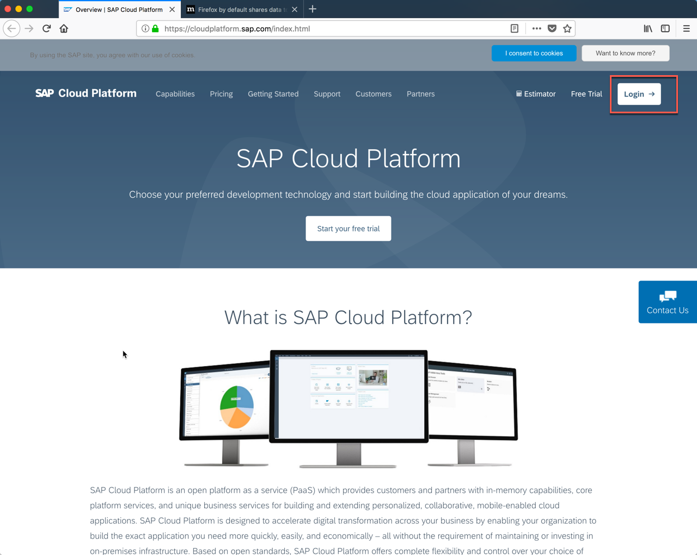

1.	Click on **Neo Trial**

	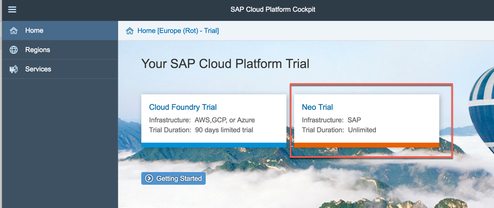

	> NOTE: The SAP Web IDE Full-Stack version is provided via the SAP CP Neo environment, but able to deploy to SAP CP Cloud Foundry and Neo. 


1.	In the left menu bar, navigate to Services and search for "web". You will get two flavours of the SAP Web IDE. We will use the **SAP Web IDE Full-Stack** version as this is the one supports SAP Cloud Foundry and Java 
	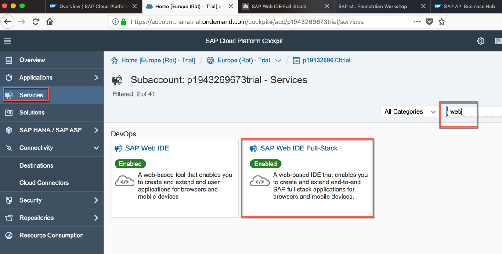

1.	Click on **Go to Service** which will open up the SAP Web IDE

	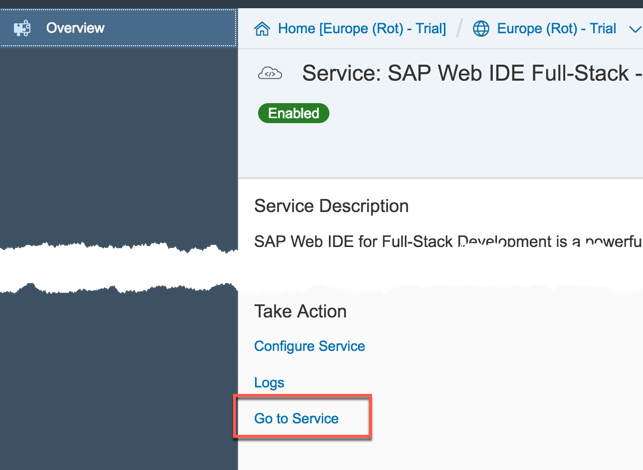

1.	From the **File** menu click on **Import -> From File System** 

	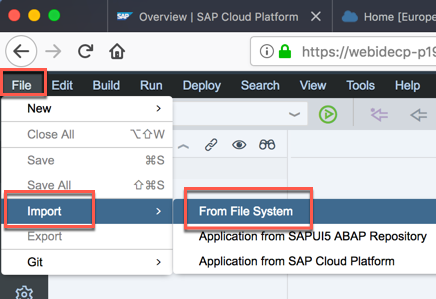


1.	Browse in your file system for the file you have already downloaded in the prerequisites section (*MLFSAPUI5\_Project\_Exercise.zip*), keep the proposed folder in the "Import to" field and click **OK**  
	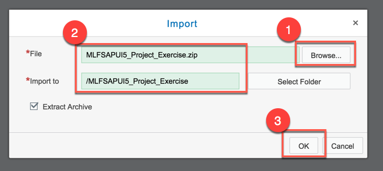

	We will need this project later in the next exercises when you develop SAPUI5 apps to call ML Foundation services

1.	Clicking on the **Development** button on the left toolbar, you should see a files and folder structure similar to the one shown on this screenshot

	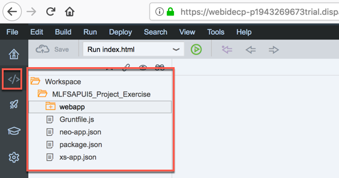


### <a name="image-classification"></a> Use SAP Leonardo ML Image Classification with SAPUI5
In this exercise you will learn how to quickly integrate the Image and Product Image Classification SAP Leonardo Machine Learning Functional Services published from the SAP API Business Hub sandbox in a SAPUI5 application. These will be the steps you will go through:

* Import a SAPUI5 application calling a REST service (see prerequisites)
* Create a destination in SCP Cockpit to your ML Service endpoint in API Business Hub
* Use the API Key for the image and product image classification from SAP API Business Hub
* Adjust your prepared SAPUI5 application
* Run the SAPUI5 application and test your ML Services.

1.	Open a new tab in your Firefox web browser and go to SAP Cloud Platform Cockpit <http://account.hanatrial.ondemand.com/cockpit>. Login in case you are not already logged in by using the given credentials and not SSO  
	
1.	Click on the **Neo Trial** tile  
	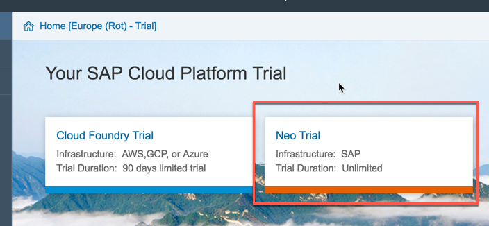
1.	On the left side bar, you can navigate to **Connectivity -> Destinations**  
	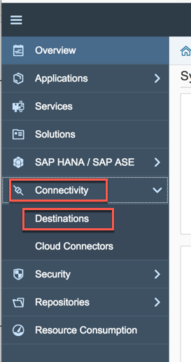
1.	Click on **New Destination**  
	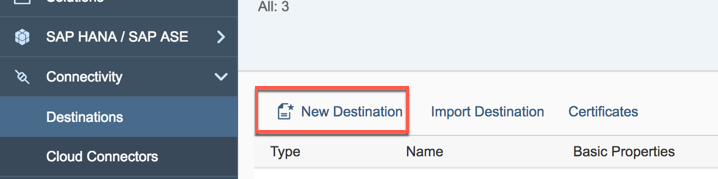
1.	Enter the following information and click on the **New Property** button   

	|Parameter|Value|
	|---------|-----|
	|Name|sapui5ml-api|
	|Type|HTTP|
	|Description|SAP Leonardo Machine Learning APIs|
	|URL|https://sandbox.api.sap.com/ml|
	|Proxy Type|Internet|
	|Authentication|NoAuthentication|

	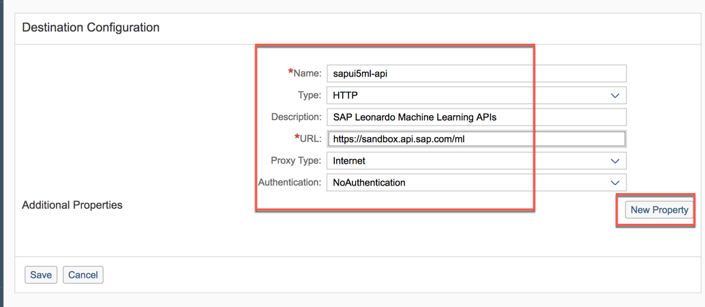

1. Add the property **WebIDEEnabled = true** to the destination and click **Save**
	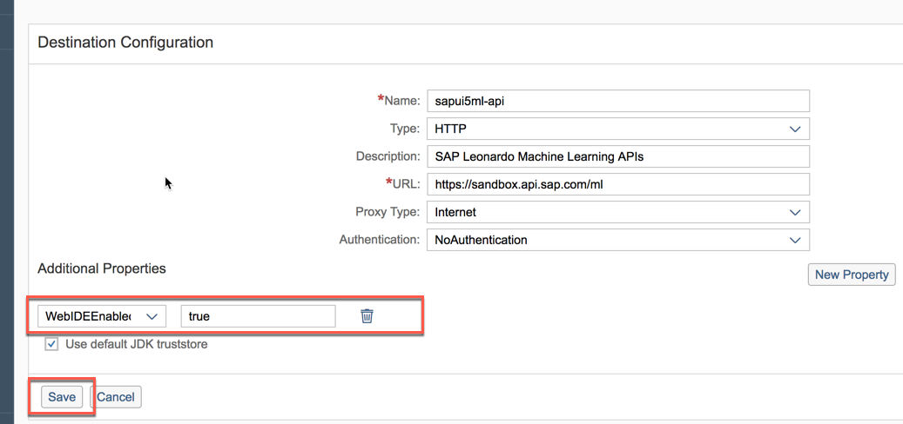
1.	You can use the **Check Connection** button to validate that the URL can be accessed. The response should be `Connection to "sapui5ml-api" established. Response returned: "404: Not Found"`  
	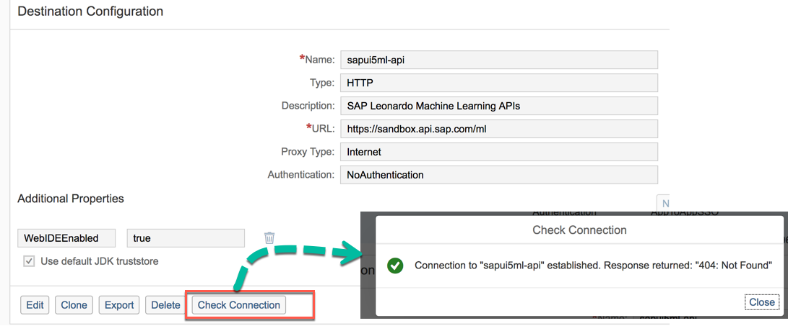


### <a name="adjust-app"></a> Adjust the prepared SAPUI5 application to access your ML foundation services
For the exercises where we develop SAPUI5 and Java applications, we will work with the SAP WebIDE in SAP Cloud Platform. To save time, we prepared a project for you so that we can focus on the ML Foundation parts. This project needs to be imported into your SAP Web IDE workspace. You will extend the applications included in the project to test the SAP Leonardo ML services. 

1.	Open your SAP Web IDE Full-Stack edition  
	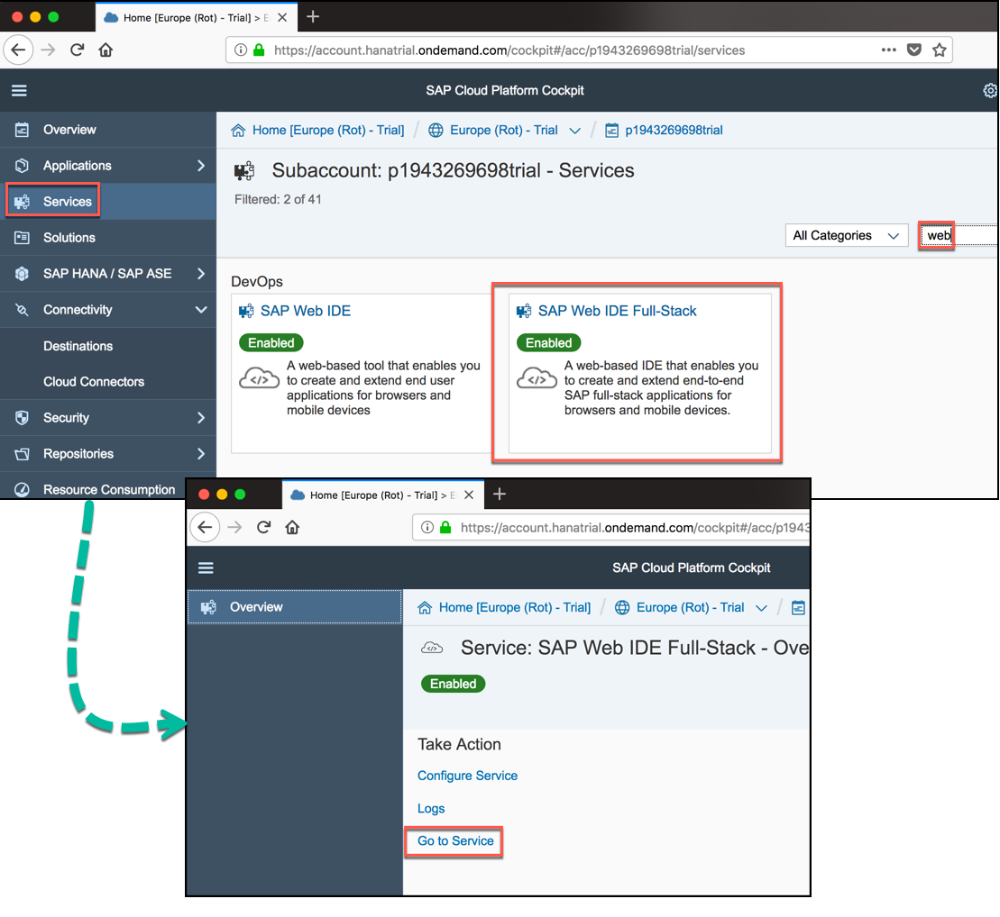
1.	Open the *neo-app.json* file located under **MLFSAPUI5\_Project\_Exercise -> neo-app.json**   
	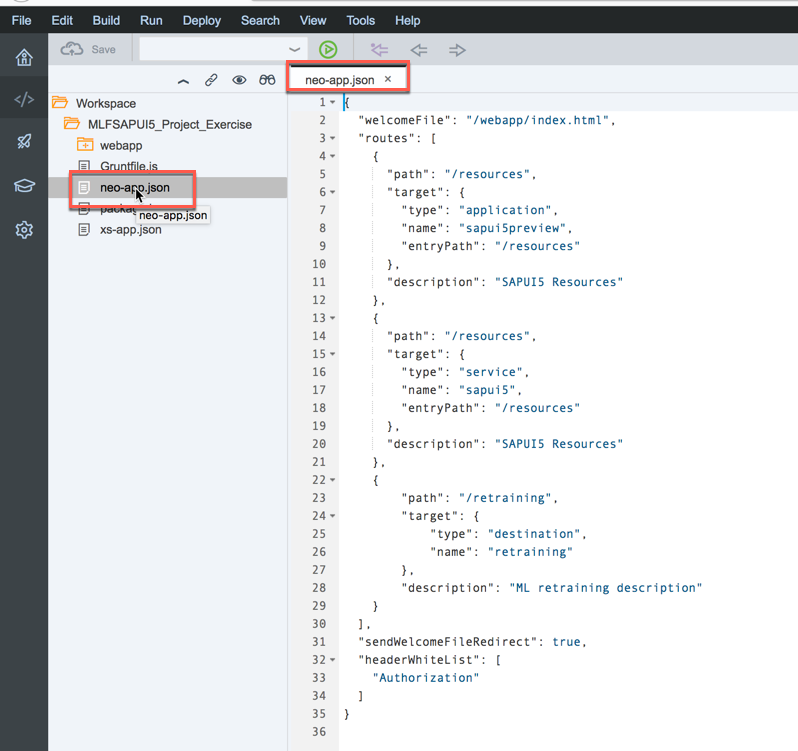
1. Add a new route to the new destination named **sapui5ml-api**, we previously created in the SAP CP cockpit. You can copy the following code into the file (pay attention to the first comma which separates this from the previous resources)

	```json
	,
	    {
	    	"path": "/ml",
	    	"target": {
	    		"type": "destination",
	    		"name": "sapui5ml-api"
	    	},
	    	"description": "ML API description"
	    }
	```

1.	Scroll to the end of the *neo-app.json* file and add the String **"APIKey",** (pay attention to include the comma) to the **headerWhiteList** section and then save the file. This is how the file should look after these operations  
	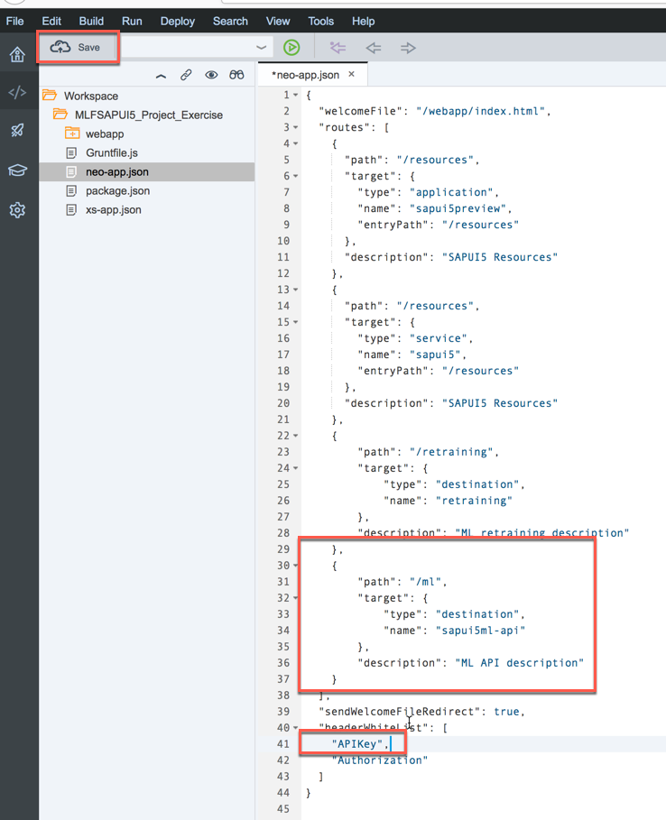
1.	Open the *settings.json* file located under **MLFSAPUI5\_Project\_Exercise -> webapp -> model** folder
	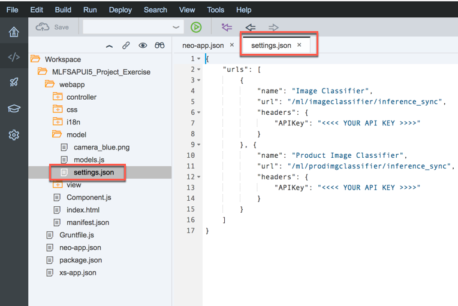
1. Before we proceed with editing the *settings.json*, we need to get the **API Key** for the ML services from the API Business Hub, explained in the next steps
1.	Go to <https://api.sap.com> and click on **Business Services**
	
1.	Then just click on **SAP Leonardo Machine Learning - Functional Services**
	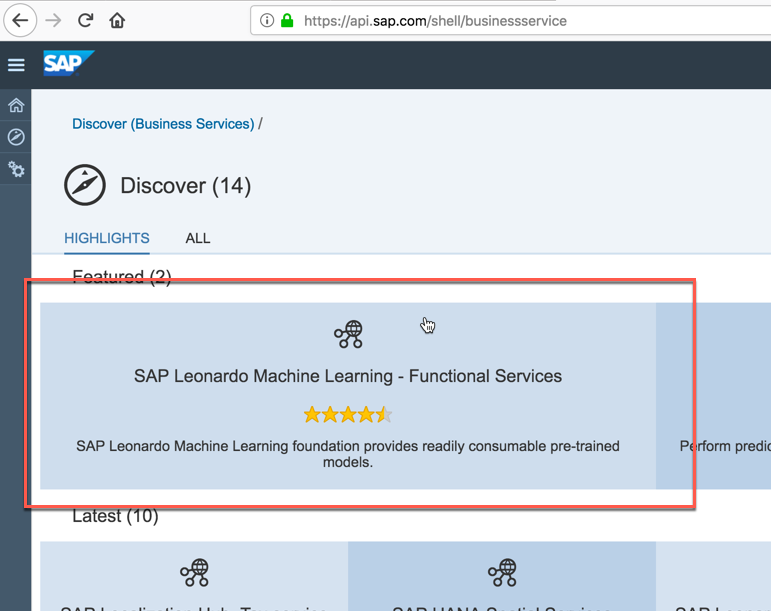
1.	Click on **Artifacts**, then scroll through the list and click on the **Image Classifier Service**
	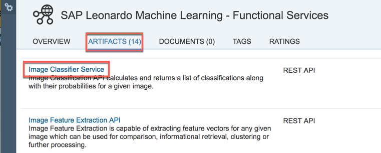
1. Login in case you are not already logged in
1. When using any of the APIs outside of the SAP API Business Hub, an **application key** will be needed in every request header of your API calls. To get your API key click on the button in the top right corner of the page
	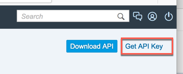
1. Here you see your key. Choose the **Copy API Key** button to copy it to your clipboard
	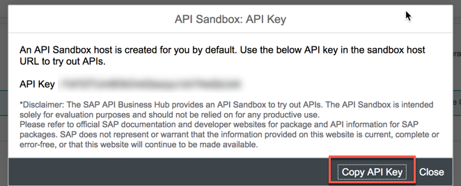
1. Now go back to your SAP Web IDE in SAP Cloud Platform, where the *settings.json* is still open.
For the two urls "Image Classification" and "Product Image Classification" replace the 
**<<<< COPY YOUR API KEY >>>>**  with the API key you copied in the clipboard and save the file
	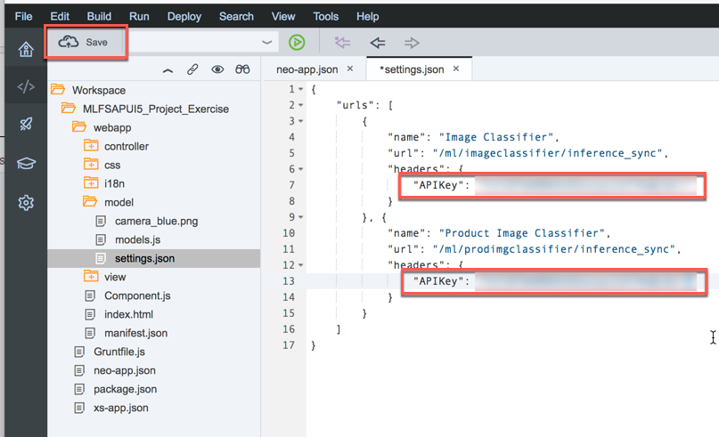
1.	Click on the **Run** icon on the toolbar to execute the application   
	
1. An application with two tiles comes up. Select the tile with the title **Image Classification**
	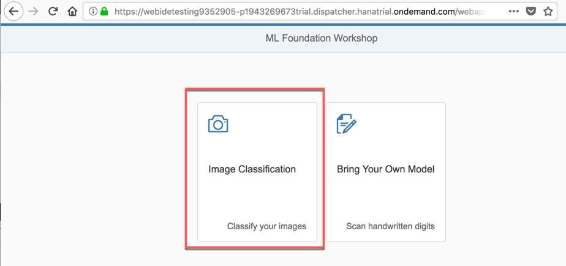
1. Extract the 4 images contained in the zip file you have downloaded already as explained in the prerequisites ([test_images.zip](test_images.zip))
	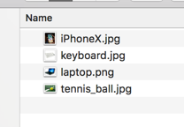
1. Either drag & drop the selected image onto the icon or press the icon to open a file select dialog.
Choose one by one *tennis_ball.jpg*, *keyboard.jpg*, *laptop.png* and *iPhoneX.jpg* as test images and analyze the results
	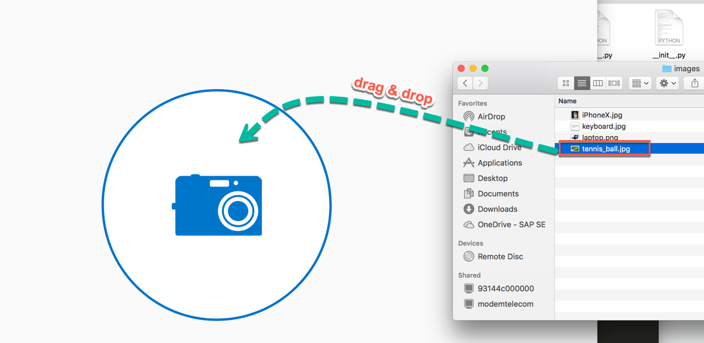
1. The application charts the 5 most probable classifications for the image. To see the actual response from the server you can press the "View JSON" Button 
	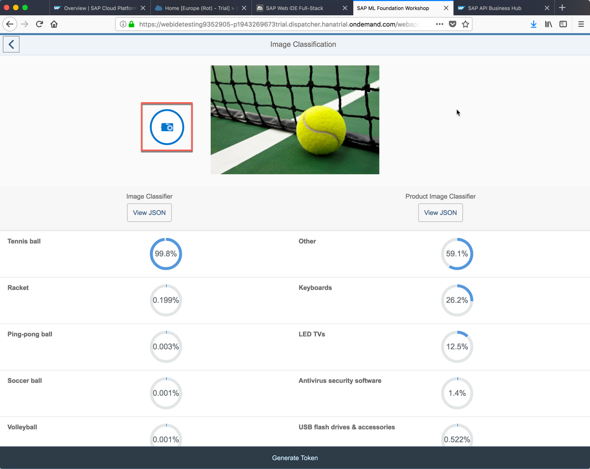
1. This concludes the exercise.


## Summary
This concludes the exercise. You are now able to:

* Use the SAP Web IDE to import a SAPUI5 application
* Create a destination that points to your ML service API endpoint in SAP API Business Hub
* Adjust a prepared project using a configured destination calling REST services from ML foundation
 
 Please proceed with next exercise.
