<table width=100% border=>
<tr><td colspan=2><h1>EXERCISE 07 - ML Foundation in SAP Cloud Foundry - Preparation</h1></td></tr>
<tr><td><h3>SAP Partner Workshop</h3></td><td><h1> &nbsp;60 min</h1></td></tr>
</table>

## Description
In this exercise, you’ll learn how 

* access SAP Cloud Foundry Org and Space via SAP CP Cockpit
* create Service Instance and Service Key for ML Foundation
* generate an access token with the Generate Token tool

## Target group

* Developers
* People interested in SAP Leonardo and Machine Learning 

## Goal

The goal of this exercise is to understand how to access SAP Cloud Foundry cockpit, how to setup the ML Foundation service and how to generate a service key for accessing it from an external application.

## Prerequisites
  
Here below are prerequisites for this exercise.

* A trial account on the SAP Cloud Platform. You can get one by registering here <https://account.hanatrial.ondemand.com>

## Steps

1. [SAP Cloud Foundry Org and Space via SAP CP Cockpit](#cf-org-space)
1. [Create Service Instance and Service Key for ML Foundation](#service-instance-key)
1. [Generate Access Token](#access-token)

###  SAP Cloud Foundry Org and Space via SAP CP Cockpit
You used the Cloud Foundry user to access the SAP API Business Hub and the SAP Cloud Platform - Neo environment. Now you will learn how to work with ML Foundation Services that are available within your SAP Cloud Platform Global Account. Please, make sure that you work with the correct username to avoid conflicts with other participants. Take note of the following Cloud foundry credential, you will be using it in the following steps.
Organization and space will be automatically configured and made available during the login process as there is just one space and org for each user.

|Parameter   |Value                                                |
|------------|-----------------------------------------------------|
|Username    |ml-train+XX@sap.com                                  |
|Password    |\<specific to your username\> provided by the trainer|
|API endpoint|api.cf.eu10.hana.ondemand.com                        |
|Organization|ml-trainXX (same as your user name without the +)    |
|Space       |ml-trainXX (same as your user name without the +)    |

1. Open Firefox as Chrome will use SSO for SAP Employees. Login to SAP Cloud Platform Cockpit via <https://account.hanatrial.ondemand.com/cockpit>. Login with your given e-Mail 
**ml-train+XX@sap.com**, where **XX** must be replaced by your group number, and the password provided by the trainer  
	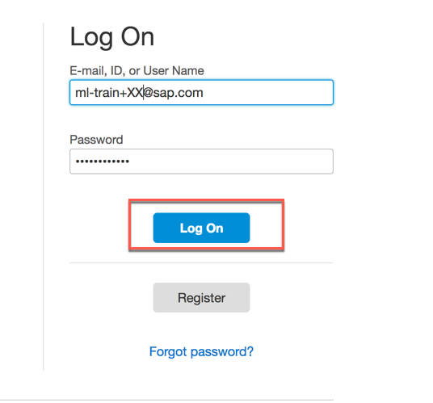
1.	Navigate to **Regions -> Cloud Foundry Environment > Europe (Frankfurt)**  
	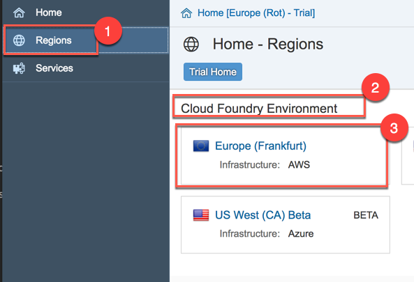
1.	Click on your global account **SAP\_ML\_Demo**  	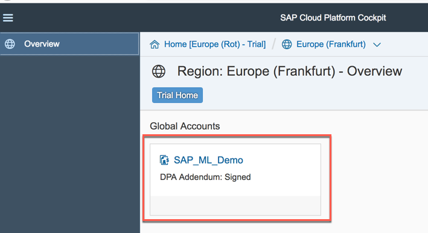
1.	Click on the Subaccount/Organisation **ml-trainxx** where XX is your group number  
	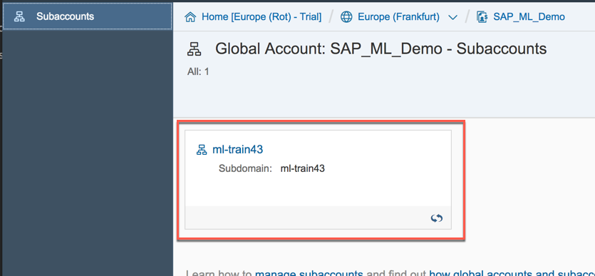
1.	Here you can see some your Cloud Foundry details like the name of your Organization, the number of Spaces and the API endpoint. Click on the **number of Spaces**  	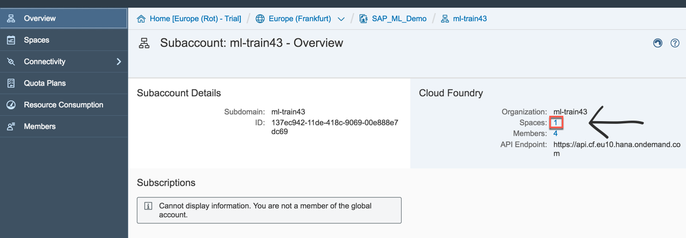
1. Click on the tile named "training" which is the one related to your space  
	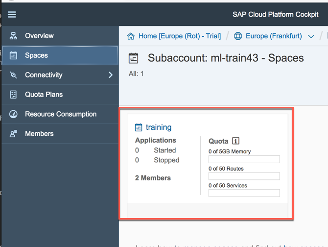
1. You have reached your Cloud Foundry cockpit. At moment there should be no applications available  
	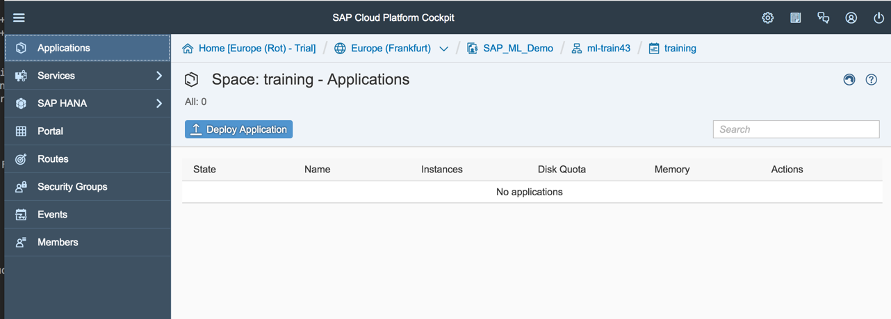
1. You have finished with the preparation of your Cloud Foundry environment.

###  Create Service Instance and Service Key for ML Foundation
Before we continue we need to get a service key from the ML Foundation service. A service key enables the ML Foundation Service to be used outside the CF environment. In this exercise, you need to create such a key to be used by an external applications like Swagger UI or Postman. The service key contains all the URLs and credentials (clientid and clientsecret) required for you to access the ML Foundation service running for your productive account. Please keep this browser window open, since you will need it in the next section.

1.	Within your space navigate to **Services -> Service Marketplace**, then click on the **ml-foundation** tile  
	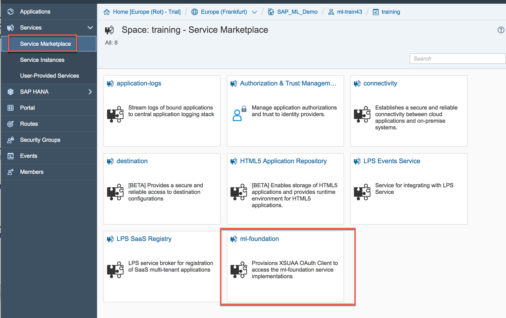
1.	Select Instances on the left menu bar and click on **New Instance**  
	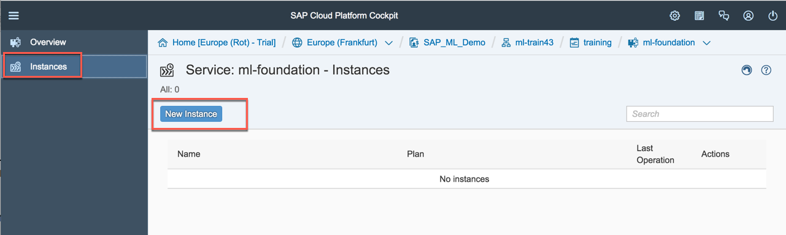
1.	Select the Plan **standard** and click **Next**  
	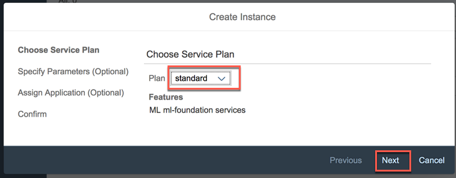
1.	Click **Next**  
	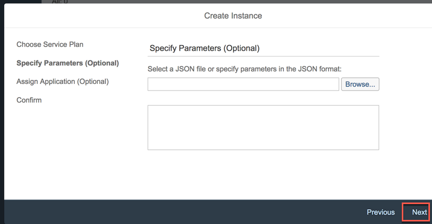
1.	Click **Next**  
	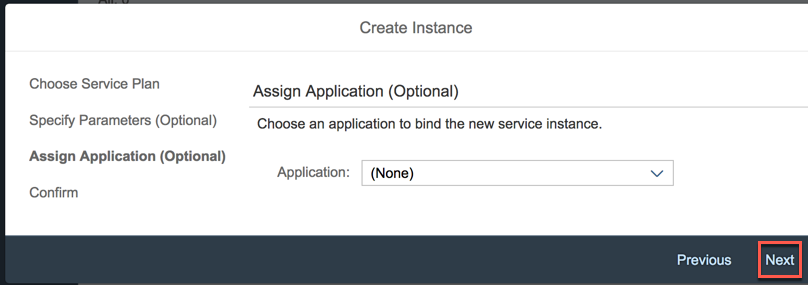
1.	Enter a name for the new instace, like **ml\_instance\_XX** where XX is your group number and click **Finish**  
	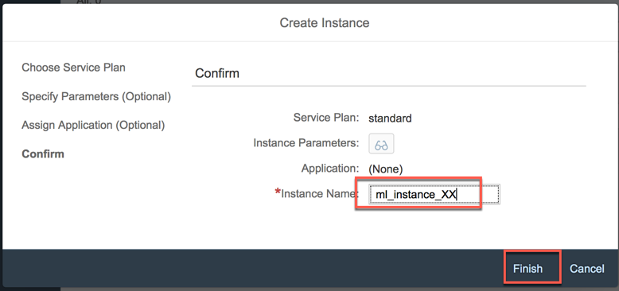
1.	Click on the newly created instance  
	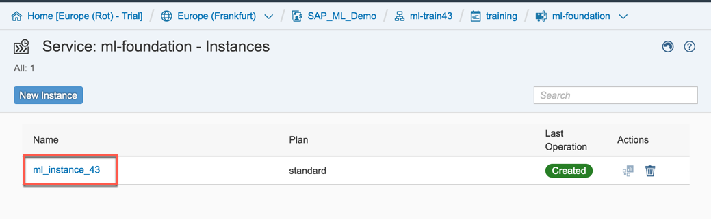
1.	Select **Service Keys** in the left menu bar and click the **Create Service Key** button to create a new service key for your instance  
	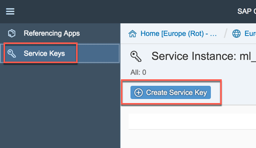
1.	 Enter a name for this service key like **ml\_servicekey\_XX** where XX is your group number; then click **Save** to save your newly created service key  
	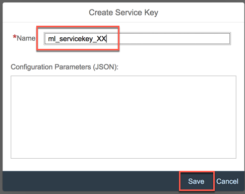
1.	You get a screen like this. Please keep this page open or copy the service key somewhere because you'll need it in the next exercises  
	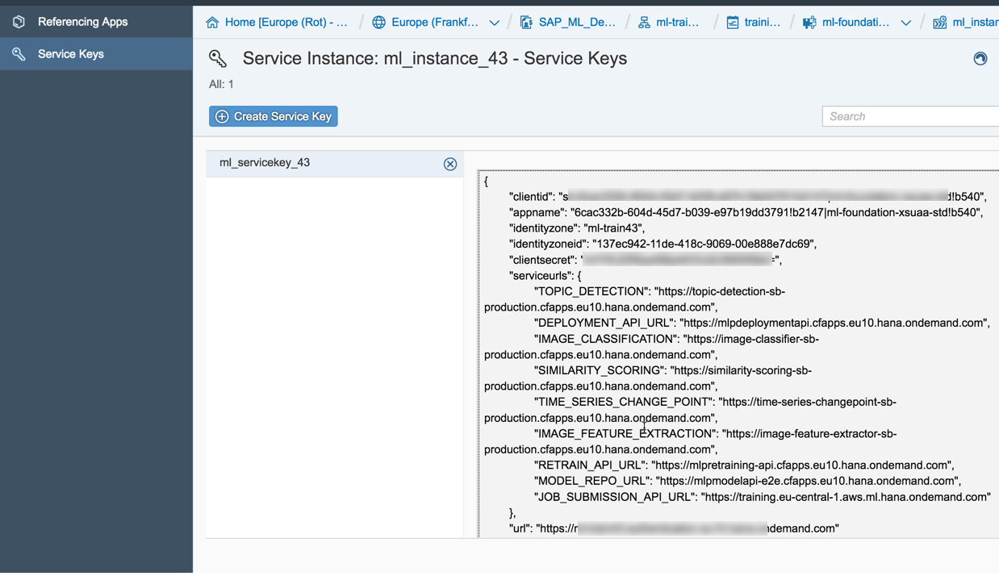
1. You have successfully generated a service key for the ML Foundation service.

###  Generate Access Token
For the next exercises you will need an OAuth2 token to access the ML Foundation services in your productive Cloud Foundry environment. We prepared a small helper application to facilitate you to retrieve this token. Please use the URL <https://get_token.cfapps.eu10.hana.ondemand.com/> to access this token generation application: you need to be logged in to your SAP Cloud Foundry account, to access it. This application is a tool that we provide during this workshop, but it is not part of our standard ML Foundation service offering. In the appendix, you will find a description on how to generate the token by yourself with a tool like Postman. 

>NOTE: You do not need to do this step now! You'll need it several times in the next exercises and we will reference this chapter when needed.

1. With your Firefox browser, navigate to the URL <https://get_token.cfapps.eu10.hana.ondemand.com/> 
1. A new window comes up where you need to enter 

	- Authentication URL
	- Client-ID
	- Client-Secret  

	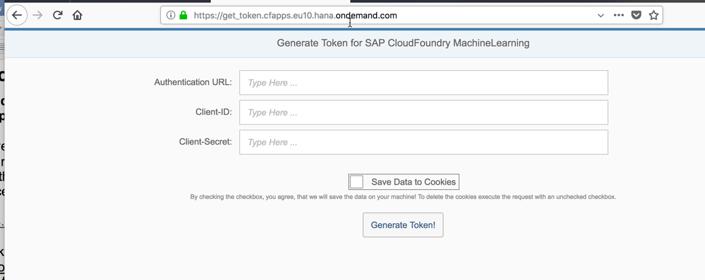

1.	Go back to your service key and copy the required information from there. Paste all the needed parameters in the Token Generator app  
	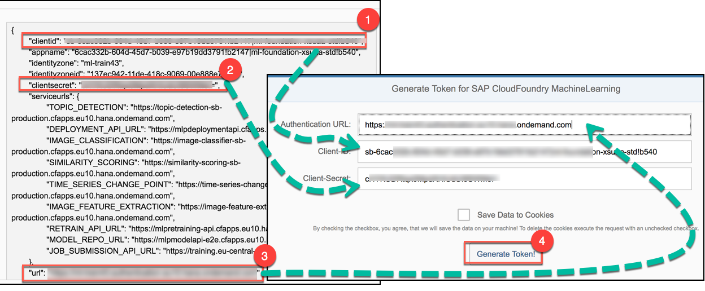
1.	A token with the prefix **Bearer** is generated. Use the **Copy To Clipboard!** button to copy the key in the clipboard when needed 
	>NOTE: Actually, you do not need to copy the token now, but we will reference this section when you need the token to access the ML foundation services  

	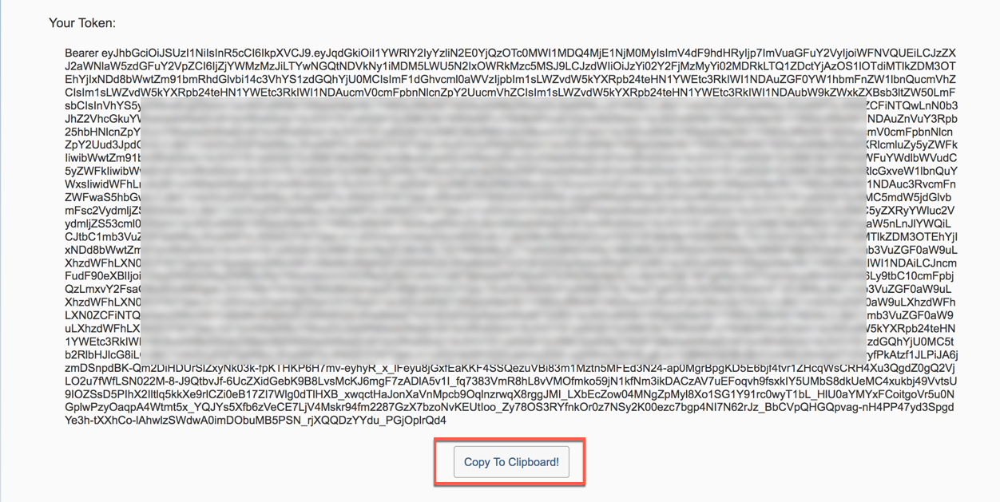

1.	For your convenience, this application is also linked in the project you imported into SAP Web IDE Full-Stack. There you will find a black button at the bottom of the screen, that will bring you to this Generate Token tool  
	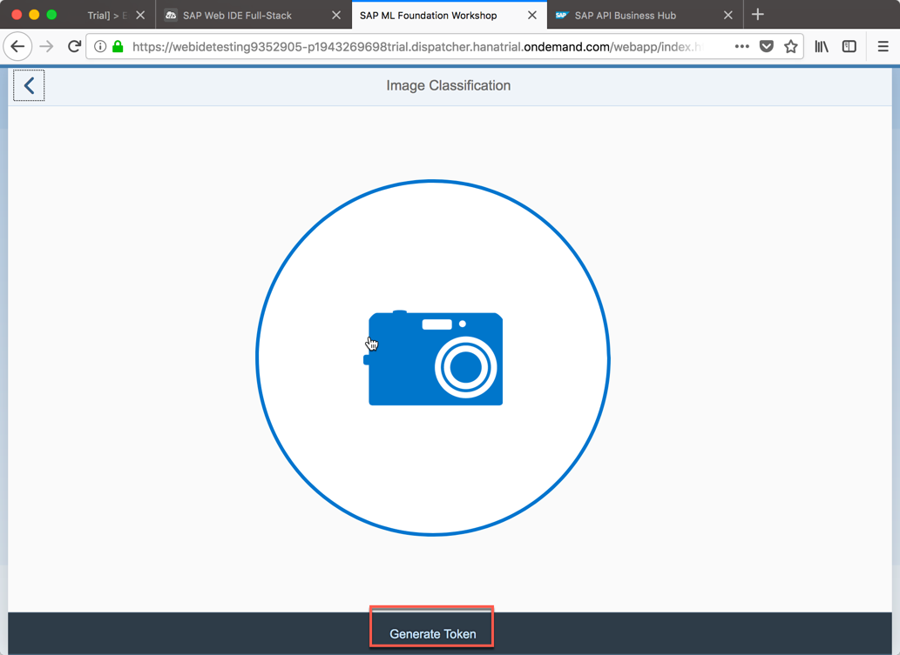

## Summary
This concludes the exercise. You should have learned how to 

* access SAP Cloud Foundry Org and Space via SAP CP Cockpit
* create Service Instance and Service Key for ML Foundation
* generate an access token with the Generate Token tool

Please proceed with next exercise.
