<table width=100% border=>
<tr><td colspan=2><h1>EXERCISE 08 - ML Foundation Re-trainable services</h1></td></tr>
<tr><td><h3>SAP Partner Workshop</h3></td><td><h1> &nbsp;60 min</h1></td></tr>
</table>


## Description
In this exercise you will learn how to 'fine-tune' a generic machine learning model to a custom use case. You can use this service without being a Machine Learning Expert. The base model is provided by SAP. The Retrain Service adapts the base model to a specific model using training data provided by the user: thus, the classification results for the user data-set are greatly improved compared to the generic base model.

Exercise Description - SAP Leonardo ML Foundation Retrain Service

-	Install SAP CF CLI (pre-installed - for more info on how to install CF CLI go to: <https://help.sap.com/viewer/65de2977205c403bbc107264b8eccf4b/Cloud/en-US/b8ee7894fe0b4df5b78f61dd1ac178ee.html>) 
-	Login to SAP CF using the SAP CF CLI
-	Create Retrain Service Instance and Service Key (already done in previous exercise)
-	Install SAPML CLI plugin
-	Login to access ML Foundation services
-	Upload the training data. (Note: the training data is already uploaded for this exercise)
-	Perform retraining process using the SAPML CLI tool
-	Deploy the retrained model using the SAPML CLI tool
-	Use the deployed retrained model for inference (with a prepared SAPUI5 app)

## Target group

* Developers
* People interested in SAP Leonardo and Machine Learning 


## Goal

The goal of this exercise is to understand how to access SAP Cloud Foundry cockpit, how to setup the ML Foundation service and how to generate a service key for accessing it from an external application.  So that you can retrain a generic machine learning model to a custom use case.


## Prerequisites
  
Here below are prerequisites for this exercise.

* A trial account on the SAP Cloud Platform. You can get one by registering here <https://account.hanatrial.ondemand.com>
* Completed previous exercises
* A set of test images you will use for testing your retrained service. Please download the zip file from here [RetrainImages.zip](files/RetrainImages.zip) and uncompress it in a proper folder on your machine
* You need to create a service instance and service key for the ML foundation service in your SAP Cloud Foundry space. Please complete previous exercise before you proceed with this one.
* The data for retraining is already uploaded to the file system associated with your Cloud foundry ML Foundation service account. This is a step that you need to perform as well in a productive environment or POC. We skipped it during this workshop as it would take some time
* As the retraining service is running in the productive Cloud Foundry environment, you will need an Access Token to run the service. Please use the Generate Token helper tool in order to get the OAuth2 token
* For this exercise, you will need the SAP CF CLI and the SAPML CLI plugin. In case you do not have SAP CF CLI on your laptop, please ask the instructor. We prepared images for you that you can use. Please use Remote Desktop Connection to connect to these images. 

|Parameter   |Value                                                |
|------------|-----------------------------------------------------|
|Username    |ml-train+XX@sap.com                                  |
|Password    |\<specific to your username\> provided by the trainer|
|API endpoint|api.cf.eu10.hana.ondemand.com                        |
|Organization|ml-trainXX (same as your user name without the +)    |
|Space       |ml-trainXX (same as your user name without the +)    |
|Cloud Foundry Login command|cf login -a api.cf.eu10.hana.ondemand.com -u ml-train+XX@sap.com|

## Steps

1. [Retrain and Deploy the retrained Image Classifier Model](#retrain-and-deploy)
1. [Test your retrained Model](#test-retrained-model)


### <a name="retrain-and-deploy"></a> Retrain and Deploy the retrained Image Classifier Model
In the next section, you will retrain the pre-trained Image Classification Model that is behind the exposed corresponding service. The data for retraining is already uploaded to your filesystem on the cloud data center. You will learn how you can initialize the data for your SAP Cloud Foundry account to see its structure. You will start a retraining job based on that data. Your re-trained model is created, automatically uploaded to the model repository and you will deploy it for inference.


1.	Connect to your remote host or make sure, that you work with an environment where the SAP CF CLI is installed. Open a Terminal window and enter 
	
	```sh
	cf
	``` 
	
	to check if the SAP CF CLI is available. You should get a screen like this  
	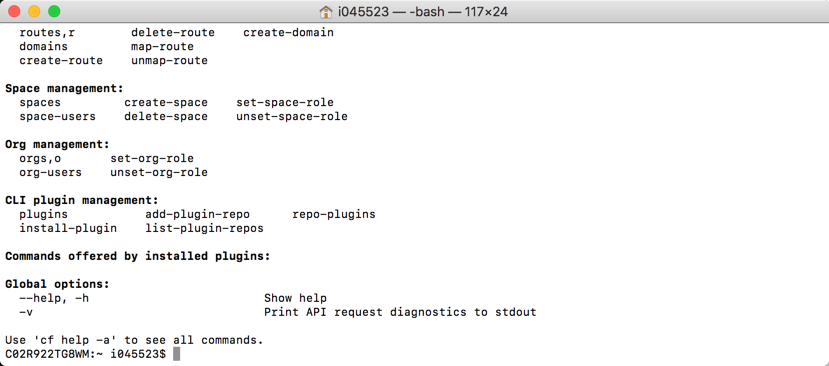
1. Now, login to SAP Cloud Platform with the command

	```sh
	cf login -a https://api.cf.eu10.hana.ondemand.com -u ml-train+XX@sap.com
	```
	where **XX** must be replaced with your group number. Enter the password for your user provided by the instructor.  Note: The password will not show.
	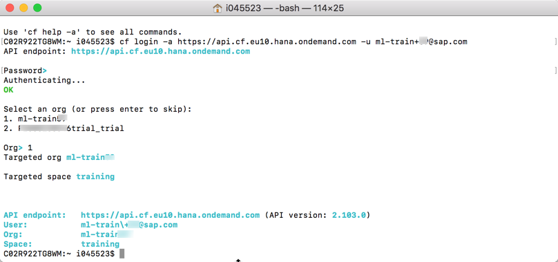

1.	Enter the command `cf service-key <instance name> <service key>` to display your service key and make sure that everything is available.
	If you have followed the naming convention we used in the previous exercise, your command should 	be 

	```sh
	cf service-key ml_instance_XX ml_servicekey_XX
	```
	
	where **XX** must be replaced by your group number
	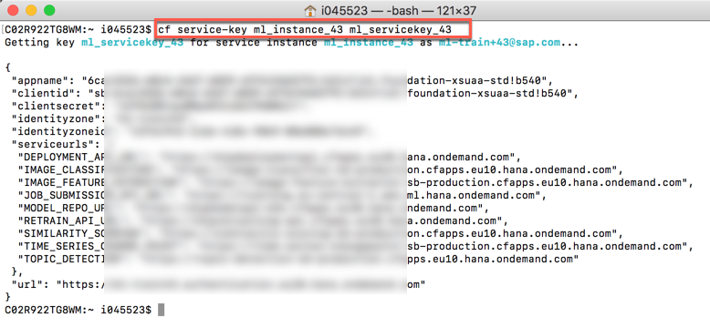

1.	Install SAPML CF CLI plugin. This CLI plugin is an extension of standard CF plugin. We have added a subcommand called `sapml` to easily interact with our ML Foundation APIs. Download the plugin file related to your platform and save it in a proper location on your machine

	|Platform |File|
	|---------|-----|
	|Windows|[sap\_ml\_cli\_windows.exe](files/sap_ml_cli_windows.exe)|
	|OSX|[sap\_ml\_cli\_mac\_os.bin](files/sap_ml_cli_mac_os.bin)|
	|Linux|[sap\_ml\_cli\_linux.bin](files/sap_ml_cli_linux.bin)|
	
	Then from the Terminal window run the command
	
	```sh
	cf install-plugin -f <path/to/plugin/plugin_file> 
	```
	
	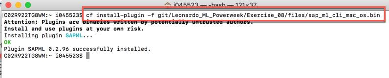

1.	Enter the command: 

	```sh
	cf sapml config get
	```
	You will see that some values are not set, after you installed the SAPML plugin. In case you used it before, make sure that the values point to the right API endpoints, see next steps  
	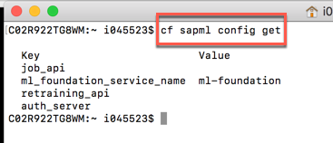
	
1.	Set the correct values for your SAPML configuration. You will need the values of your Service Key (see chapter 3.1 Create ML Foundation Service Instance & Service Key: 

	```sh
	cf sapml config set auth_server <your authentication URL from the service key>
	cf sapml config set job_api https://training.eu-central-1.aws.ml.hana.ondemand.com
	cf sapml config set retraining_api https://mlpretraining-api.cfapps.eu10.hana.ondemand.com
	```

	Enter
	
	```sh
	cf sapml config get
	```
	
	to check is everything is set correctly.  
	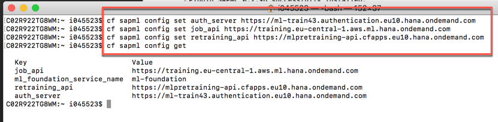

1. Initialize the cloud filesystem with the command
	
	```sh
	cf sapml fs init 
	```
	

1. List the root directory with the command

	```sh
	cf sapml fs list
	```

	Display the subfolders of the already available "Brands" training data.
	
	```sh
	cf sapml fs list Brands/
	```
	
	Display the training categories.
	
	```sh
	cf sapml fs list Brands/training/
	```
	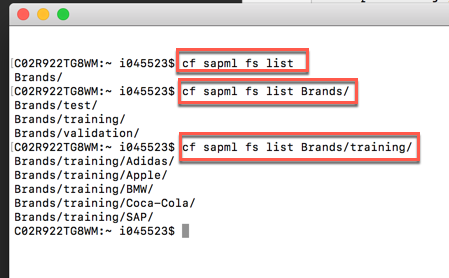

1. You need now to prepare a configuration file for retraining. Open your favourite text editor and create a new file name retrain.json
1. Copy the text below and paste it in this new file  

	```json
	{
	  "mode": "image",
	  "options": {
	    "dataset": "Brands",
	    "modelName": "your-model-name",
	    "learningRate": "0.001"
	  }
	}
	```

	Let me give you a bit of explanation about the content of this file. Mode "image" means, that we retrain the pre-trained Image Classification service. There are other retrainable services in the future, where this mode value needs to be set accordingly. You need to specify the data set name and a model name. As our folder structure has the root name "Brands", we choose the value "Brands" for our dataset. Give it a new model name of your choice and save it (e.g. brands-xx). You can add optional retrain parameters (e.g. learning rate). Once finished editing, remember to save the file.

	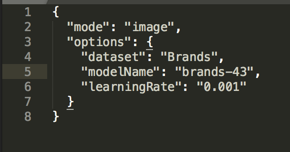

1. Start the retrain process using the SAPML CLI command

	```sh
	cf sapml retraining job_submit path/to/retrain.json
	```

	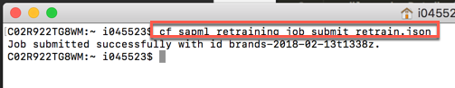
	
1. Check the job status  

	```sh
	cf sapml retraining jobs
	```
	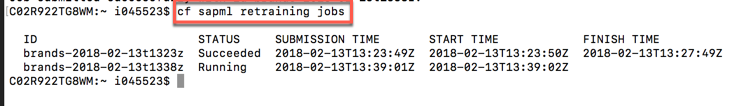
1. After a while your job should finish successfully: be patient, it might take some time

	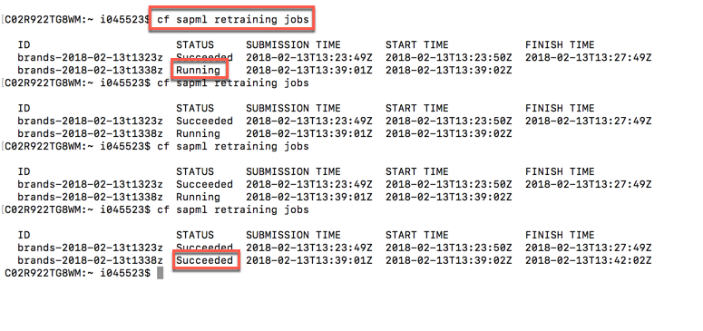

1. List the directory to get the name of the executed job

	```sh
	cf sapml fs list
	```
	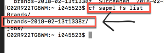

1. Download the retrain log by specifying the job name in its path and the local path where you want to put the downloaded log

	```sh
	cf sapml fs get [REMOTE_PATH] [LOCAL_PATH]
	```

	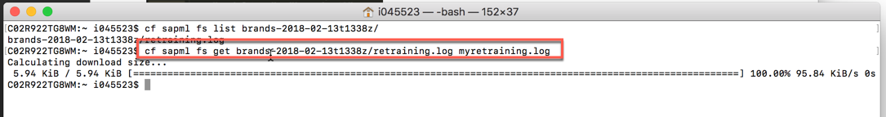

1. Display the retrain log by opening it with your favourite text editor. Please whait until the job is finished successfully and take note of the version number at the bottom of the log (in your case it should be 1). This version is incremented for every retrain run when using the same model name. The model name is the "brand-XX" string (remember to replace **XX** with your group number) you have previously specified in the *retrain.json* file

	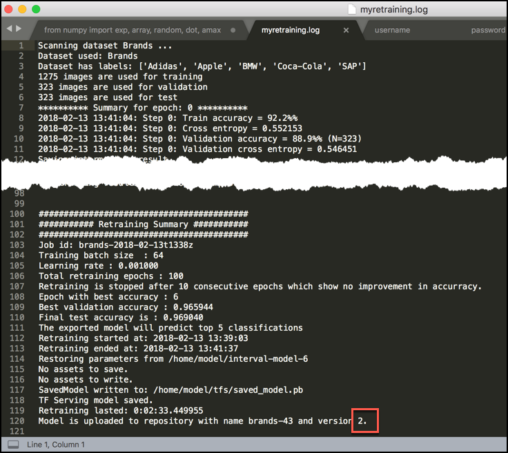

1. Deploy the retrained model by specifying the model name and version

	```sh
	cf sapml retraining model_deploy [MODEL_NAME] [MODEL_VERSION]
	```
	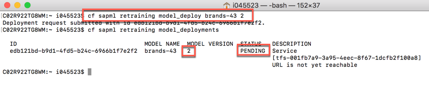

1. Check the deployment status: it takes a couple of minutes until the model container with the retrained model is up and running. At the end of the process you should get a deployment status "SUCCEEDED" message.

	```sh
	cf sapml retraining model_deployments
	```

	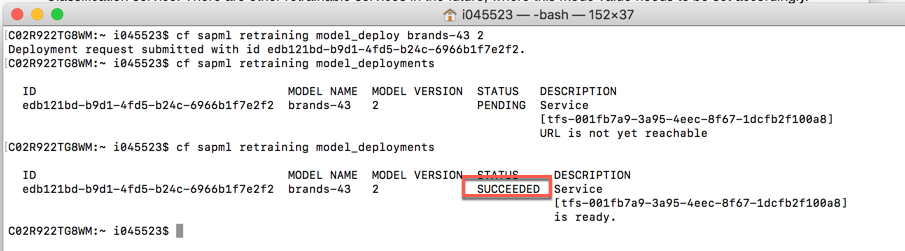


### <a name="test-retrained-model"></a> Test your retrained Model
In the next section, you will use the prepared project and adjust it to call the Image Classifier Service with your new model in order to test the retrained, newly deployed model.

1.	Before you can test your retrained model you need to gather some required information like a service key and an access token. Write down in your favourite text editor all this information because it will be requested later. First of all let's get a service key. In the Terminal window, run the command 
	```sh
	cf service-key ml_instance_XX ml_servicekey_XX
	```
	
	where **XX** must be replaced by your group number, in order to get your service key.

	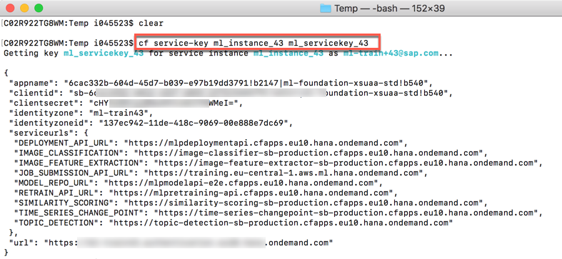
1. Open your favourite text editor and write down the following parameters:
	- Authentication URL (the last **url** you see in the service key)
	- **clientid** (the Client ID)
	- **clientsecret** (the Client Secret)
	- **IMAGE_CLASSIFICATION** URL
	- model name (it should be **brands-XX** where **XX** is your group number)  

	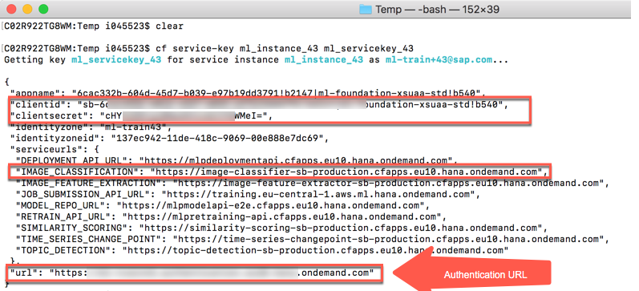

1. With your Firefox browser, navigate to the URL <https://get_token.cfapps.eu10.hana.ondemand.com/> 
1. A new window comes up. Enter 

	- Authentication URL
	- Client-ID
	- Client-Secret  

	and click **Generate Token!**
	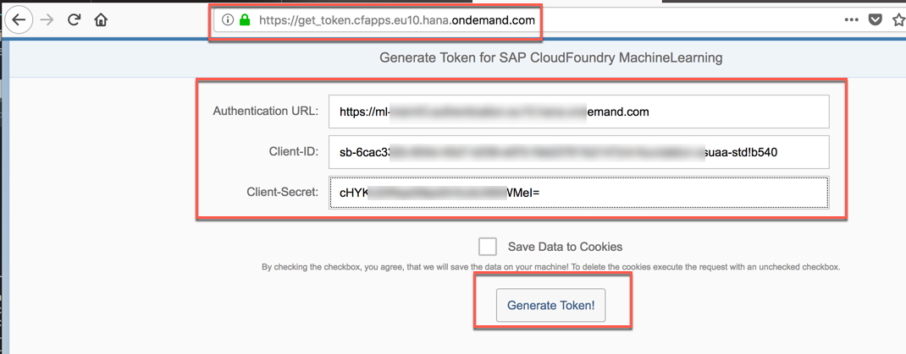

1.	A token with the prefix **Bearer** is generated. Keep this page opened because we need to copy this token in the next steps  
	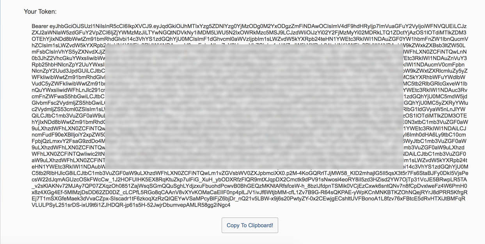

1. Connect to your SAP CP cockpit <https://account.hanatrial.ondemand.com/cockpit>. Login if required
	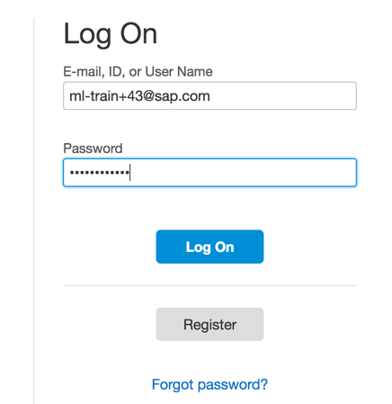

1.	Go to Regions -> Trial -> Europe (Rot) Trial. 
	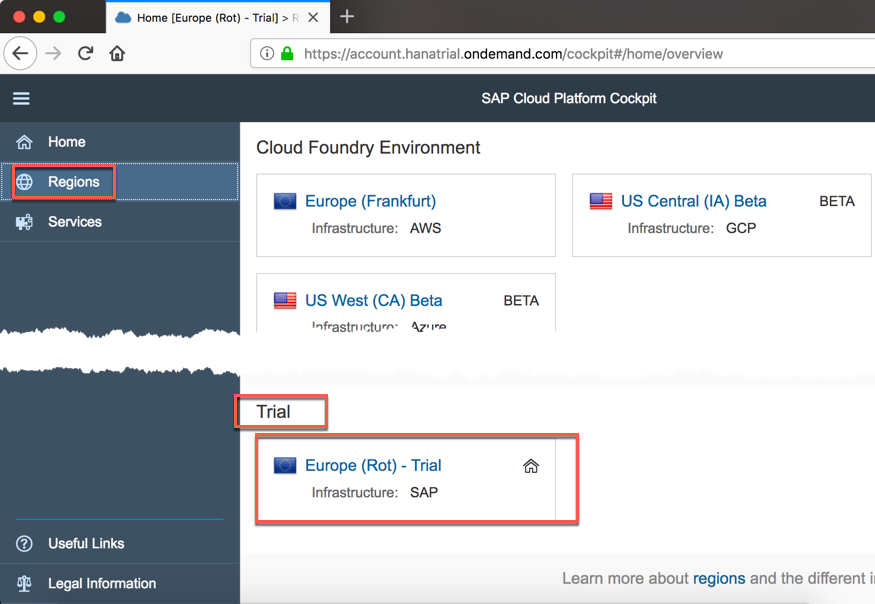

1. Navigate to your trial account. You are in the Cloud Platform Cockpit Neo environment. 
	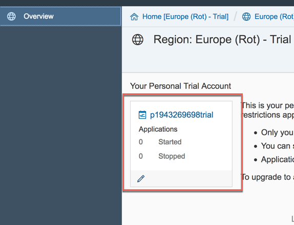

1. Navigate to Connectivity -> Destinations. On the Destinations overview page, click on New Destination  
	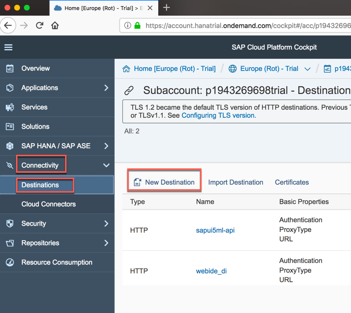
1. Enter the information like you see it on the right side and then click on the **New Property** button

	|Parameter|Value|
	|---------|-----|
	|Name|retraining|
	|Type|HTTP|
	|Description|Retraining|
	|URL|[the IMAGE_CLASSIFICATION URL you retrieved from the service key]|
	|Proxy Type|Internet|
	|Authentication|NoAuthentication|
	
	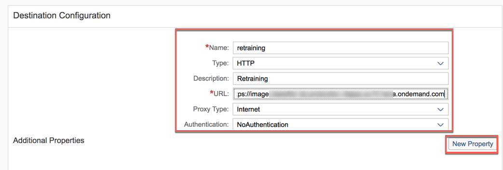

1.	Add the property WebIDEEnabled = true to the destination. Then click Save.
	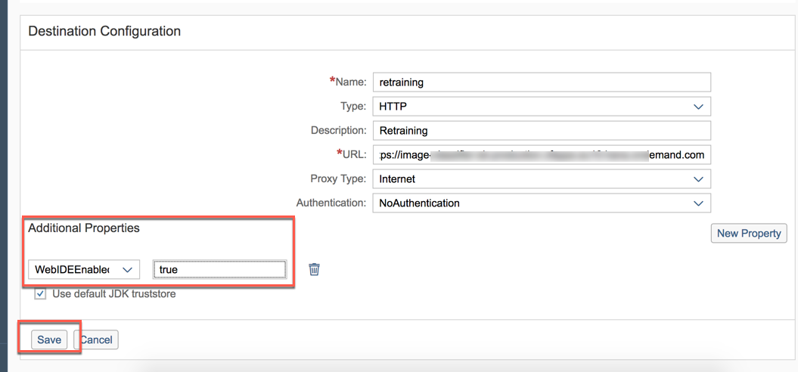

1.	Open your SAP WebIDE Full-Stack edition. Navigate to your project that you imported before.	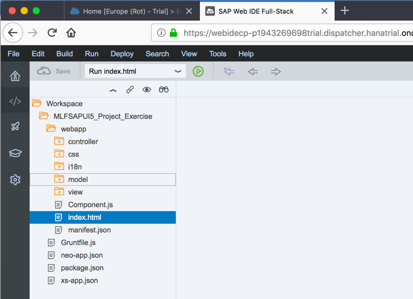
	 
1.	Open *settings.json* file 
	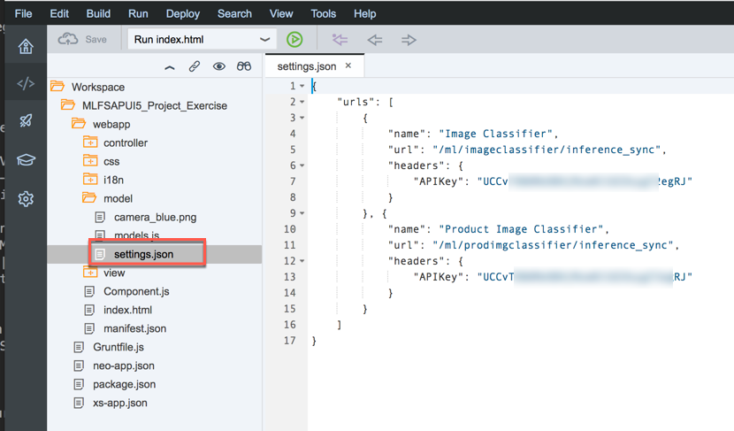
1. Add the following section to the file 

	```json
	, {
				"name": "Retrained Image Classifier",
				"url": "/retraining/inference_sync",
				"headers": {
					"Authorization": "<<<< YOUR BEARER TOKEN >>>>"
				},
				"options": {
					"modelName": "<<<< YOUR MODEL NAME >>>>",
					"modelVersion": "<<<< YOUR MODEL VERSION >>>>"
				}
			}
	```
	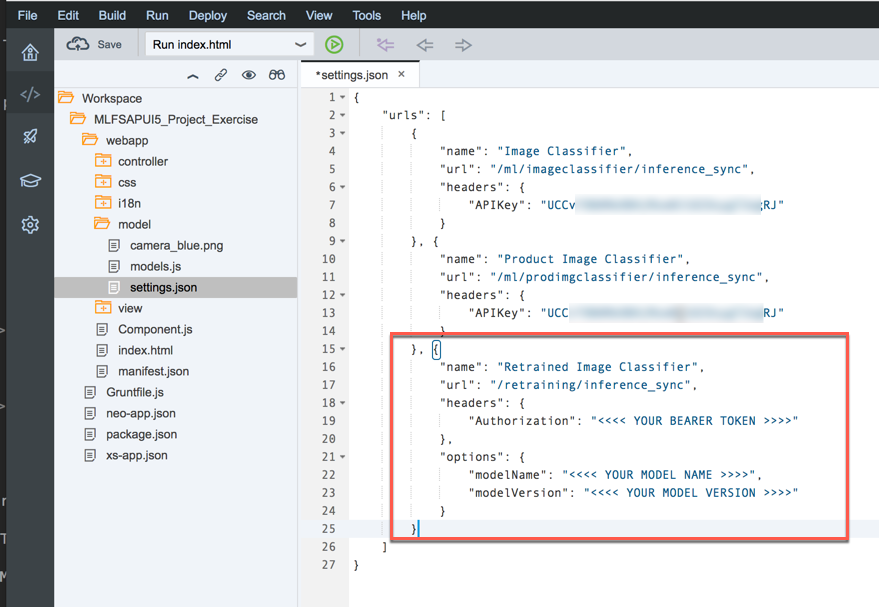
 
1. Go to the page where you have previously generated the access token and click the **Copy to clipboard!** button
	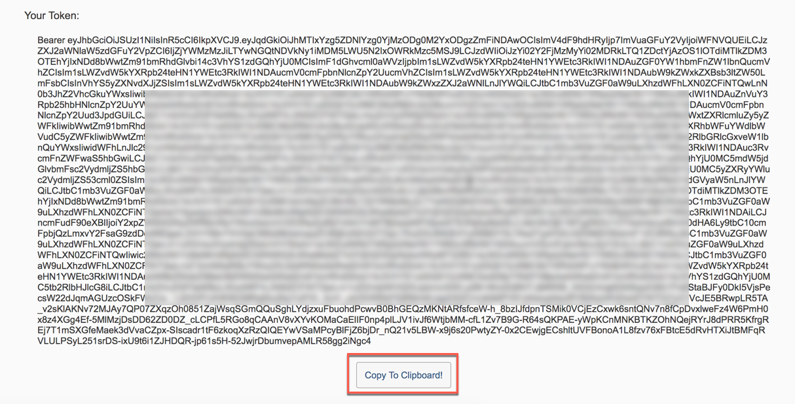

1. Replace  <<<<< COPY YOUR BEARER TOKEN >>>>> with the content of the clipboard 
	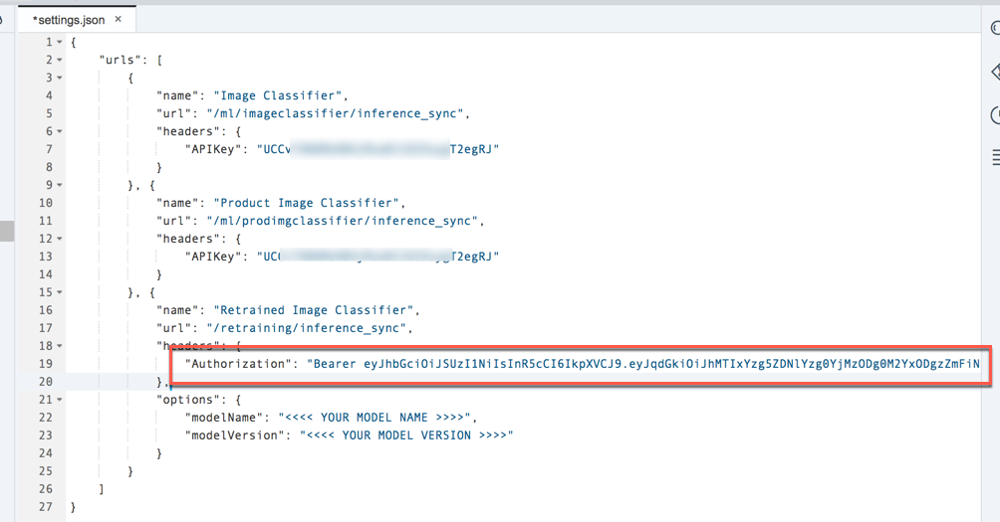
1. Replace <<<<< YOUR MODEL NAME >>>>> with the name and the version of your retrained model and then save the file
	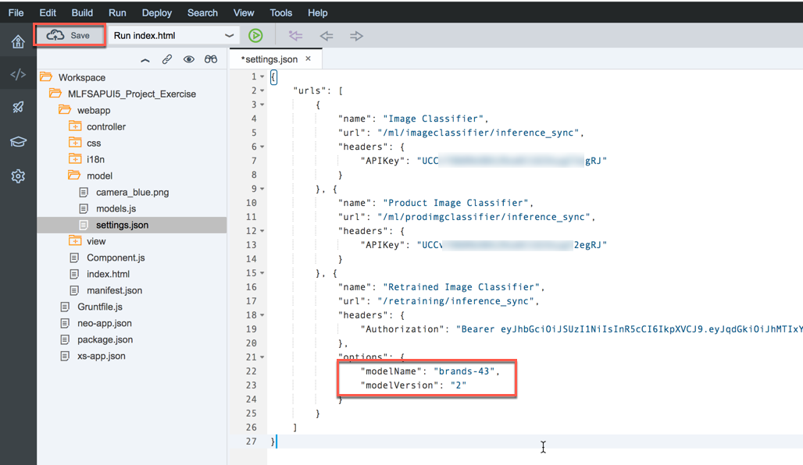

1. Select the project folder and click on the **Run** icon in the toolbar	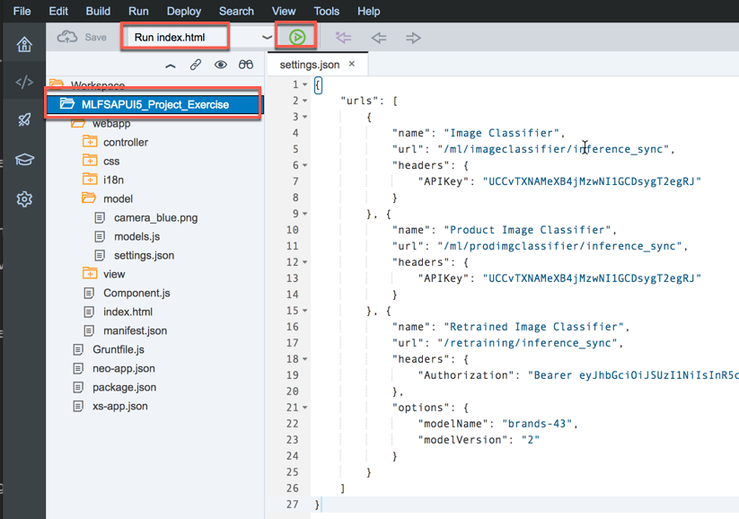
	 
1.	Select the **Image Classification** tile
	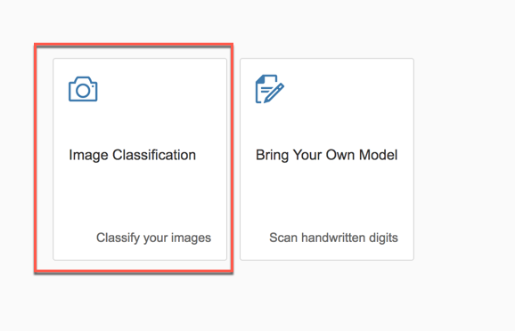
	 
1.	Either drag & drop the images you have already downloaded as a zip file ([RetrainImages.zip](files/RetrainImages.zip)) in the prerequisites section onto the icon or press the icon to open a file select dialog. Choose for example the *SAP\_WDF19.jpg* image
	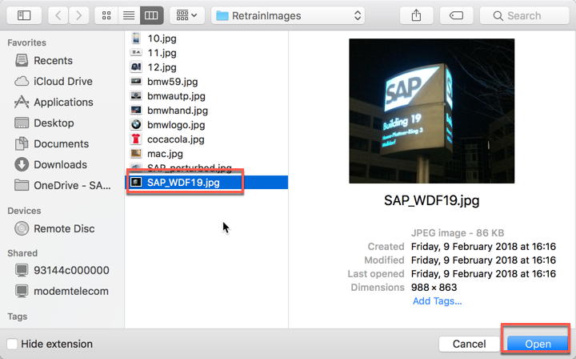
1.	You will see a result with three columns. The first one is the Image Classification pointing to the API Business Hub, the second one is the Product Image Classification service pointing to the API Business Hub and the third is the Image Classification service pointing to the ML Service Endpoint in SAP Cloud Foundry using your pretrained and deployed model
	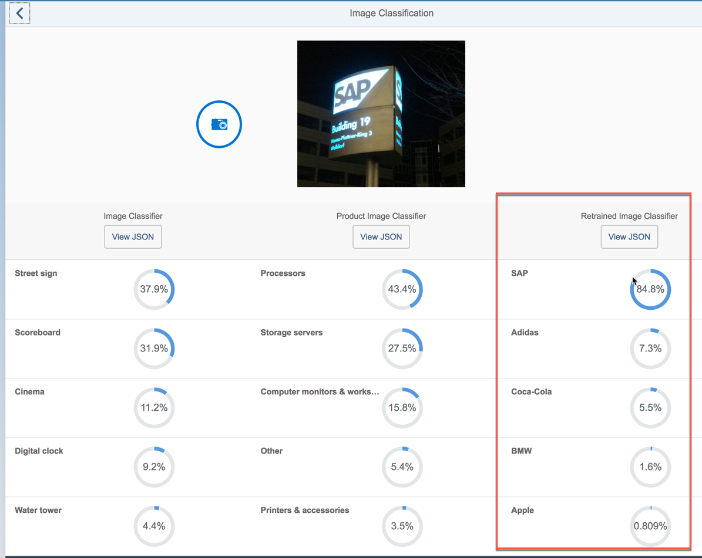
1. Congratutaltions! You have successfully tested your retrain service.


## Summary
You have completed the exercise!
You are now able to:

* Use CF commands to create ML FOUNDATION SERVICE instance and service key
* Use SAPML CF CLI plugin to interact with ML FOUNDATION SERVICE APIs
* Retrain your Model 
* Deploy your retrained Model 
* Use the retrained Model for inference

Please proceed with next exercise.
