<table width=100% border=>
<tr><td colspan=2><h1>PREREQUISITES</h1></td></tr>
<tr><td><h3>SAP Partner Workshop</h3></td><td><h1> &nbsp;30 min</h1></td></tr>
</table>

## Description

In this exercise, you’ll go through the basic steps of setting up the development environment required for SAP Leonardo and SAP Cloud Platform workshop.  

## Target group

* Application Developers
* People interested in learning about SAP Leonardo and SAP Cloud Platform  

## Goal

The goal of this exercise is to have your workstation/laptop well prepared in order to attend to the SAP Leonardo and SAP Cloud Platform workshop.  

## Prerequisites
  

Below are prerequisites required for the exercises in this workshop.  

1. [Bring Your Own Laptop with Admin Access](#laptop)
2. [Remote Desktop Connection](#rdc)
1. [Install Java JRE](#install-java-jre)
1. [Sign up for SAP Cloud Platform Neo trial account](#sign-up-neo)
1. [Sign up for SAP Cloud Platform Cloud Foundry trial account](#sign-up-cf)
1. [Install Cloud Foundry CLI](#install-cf-cli)
1. [Install Chrome Postman application](#postman)
1. [Install Chrome Postman Interceptor application](#postman-interceptor)  
  

##  Bring Your Own Laptop with Admin Access

 
Please bring the laptop that you have admin access for hands-on exercises.   

To be continued ...  

##  Remote Desktop Connection

 
In order to connect with the Virtual Machines we have prepared for you, you need to have the Remote Desktop Connection (RDC) tool installed on your machine. For Windows users, RDC comes already installed, so if you have Windows you don't have to worry about it. If you are MAC user, instead, you can download it for free from the Mac App Store.  
	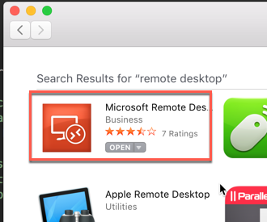

## Install Java JRE

1.	Download and install Java JRE from this link <https://www.java.com/en/>  
	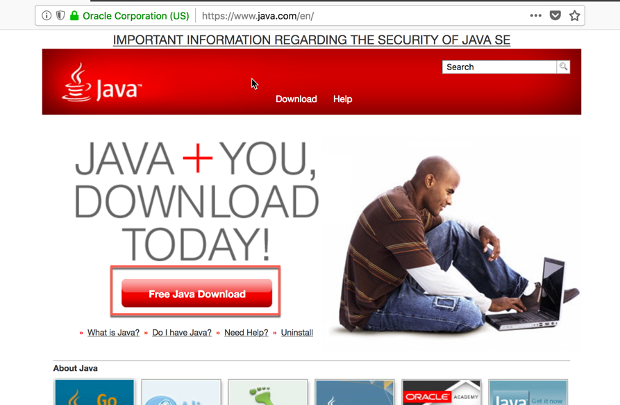

## Sign up for SAP Cloud Platform Neo trial account
You need Neo trial SAP Cloud Platform to complete some of the hands-on exercises.

1.	Sign up for SAP Cloud Platform trial account from <https://account.hanatrial.ondemand.com/>  
	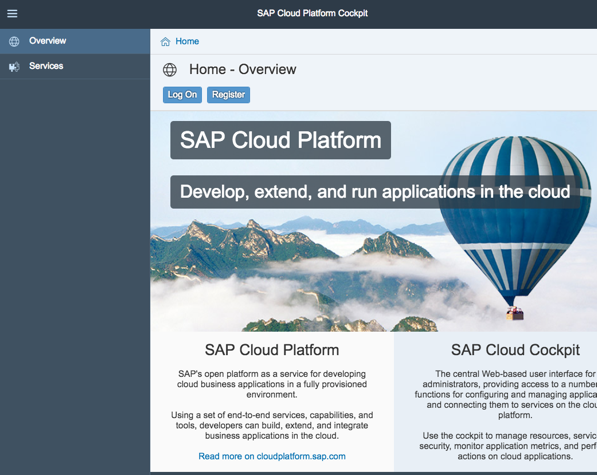

	> NOTE: If you don’t have an account on SAP Cloud Platform yet, go to the Sign up for a free trial account tutorial, and then come back to this step.

1. After you have logged in, click on **Home**.  Then, click on **Neo Trial**  
	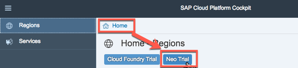

1. This will take you to the **Overview** page of the SAP Cloud Platform Cockpit for Neo stack  
	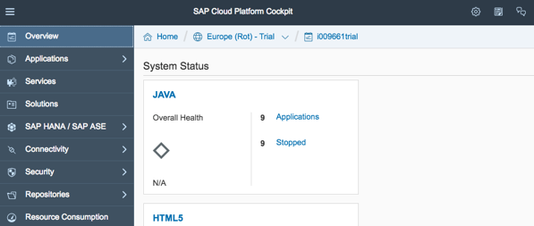

1.	From SAP Cloud Platform Cockpit, click on Services. Enable the following services	 
	- SAP Web IDE Full-Stack
	  
	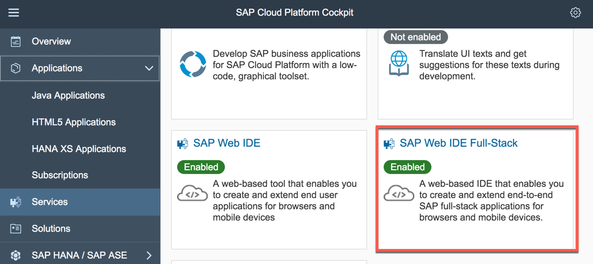
	
	>NOTE: Please, if possible, enable Portal as first service.

        
## Sign up for SAP Cloud Platform Cloud Foundry trial account
Sign up also for SAP Cloud Platform Cloud Foundry trial account.

1.	From SAP Cloud Platform Cockpit, click on Home.  Then, click on **Cloud Foundry Trial**. Select a **Region**, for example, US East (VA) or Europe (Frankfurt)  
	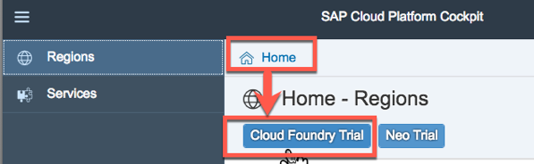
1.	Select the Global account that matches your login. Next, select the trial sub-account  
	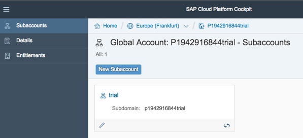	 
1.	Make sure you have **2GB Memory** for the space.  If you don’t have 2GB Memory, please register a new account.  
	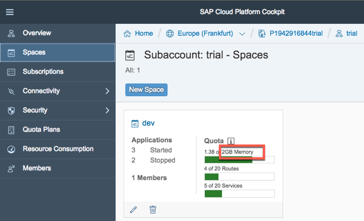

To be continued ...  

##  Install Cloud Foundry CLI
To install Cloud Foundry Command Line Interface (CLI)  

1.	Go to Cloud Foundry CLI download page <https://github.com/cloudfoundry/cli#downloads>  

1. Download and run the installer specific for your platform.  
	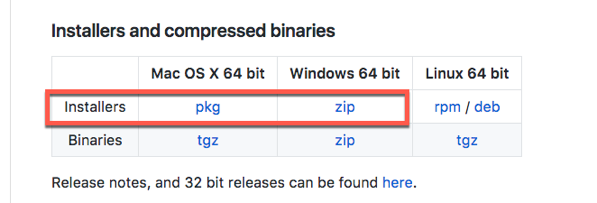

##  Install Chrome Postman application
For the workshop exercises you need to install the **Postman** application for Chrome. It will allow you to send REST requests to backend systems. Please pay attention that, this kind of application has been deprecated and removed from the Chrome web store, because it has been converted to a stand-alone application. However, for the scope of these exercises you will need to install it as a Chrome app. You can open the following link to install it:

<https://chrome.google.com/webstore/detail/postman/fhbjgbiflinjbdggehcddcbncdddomop>  
	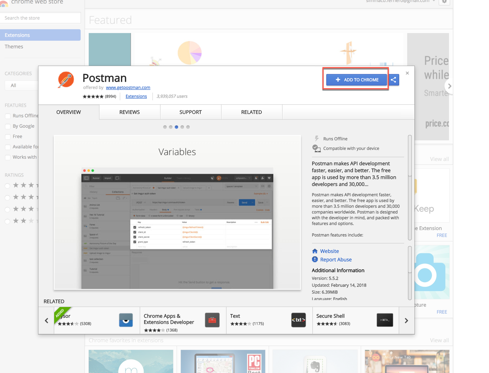

##  Install Chrome Postman Interceptor application
Another required tool is the Postman Interceptor app for Chrome. This can be found on the Chrome Web Store.

1. Navigate to <https://chrome.google.com/webstore/search/postman%20interceptor> and select the **Postman Interceptor** tool  
	

1. Click **Add to Chrome**  
	

## Summary
You have successfully completed the prerequisites installation.
